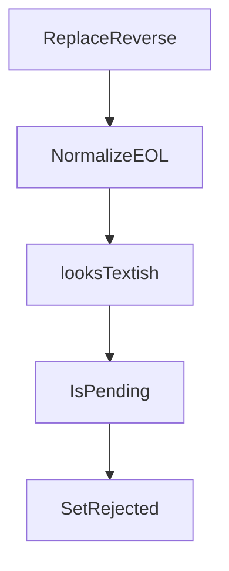

# Chapter 8: Self-Hosting and Production Operations

Welcome to **Chapter 8: Self-Hosting and Production Operations**. In this part of **Plandex Tutorial: Large-Task AI Coding Agent Workflows**, you will build an intuitive mental model first, then move into concrete implementation details and practical production tradeoffs.


This chapter covers local/self-hosted operation patterns for production-grade Plandex usage.

## Operations Checklist

- isolate secrets and provider keys by environment
- monitor task success, retry, and rollback rates
- keep release process tied to eval + review gates

## Source References

- [Plandex Self-Hosting Quickstart](https://docs.plandex.ai/hosting/self-hosting/local-mode-quickstart)
- [Plandex Docs](https://docs.plandex.ai/)

## Summary

You now have an operations baseline for running Plandex as a serious engineering tool.

## Source Code Walkthrough

### `app/shared/utils.go`

The `ReplaceReverse` function in [`app/shared/utils.go`](https://github.com/plandex-ai/plandex/blob/HEAD/app/shared/utils.go) handles a key part of this chapter's functionality:

```go
}

func ReplaceReverse(s, old, new string, n int) string {
	// If n is negative, there is no limit to the number of replacements
	if n == 0 {
		return s
	}

	if n < 0 {
		return strings.Replace(s, old, new, -1)
	}

	// If n is positive, replace the last n occurrences of old with new
	var res string
	for i := 0; i < n; i++ {
		idx := strings.LastIndex(s, old)
		if idx == -1 {
			break
		}
		res = s[:idx] + new + s[idx+len(old):]
		s = res
	}
	return res
}

func NormalizeEOL(data []byte) []byte {
	if !looksTextish(data) {
		return data
	}

	// CRLF -> LF
	n := bytes.ReplaceAll(data, []byte{'\r', '\n'}, []byte{'\n'})
```

This function is important because it defines how Plandex Tutorial: Large-Task AI Coding Agent Workflows implements the patterns covered in this chapter.

### `app/shared/utils.go`

The `NormalizeEOL` function in [`app/shared/utils.go`](https://github.com/plandex-ai/plandex/blob/HEAD/app/shared/utils.go) handles a key part of this chapter's functionality:

```go
}

func NormalizeEOL(data []byte) []byte {
	if !looksTextish(data) {
		return data
	}

	// CRLF -> LF
	n := bytes.ReplaceAll(data, []byte{'\r', '\n'}, []byte{'\n'})

	// treat stray CR as newline as well
	n = bytes.ReplaceAll(n, []byte{'\r'}, []byte{'\n'})
	return n
}

// looksTextish checks some very cheap heuristics:
//  1. no NUL bytes      → probably not binary
//  2. valid UTF-8       → BOMs are OK
//  3. printable ratio   → ≥ 90 % of runes are >= 0x20 or common whitespace
func looksTextish(b []byte) bool {
	if bytes.IndexByte(b, 0x00) != -1 { // 1
		return false
	}
	if !utf8.Valid(b) { // 2
		return false
	}

	printable := 0
	for len(b) > 0 {
		r, size := utf8.DecodeRune(b)
		b = b[size:]
		switch {
```

This function is important because it defines how Plandex Tutorial: Large-Task AI Coding Agent Workflows implements the patterns covered in this chapter.

### `app/shared/utils.go`

The `looksTextish` function in [`app/shared/utils.go`](https://github.com/plandex-ai/plandex/blob/HEAD/app/shared/utils.go) handles a key part of this chapter's functionality:

```go

func NormalizeEOL(data []byte) []byte {
	if !looksTextish(data) {
		return data
	}

	// CRLF -> LF
	n := bytes.ReplaceAll(data, []byte{'\r', '\n'}, []byte{'\n'})

	// treat stray CR as newline as well
	n = bytes.ReplaceAll(n, []byte{'\r'}, []byte{'\n'})
	return n
}

// looksTextish checks some very cheap heuristics:
//  1. no NUL bytes      → probably not binary
//  2. valid UTF-8       → BOMs are OK
//  3. printable ratio   → ≥ 90 % of runes are >= 0x20 or common whitespace
func looksTextish(b []byte) bool {
	if bytes.IndexByte(b, 0x00) != -1 { // 1
		return false
	}
	if !utf8.Valid(b) { // 2
		return false
	}

	printable := 0
	for len(b) > 0 {
		r, size := utf8.DecodeRune(b)
		b = b[size:]
		switch {
		case r == '\n', r == '\r', r == '\t':
```

This function is important because it defines how Plandex Tutorial: Large-Task AI Coding Agent Workflows implements the patterns covered in this chapter.

### `app/shared/plan_result.go`

The `IsPending` function in [`app/shared/plan_result.go`](https://github.com/plandex-ai/plandex/blob/HEAD/app/shared/plan_result.go) handles a key part of this chapter's functionality:

```go
)

func (rep *Replacement) IsPending() bool {
	return !rep.Failed && rep.RejectedAt == nil
}

func (rep *Replacement) SetRejected(t time.Time) {
	rep.RejectedAt = &t
}

func (res *PlanFileResult) NumPendingReplacements() int {
	numPending := 0
	for _, rep := range res.Replacements {
		if rep.IsPending() {
			numPending++
		}
	}
	return numPending
}

func (res *PlanFileResult) IsPending() bool {
	return res.AppliedAt == nil && res.RejectedAt == nil && (res.Content != "" || res.NumPendingReplacements() > 0 || res.RemovedFile)
}

func (p PlanFileResultsByPath) SetApplied(t time.Time) {
	for _, planResults := range p {
		for _, planResult := range planResults {
			if !planResult.IsPending() {
				continue
			}
			planResult.AppliedAt = &t
		}
```

This function is important because it defines how Plandex Tutorial: Large-Task AI Coding Agent Workflows implements the patterns covered in this chapter.


## How These Components Connect


