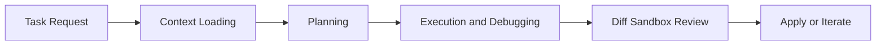

# Plandex Tutorial: Large-Task AI Coding Agent Workflows

> Learn how to use `plandex-ai/plandex` for large codebase tasks with strong context management, cumulative diff review, model packs, and self-hosted operations.

## Why This Track Matters

Plandex is a terminal AI coding agent built specifically for large, multi-file, long-horizon tasks where simpler assistants often break down.

This track focuses on:

- context management for large codebases
- planning and execution loops with review sandboxing
- model pack and provider strategy optimization
- self-hosted and production deployment practices

## Current Snapshot (auto-updated)

- repository: [`plandex-ai/plandex`](https://github.com/plandex-ai/plandex)
- stars: about **15.0k**
- latest release: [`cli/v2.2.1`](https://github.com/plandex-ai/plandex/releases/tag/cli/v2.2.1)
- development activity: active with mature docs and workflows
- project positioning: terminal coding agent for large projects with diff sandbox and autonomy controls

## Mental Model

## Chapter Guide

| Chapter | Key Question | Outcome |
|:--------|:-------------|:--------|
| [01 - Getting Started](01-getting-started.md) | How do I install and run Plandex quickly? | Working baseline |
| [02 - Architecture and Workflow](02-architecture-and-workflow.md) | How does Plandex handle large coding tasks end-to-end? | Strong operating model |
| [03 - Context Management at Scale](03-context-management-at-scale.md) | How does Plandex manage large context efficiently? | Better context discipline |
| [04 - Planning, Execution, and Diff Sandbox](04-planning-execution-and-diff-sandbox.md) | How do I keep changes safe and reviewable? | Safer change management |
| [05 - Model Packs and Provider Strategy](05-model-packs-and-provider-strategy.md) | How do I combine models for quality and cost? | Robust provider strategy |
| [06 - Autonomy, Control, and Debugging](06-autonomy-control-and-debugging.md) | How do I tune automation vs manual control? | Better reliability controls |
| [07 - Git, Branching, and Review Workflows](07-git-branching-and-review-workflows.md) | How do I integrate Plandex with team Git workflows? | Team-ready process |
| [08 - Self-Hosting and Production Operations](08-self-hosting-and-production-operations.md) | How do I deploy and operate Plandex in production? | Ops runbook baseline |

## What You Will Learn

- how to run Plandex effectively on large code tasks
- how to manage context, model selection, and review loops safely
- how to integrate Plandex with team Git and CI workflows
- how to self-host and operate Plandex with production controls

## Source References

- [Plandex Repository](https://github.com/plandex-ai/plandex)
- [Plandex Releases](https://github.com/plandex-ai/plandex/releases)
- [Plandex Docs](https://docs.plandex.ai/)
- [Plandex Local Self-Hosting Quickstart](https://docs.plandex.ai/hosting/self-hosting/local-mode-quickstart)

## Related Tutorials

- [Aider Tutorial](../aider-tutorial/)
- [OpenCode Tutorial](../opencode-tutorial/)
- [Cline Tutorial](../cline-tutorial/)
- [Roo Code Tutorial](../roo-code-tutorial/)

---

Start with [Chapter 1: Getting Started](01-getting-started.md).

## Navigation & Backlinks

- [Start Here: Chapter 1: Getting Started](01-getting-started.md)
- [Back to Main Catalog](../../README.md#-tutorial-catalog)
- [Browse A-Z Tutorial Directory](../../discoverability/tutorial-directory.md)
- [Search by Intent](../../discoverability/query-hub.md)
- [Explore Category Hubs](../../README.md#category-hubs)

## Full Chapter Map

1. [Chapter 1: Getting Started](01-getting-started.md)
2. [Chapter 2: Architecture and Workflow](02-architecture-and-workflow.md)
3. [Chapter 3: Context Management at Scale](03-context-management-at-scale.md)
4. [Chapter 4: Planning, Execution, and Diff Sandbox](04-planning-execution-and-diff-sandbox.md)
5. [Chapter 5: Model Packs and Provider Strategy](05-model-packs-and-provider-strategy.md)
6. [Chapter 6: Autonomy, Control, and Debugging](06-autonomy-control-and-debugging.md)
7. [Chapter 7: Git, Branching, and Review Workflows](07-git-branching-and-review-workflows.md)
8. [Chapter 8: Self-Hosting and Production Operations](08-self-hosting-and-production-operations.md)

*Generated by [AI Codebase Knowledge Builder](https://github.com/The-Pocket/Tutorial-Codebase-Knowledge)*
