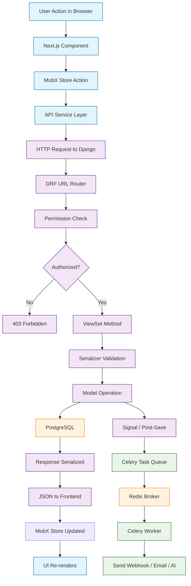

# Chapter 2: System Architecture

Welcome to **Chapter 2** of the **Plane Tutorial**. This chapter examines the full-stack architecture of Plane — from the Next.js frontend to the Django backend, database schema design, and background worker system.

> Understand how Plane's Django backend, Next.js frontend, and supporting services fit together.

## What Problem Does This Solve?

Building a project management tool requires coordinating many concerns: real-time updates, background processing, file storage, API design, and a responsive UI. Understanding Plane's architecture shows you how a production-grade PM platform organizes these layers and how each service communicates.

## High-Level Architecture

Plane follows a classic client-server architecture with clear separation between the frontend SPA and the backend API.

```
┌─────────────────────────────────────────────────┐
│                  User Browser                    │
└──────────────────────┬──────────────────────────┘
                       │ HTTPS
┌──────────────────────▼──────────────────────────┐
│              Nginx / Reverse Proxy               │
├────────────┬─────────────────┬──────────────────┤
│  /         │  /api/          │  /uploads/        │
│  Next.js   │  Django API     │  MinIO / S3       │
│  (Web)     │  (apiserver)    │  (Storage)        │
└────────────┴────────┬────────┴──────────────────┘
                      │
        ┌─────────────┼─────────────┐
        │             │             │
   PostgreSQL      Redis       Celery Workers
   (Data store)   (Cache/MQ)  (Background jobs)
```

## Backend: Django API Server

The Django backend lives in the `apiserver/` directory and provides the REST API that powers the entire application.

### Project Layout

```
apiserver/
├── plane/
│   ├── api/           # API views and serializers
│   │   ├── views/     # ViewSets for each resource
│   │   ├── serializers/
│   │   └── urls/      # URL routing
│   ├── app/           # Core application logic
│   │   ├── views/     # App-specific views
│   │   └── permissions.py
│   ├── db/            # Database models
│   │   └── models/
│   │       ├── workspace.py
│   │       ├── project.py
│   │       ├── issue.py
│   │       ├── cycle.py
│   │       ├── module.py
│   │       └── page.py
│   ├── bgtasks/       # Celery background tasks
│   ├── middleware/     # Custom middleware
│   └── settings/      # Django settings
├── requirements.txt
└── manage.py
```

### API Design Pattern

Plane uses Django REST Framework (DRF) ViewSets with a consistent URL structure:

```python
# apiserver/plane/api/urls/issue.py

from django.urls import path
from plane.api.views import (
    IssueViewSet,
    IssueLabelViewSet,
    IssueCommentViewSet,
    IssueActivityViewSet,
)

urlpatterns = [
    path(
        "workspaces/<str:slug>/projects/<uuid:project_id>/issues/",
        IssueViewSet.as_view({"get": "list", "post": "create"}),
        name="project-issues",
    ),
    path(
        "workspaces/<str:slug>/projects/<uuid:project_id>/issues/<uuid:pk>/",
        IssueViewSet.as_view({
            "get": "retrieve",
            "patch": "partial_update",
            "delete": "destroy",
        }),
        name="project-issue-detail",
    ),
]
```

### Base Model Pattern

All Plane models inherit from a `BaseModel` that provides common fields:

```python
# apiserver/plane/db/models/base.py

import uuid
from django.db import models


class BaseModel(models.Model):
    id = models.UUIDField(
        default=uuid.uuid4, unique=True, editable=False, primary_key=True
    )
    created_at = models.DateTimeField(auto_now_add=True)
    updated_at = models.DateTimeField(auto_now=True)
    created_by = models.ForeignKey(
        "db.User",
        on_delete=models.SET_NULL,
        null=True,
        blank=True,
        related_name="%(class)s_created_by",
    )
    updated_by = models.ForeignKey(
        "db.User",
        on_delete=models.SET_NULL,
        null=True,
        blank=True,
        related_name="%(class)s_updated_by",
    )

    class Meta:
        abstract = True
```

This gives every entity a UUID primary key, timestamps, and audit fields — a pattern common in enterprise PM tools.

### Permission Layer

Plane uses a custom permission system based on workspace and project roles:

```python
# apiserver/plane/app/permissions.py

from rest_framework.permissions import BasePermission

ROLE_CHOICES = {
    "owner": 20,
    "admin": 15,
    "member": 10,
    "guest": 5,
}


class ProjectEntityPermission(BasePermission):
    def has_permission(self, request, view):
        if request.method in ["GET", "HEAD"]:
            return ProjectMember.objects.filter(
                project_id=view.kwargs.get("project_id"),
                member=request.user,
                role__gte=ROLE_CHOICES["guest"],
            ).exists()

        return ProjectMember.objects.filter(
            project_id=view.kwargs.get("project_id"),
            member=request.user,
            role__gte=ROLE_CHOICES["member"],
        ).exists()
```

## Frontend: Next.js Web Application

The frontend lives in the `web/` directory and is built with Next.js, TypeScript, and Tailwind CSS.

### Frontend Structure

```
web/
├── app/               # Next.js App Router pages
│   ├── [workspaceSlug]/
│   │   ├── projects/
│   │   │   └── [projectId]/
│   │   │       ├── issues/
│   │   │       ├── cycles/
│   │   │       ├── modules/
│   │   │       └── pages/
│   │   └── settings/
│   └── layout.tsx
├── components/        # Reusable UI components
├── store/             # State management (MobX)
├── services/          # API client layer
├── helpers/           # Utility functions
└── lib/               # Configuration and providers
```

### API Client Layer

The frontend communicates with the Django backend through a typed service layer:

```typescript
// web/services/issue.service.ts

import { APIService } from "services/api.service";
import { IIssue, IIssueResponse } from "types/issue";

export class IssueService extends APIService {
  constructor() {
    super(process.env.NEXT_PUBLIC_API_BASE_URL || "");
  }

  async getIssues(
    workspaceSlug: string,
    projectId: string,
    queries?: object
  ): Promise<IIssueResponse> {
    return this.get(
      `/api/v1/workspaces/${workspaceSlug}/projects/${projectId}/issues/`,
      { params: queries }
    );
  }

  async createIssue(
    workspaceSlug: string,
    projectId: string,
    data: Partial<IIssue>
  ): Promise<IIssue> {
    return this.post(
      `/api/v1/workspaces/${workspaceSlug}/projects/${projectId}/issues/`,
      data
    );
  }
}
```

### State Management with MobX

Plane uses MobX for reactive state management:

```typescript
// web/store/issue/issue.store.ts

import { makeObservable, observable, action, computed } from "mobx";
import { IIssue } from "types/issue";
import { IssueService } from "services/issue.service";

export class IssueStore {
  issues: Record<string, IIssue> = {};
  issueService: IssueService;

  constructor() {
    makeObservable(this, {
      issues: observable,
      fetchIssues: action,
      issuesList: computed,
    });
    this.issueService = new IssueService();
  }

  get issuesList(): IIssue[] {
    return Object.values(this.issues);
  }

  fetchIssues = async (workspaceSlug: string, projectId: string) => {
    const response = await this.issueService.getIssues(
      workspaceSlug,
      projectId
    );
    response.results.forEach((issue) => {
      this.issues[issue.id] = issue;
    });
  };
}
```

## How It Works Under the Hood

When a user interacts with the Plane UI, here is the full request lifecycle:



## Background Task System

Plane uses Celery with Redis as the message broker for asynchronous work:

```python
# apiserver/plane/bgtasks/issue_activity_task.py

from celery import shared_task
from plane.db.models import IssueActivity


@shared_task
def issue_activity_task(
    type, requested_data, current_instance,
    issue_id, project_id, workspace_id, actor_id
):
    """Track all changes made to an issue as activity entries."""
    IssueActivity.objects.create(
        issue_id=issue_id,
        project_id=project_id,
        workspace_id=workspace_id,
        actor_id=actor_id,
        field=type,
        old_value=current_instance,
        new_value=requested_data,
    )
```

## Database Schema Overview

The core entities and their relationships:

```
Workspace (1) ──< Project (1) ──< Issue
                      │              │
                      ├──< Cycle     ├──< IssueComment
                      ├──< Module    ├──< IssueActivity
                      ├──< Page      ├──< IssueLabel
                      ├──< Label     └──< IssueAssignee
                      └──< State
```

## Key Takeaways

- Plane is a Django + Next.js full-stack application with PostgreSQL, Redis, and Celery.
- The backend uses DRF ViewSets with nested URL routing scoped to workspace/project.
- All models share a `BaseModel` with UUID primary keys and audit fields.
- The frontend uses MobX for state management and a typed service layer for API calls.
- Background tasks (activity tracking, webhooks, notifications) are processed by Celery workers.

## Cross-References

- **Previous:** [Chapter 1: Getting Started](01-getting-started.md) covers installation.
- **Next:** [Chapter 3: Issue Tracking](03-issue-tracking.md) dives into the issue data model.
- **Deployment details:** [Chapter 8: Self-Hosting and Deployment](08-self-hosting-and-deployment.md).

---

*Generated by [AI Codebase Knowledge Builder](https://github.com/The-Pocket/Tutorial-Codebase-Knowledge)*
