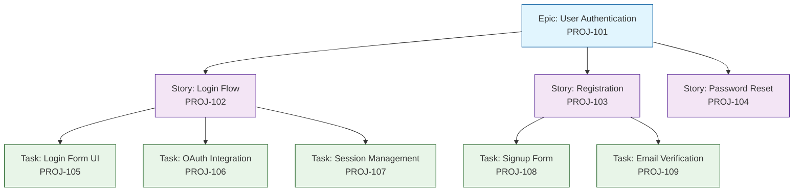
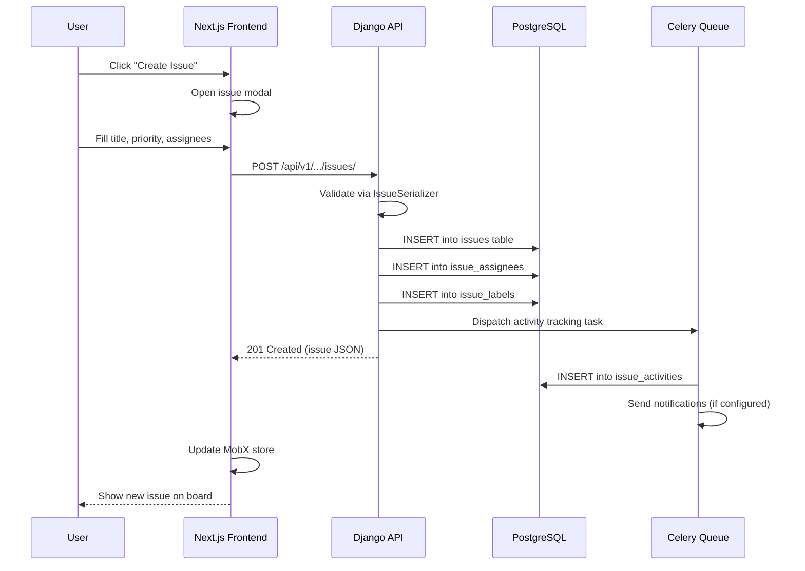

# Chapter 3: Issue Tracking

Welcome to **Chapter 3** of the **Plane Tutorial**. This chapter covers the core of any project management tool — issues. You will learn how Plane models issues, states, labels, priorities, assignees, and sub-issues.

> Create, organize, and track issues with states, priorities, labels, and hierarchical sub-issues.

## What Problem Does This Solve?

Every software team needs a structured way to track work. Plane's issue system provides a flexible, extensible data model that supports multiple views (list, board, spreadsheet), custom states, and hierarchical relationships — all without the complexity overhead of legacy tools like Jira.

## The Issue Data Model

At its core, an issue in Plane is a rich entity with many relationships:

```python
# apiserver/plane/db/models/issue.py

class Issue(ProjectBaseModel):
    PRIORITY_CHOICES = (
        ("urgent", "Urgent"),
        ("high", "High"),
        ("medium", "Medium"),
        ("low", "Low"),
        ("none", "None"),
    )

    name = models.CharField(max_length=255)
    description = models.JSONField(blank=True, default=dict)
    description_html = models.TextField(blank=True, default="<p></p>")
    description_stripped = models.TextField(blank=True, null=True)
    priority = models.CharField(
        max_length=30,
        choices=PRIORITY_CHOICES,
        default="none",
    )
    state = models.ForeignKey(
        "db.State",
        on_delete=models.CASCADE,
        related_name="state_issues",
    )
    parent = models.ForeignKey(
        "self",
        on_delete=models.CASCADE,
        null=True,
        blank=True,
        related_name="sub_issues",
    )
    estimate_point = models.IntegerField(
        null=True, blank=True, default=None
    )
    sequence_id = models.FloatField(default=65535)
    start_date = models.DateField(null=True, blank=True)
    target_date = models.DateField(null=True, blank=True)
    sort_order = models.FloatField(default=65535)

    class Meta:
        ordering = ("-created_at",)
```

### Key Relationships

Issues connect to many other entities through junction tables:

```python
# Assignees — many-to-many through IssueAssignee
class IssueAssignee(ProjectBaseModel):
    issue = models.ForeignKey(
        Issue, on_delete=models.CASCADE, related_name="issue_assignees"
    )
    assignee = models.ForeignKey(
        "db.User", on_delete=models.CASCADE, related_name="issue_assignees"
    )

    class Meta:
        unique_together = ["issue", "assignee"]


# Labels — many-to-many through IssueLabel
class IssueLabel(ProjectBaseModel):
    issue = models.ForeignKey(
        Issue, on_delete=models.CASCADE, related_name="issue_labels"
    )
    label = models.ForeignKey(
        "db.Label", on_delete=models.CASCADE, related_name="issue_labels"
    )

    class Meta:
        unique_together = ["issue", "label"]
```

## States and Workflow

States define the workflow for issues in a project. Each project can have custom states organized into groups:

```python
# apiserver/plane/db/models/state.py

class State(ProjectBaseModel):
    GROUP_CHOICES = (
        ("backlog", "Backlog"),
        ("unstarted", "Unstarted"),
        ("started", "Started"),
        ("completed", "Completed"),
        ("cancelled", "Cancelled"),
    )

    name = models.CharField(max_length=255)
    description = models.TextField(blank=True)
    color = models.CharField(max_length=255)
    group = models.CharField(
        max_length=20, choices=GROUP_CHOICES, default="backlog"
    )
    sequence = models.FloatField(default=65535)
    is_default = models.BooleanField(default=False)

    class Meta:
        unique_together = ["project", "name"]
        ordering = ("sequence",)
```

### Default States per Project

When a project is created, Plane automatically provisions default states:

| Group | Default State | Color |
|:------|:-------------|:------|
| Backlog | Backlog | `#A3A3A3` |
| Unstarted | Todo | `#3A3A3A` |
| Started | In Progress | `#F59E0B` |
| Completed | Done | `#16A34A` |
| Cancelled | Cancelled | `#EF4444` |

## Creating Issues via the API

### Backend ViewSet

```python
# apiserver/plane/api/views/issue.py

from rest_framework import status
from rest_framework.response import Response
from plane.db.models import Issue, IssueAssignee, IssueLabel
from plane.api.serializers import IssueSerializer
from plane.bgtasks.issue_activity_task import issue_activity_task


class IssueViewSet(ProjectBaseViewSet):
    serializer_class = IssueSerializer
    model = Issue

    def get_queryset(self):
        return (
            Issue.objects.filter(
                workspace__slug=self.kwargs.get("slug"),
                project_id=self.kwargs.get("project_id"),
            )
            .select_related("state", "parent", "project")
            .prefetch_related("issue_assignees", "issue_labels")
        )

    def create(self, request, slug, project_id):
        serializer = IssueSerializer(
            data=request.data,
            context={"project_id": project_id, "workspace_slug": slug},
        )
        if serializer.is_valid():
            serializer.save()
            # Track activity asynchronously
            issue_activity_task.delay(
                type="issue.activity.created",
                requested_data=request.data,
                current_instance=None,
                issue_id=str(serializer.data["id"]),
                project_id=str(project_id),
                workspace_id=str(request.workspace.id),
                actor_id=str(request.user.id),
            )
            return Response(serializer.data, status=status.HTTP_201_CREATED)
        return Response(serializer.errors, status=status.HTTP_400_BAD_REQUEST)
```

### Frontend: Creating an Issue

```typescript
// web/components/issues/issue-modal.tsx

import { useForm, Controller } from "react-hook-form";
import { IIssue } from "types/issue";
import { useIssueStore } from "store/issue";

interface IssueFormData {
  name: string;
  description_html: string;
  priority: "urgent" | "high" | "medium" | "low" | "none";
  state_id: string;
  assignee_ids: string[];
  label_ids: string[];
  parent_id?: string;
  start_date?: string;
  target_date?: string;
}

export const CreateIssueModal: React.FC = () => {
  const { createIssue } = useIssueStore();
  const { control, handleSubmit } = useForm<IssueFormData>({
    defaultValues: {
      name: "",
      priority: "none",
      assignee_ids: [],
      label_ids: [],
    },
  });

  const onSubmit = async (data: IssueFormData) => {
    await createIssue(workspaceSlug, projectId, data);
  };

  return (
    <form onSubmit={handleSubmit(onSubmit)}>
      <Controller
        name="name"
        control={control}
        rules={{ required: "Title is required" }}
        render={({ field }) => (
          <input
            {...field}
            placeholder="Issue title"
            className="w-full px-3 py-2 border rounded-md"
          />
        )}
      />
      {/* Priority selector, state picker, assignees, labels... */}
    </form>
  );
};
```

## Sub-Issues (Parent-Child Hierarchy)

Plane supports hierarchical issues through the `parent` self-referential foreign key. This allows you to break large tasks into smaller, trackable sub-issues.



### Querying Sub-Issues

```python
# Fetch all sub-issues of a parent
sub_issues = Issue.objects.filter(
    parent_id=parent_issue_id,
    project_id=project_id,
).select_related("state").prefetch_related("issue_assignees")

# Recursive sub-issue tree (using Django CTE or manual recursion)
def get_issue_tree(issue_id):
    issue = Issue.objects.get(id=issue_id)
    children = Issue.objects.filter(parent_id=issue_id)
    return {
        "issue": issue,
        "sub_issues": [get_issue_tree(child.id) for child in children],
    }
```

## Labels

Labels provide flexible categorization beyond states:

```python
# apiserver/plane/db/models/label.py

class Label(ProjectBaseModel):
    name = models.CharField(max_length=255)
    description = models.TextField(blank=True)
    color = models.CharField(max_length=255, blank=True)
    parent = models.ForeignKey(
        "self",
        on_delete=models.CASCADE,
        null=True,
        blank=True,
        related_name="label_children",
    )
    sort_order = models.FloatField(default=65535)

    class Meta:
        unique_together = ["project", "name"]
```

Labels also support a parent-child hierarchy, enabling grouped labels like `Frontend > React` or `Bug > Critical`.

## Issue Views and Filters

Plane supports multiple views of the same issue data:

| View | Description |
|:-----|:------------|
| **Board** | Kanban board grouped by state |
| **List** | Traditional list with sorting |
| **Spreadsheet** | Table with inline editing |
| **Calendar** | Timeline based on due dates |
| **Gantt** | Gantt chart for dependencies |

### Filter System

```typescript
// web/types/issue-filters.ts

interface IIssueFilterOptions {
  state?: string[];
  priority?: string[];
  assignees?: string[];
  labels?: string[];
  created_by?: string[];
  start_date?: string[];
  target_date?: string[];
  subscriber?: string[];
}

interface IIssueDisplayProperties {
  assignee: boolean;
  start_date: boolean;
  due_date: boolean;
  labels: boolean;
  priority: boolean;
  state: boolean;
  sub_issue_count: boolean;
  estimate: boolean;
}
```

## How It Works Under the Hood



## Key Takeaways

- Issues are rich entities with priority, state, assignees, labels, dates, and estimates.
- States are grouped into five categories (Backlog, Unstarted, Started, Completed, Cancelled) for consistent workflow reporting.
- Sub-issues use a self-referential foreign key, enabling hierarchical task breakdown.
- Labels support nesting for organized categorization.
- Issue activity is tracked asynchronously via Celery for audit trails.

## Cross-References

- **Architecture:** [Chapter 2: System Architecture](02-system-architecture.md) for the full backend structure.
- **Sprint planning:** [Chapter 4: Cycles and Modules](04-cycles-and-modules.md) for organizing issues into sprints.
- **AI-powered creation:** [Chapter 5: AI Features](05-ai-features.md) for AI-assisted issue creation.

---

*Generated by [AI Codebase Knowledge Builder](https://github.com/The-Pocket/Tutorial-Codebase-Knowledge)*
