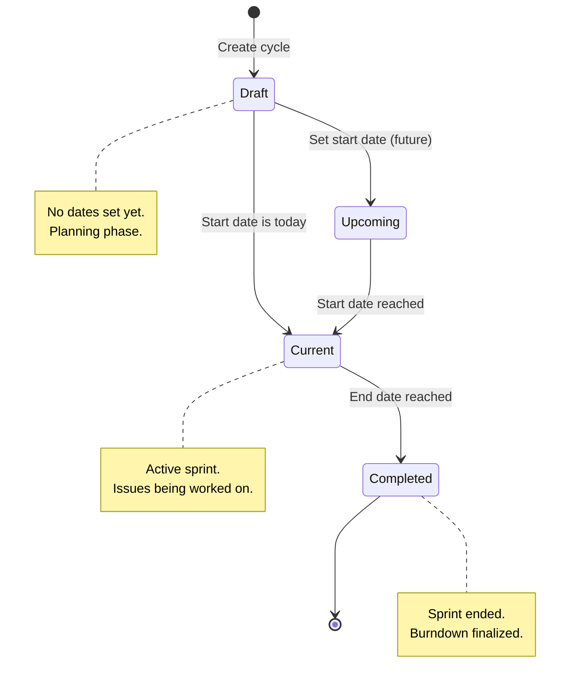
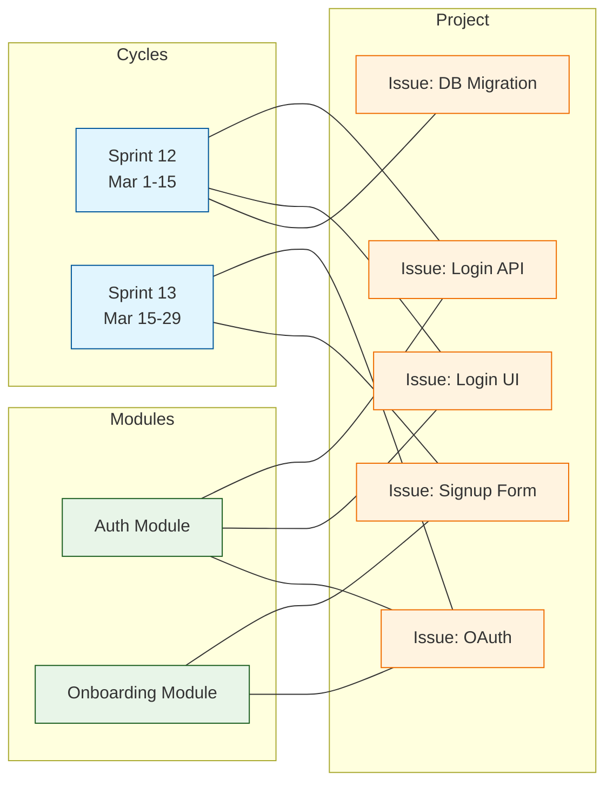

# Chapter 4: Cycles and Modules

Welcome to **Chapter 4** of the **Plane Tutorial**. This chapter covers two key organizational constructs in Plane: **Cycles** (time-boxed sprints) and **Modules** (feature-based groupings). Together, they enable flexible roadmap planning.

> Plan sprints with Cycles, group features with Modules, and build your product roadmap.

## What Problem Does This Solve?

Issues on their own are just a list. Teams need two complementary ways to organize work:

1. **Time-based planning** — "What are we doing this sprint?" (Cycles)
2. **Feature-based grouping** — "What issues belong to the authentication feature?" (Modules)

Plane provides both, and an issue can belong to one cycle and multiple modules simultaneously.

## Cycles: Time-Boxed Sprints

A Cycle represents a sprint or iteration with a start and end date. Issues are assigned to cycles for time-boxed delivery.

### Cycle Data Model

```python
# apiserver/plane/db/models/cycle.py

class Cycle(ProjectBaseModel):
    name = models.CharField(max_length=255)
    description = models.TextField(blank=True)
    start_date = models.DateField(null=True, blank=True)
    end_date = models.DateField(null=True, blank=True)
    owned_by = models.ForeignKey(
        "db.User",
        on_delete=models.CASCADE,
        related_name="owned_cycles",
    )
    view_props = models.JSONField(default=dict)
    sort_order = models.FloatField(default=65535)

    class Meta:
        ordering = ("-created_at",)
        unique_together = ["name", "project"]


class CycleIssue(ProjectBaseModel):
    """Junction table linking issues to cycles."""
    cycle = models.ForeignKey(
        Cycle, on_delete=models.CASCADE, related_name="cycle_issues"
    )
    issue = models.ForeignKey(
        "db.Issue", on_delete=models.CASCADE, related_name="issue_cycle"
    )

    class Meta:
        unique_together = ["cycle", "issue"]
```

### Cycle Lifecycle

Cycles progress through distinct phases:



### Creating a Cycle via the API

```python
# apiserver/plane/api/views/cycle.py

class CycleViewSet(ProjectBaseViewSet):
    serializer_class = CycleSerializer
    model = Cycle

    def get_queryset(self):
        return Cycle.objects.filter(
            workspace__slug=self.kwargs.get("slug"),
            project_id=self.kwargs.get("project_id"),
        ).annotate(
            total_issues=Count("cycle_issues"),
            completed_issues=Count(
                "cycle_issues",
                filter=Q(
                    cycle_issues__issue__state__group="completed"
                ),
            ),
            cancelled_issues=Count(
                "cycle_issues",
                filter=Q(
                    cycle_issues__issue__state__group="cancelled"
                ),
            ),
        )

    def create(self, request, slug, project_id):
        serializer = CycleSerializer(data=request.data)
        if serializer.is_valid():
            serializer.save(
                project_id=project_id,
                owned_by=request.user,
            )
            return Response(serializer.data, status=status.HTTP_201_CREATED)
        return Response(serializer.errors, status=status.HTTP_400_BAD_REQUEST)
```

### Adding Issues to a Cycle

```python
# POST /api/v1/workspaces/{slug}/projects/{project_id}/cycles/{cycle_id}/cycle-issues/

class CycleIssueViewSet(ProjectBaseViewSet):
    serializer_class = CycleIssueSerializer

    def create(self, request, slug, project_id, cycle_id):
        issues = request.data.get("issues", [])
        cycle_issues = []
        for issue_id in issues:
            cycle_issues.append(
                CycleIssue(
                    cycle_id=cycle_id,
                    issue_id=issue_id,
                    project_id=project_id,
                    workspace_id=request.workspace.id,
                    created_by=request.user,
                )
            )
        CycleIssue.objects.bulk_create(
            cycle_issues, ignore_conflicts=True
        )
        return Response({"message": "Issues added to cycle"}, status=200)
```

### Frontend: Cycle Board

```typescript
// web/components/cycles/cycle-board.tsx

import { observer } from "mobx-react-lite";
import { useCycleStore } from "store/cycle";

interface CycleProgress {
  total_issues: number;
  completed_issues: number;
  cancelled_issues: number;
  started_issues: number;
  unstarted_issues: number;
  backlog_issues: number;
}

export const CycleBoardView: React.FC = observer(() => {
  const { currentCycle, cycleIssues } = useCycleStore();

  const progress: CycleProgress = {
    total_issues: currentCycle?.total_issues || 0,
    completed_issues: currentCycle?.completed_issues || 0,
    cancelled_issues: currentCycle?.cancelled_issues || 0,
    started_issues: currentCycle?.started_issues || 0,
    unstarted_issues: currentCycle?.unstarted_issues || 0,
    backlog_issues: currentCycle?.backlog_issues || 0,
  };

  const completionPercentage =
    progress.total_issues > 0
      ? Math.round(
          (progress.completed_issues / progress.total_issues) * 100
        )
      : 0;

  return (
    <div className="flex flex-col gap-4">
      <div className="flex items-center justify-between">
        <h2 className="text-xl font-semibold">{currentCycle?.name}</h2>
        <span className="text-sm text-gray-500">
          {completionPercentage}% complete
        </span>
      </div>
      <ProgressBar value={completionPercentage} />
      <IssueBoard issues={cycleIssues} />
    </div>
  );
});
```

## Modules: Feature-Based Grouping

Modules group related issues by feature or initiative, independent of time. An issue can belong to multiple modules.

### Module Data Model

```python
# apiserver/plane/db/models/module.py

class Module(ProjectBaseModel):
    STATUS_CHOICES = (
        ("backlog", "Backlog"),
        ("planned", "Planned"),
        ("in-progress", "In Progress"),
        ("paused", "Paused"),
        ("completed", "Completed"),
        ("cancelled", "Cancelled"),
    )

    name = models.CharField(max_length=255)
    description = models.TextField(blank=True)
    description_html = models.TextField(blank=True, default="<p></p>")
    lead = models.ForeignKey(
        "db.User",
        on_delete=models.SET_NULL,
        null=True,
        blank=True,
        related_name="module_leads",
    )
    members = models.ManyToManyField(
        "db.User",
        blank=True,
        related_name="module_members",
        through="ModuleMember",
    )
    start_date = models.DateField(null=True, blank=True)
    target_date = models.DateField(null=True, blank=True)
    status = models.CharField(
        max_length=20, choices=STATUS_CHOICES, default="planned"
    )
    view_props = models.JSONField(default=dict)
    sort_order = models.FloatField(default=65535)

    class Meta:
        unique_together = ["name", "project"]
        ordering = ("-created_at",)


class ModuleIssue(ProjectBaseModel):
    """Junction table linking issues to modules."""
    module = models.ForeignKey(
        Module, on_delete=models.CASCADE, related_name="module_issues"
    )
    issue = models.ForeignKey(
        "db.Issue", on_delete=models.CASCADE, related_name="issue_module"
    )

    class Meta:
        unique_together = ["module", "issue"]
```

### Cycles vs. Modules

| Aspect | Cycles | Modules |
|:-------|:-------|:--------|
| **Purpose** | Time-boxed sprints | Feature grouping |
| **Time-bound** | Yes (start + end date) | Optional dates |
| **Issue membership** | One cycle per issue | Multiple modules per issue |
| **Progress tracking** | Burndown charts | Completion percentage |
| **Typical usage** | "Sprint 12" | "Authentication Feature" |

## How It Works Under the Hood

The relationship between issues, cycles, and modules:



Notice how Issue `I3` (OAuth) belongs to Sprint 13 **and** to both the Auth Module and Onboarding Module. This dual-axis organization is a core strength of Plane.

## Burndown and Analytics

Cycles provide built-in analytics. The backend computes burndown data by tracking state transitions over time:

```python
# apiserver/plane/api/views/analytic.py

def get_cycle_burndown(cycle_id, project_id):
    """Compute daily burndown for a cycle."""
    cycle = Cycle.objects.get(id=cycle_id)
    cycle_issues = CycleIssue.objects.filter(cycle=cycle)

    total = cycle_issues.count()
    burndown = []
    current_date = cycle.start_date

    while current_date <= cycle.end_date:
        completed = cycle_issues.filter(
            issue__state__group="completed",
            issue__updated_at__date__lte=current_date,
        ).count()
        burndown.append({
            "date": current_date.isoformat(),
            "total": total,
            "completed": completed,
            "remaining": total - completed,
        })
        current_date += timedelta(days=1)

    return burndown
```

### Frontend: Burndown Chart

```typescript
// web/components/cycles/cycle-analytics.tsx

interface BurndownPoint {
  date: string;
  total: number;
  completed: number;
  remaining: number;
}

export const CycleBurndownChart: React.FC<{
  data: BurndownPoint[];
}> = ({ data }) => {
  const idealBurndown = data.map((point, index) => ({
    date: point.date,
    ideal: point.total - (point.total / data.length) * index,
  }));

  return (
    <LineChart width={600} height={300}>
      <XAxis dataKey="date" />
      <YAxis />
      <Line
        data={data}
        dataKey="remaining"
        stroke="#ef4444"
        name="Actual"
      />
      <Line
        data={idealBurndown}
        dataKey="ideal"
        stroke="#a3a3a3"
        strokeDasharray="5 5"
        name="Ideal"
      />
      <Legend />
    </LineChart>
  );
};
```

## Key Takeaways

- **Cycles** are time-boxed sprints; each issue belongs to at most one active cycle.
- **Modules** are feature-based groupings; an issue can belong to multiple modules.
- Both use junction tables (`CycleIssue`, `ModuleIssue`) for many-to-many relationships.
- Cycle progress is computed via annotated querysets counting issues by state group.
- The dual-axis (time + feature) organization provides flexibility that single-axis tools lack.

## Cross-References

- **Issues:** [Chapter 3: Issue Tracking](03-issue-tracking.md) for the issue data model.
- **AI planning:** [Chapter 5: AI Features](05-ai-features.md) for AI-assisted sprint planning.
- **API access:** [Chapter 7: API and Integrations](07-api-and-integrations.md) for managing cycles/modules programmatically.

---

*Generated by [AI Codebase Knowledge Builder](https://github.com/The-Pocket/Tutorial-Codebase-Knowledge)*
