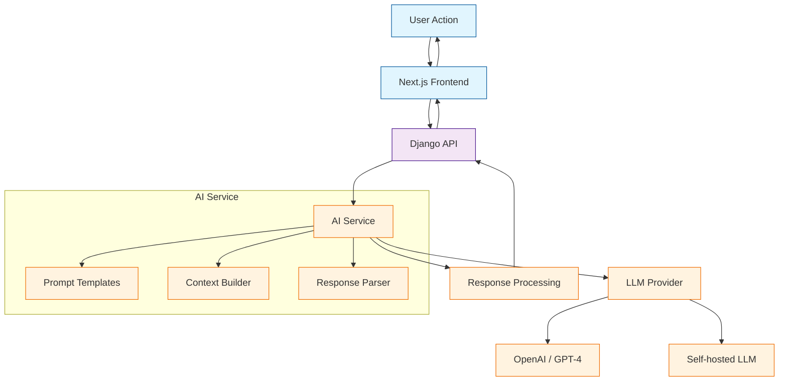
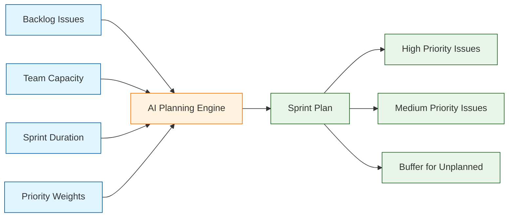
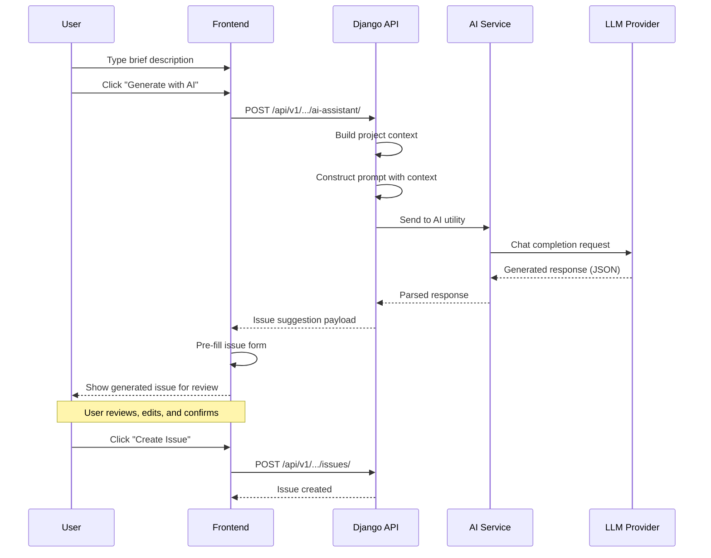

# Chapter 5: AI Features

Welcome to **Chapter 5** of the **Plane Tutorial**. This chapter explores Plane's AI-native capabilities — from AI-assisted issue creation to smart suggestions, automated triage, and intelligent planning helpers.

> Leverage AI for issue creation, smart suggestions, automated triage, and planning assistance.

## What Problem Does This Solve?

Writing clear issue descriptions, triaging incoming bugs, estimating effort, and breaking down epics are time-consuming tasks. Plane integrates AI directly into the project management workflow so that these tasks can be accelerated or automated, reducing overhead for engineering teams.

## AI Architecture Overview

Plane's AI features are built as a separate service that the Django backend communicates with asynchronously:



## AI-Assisted Issue Creation

The most visible AI feature is the ability to generate issue details from a brief description.

### Backend: AI Issue Generation Endpoint

```python
# apiserver/plane/api/views/ai.py

from rest_framework.views import APIView
from rest_framework.response import Response
from plane.app.permissions import ProjectEntityPermission
from plane.bgtasks.ai_tasks import generate_issue_description


class AIAssistantView(APIView):
    permission_classes = [ProjectEntityPermission]

    def post(self, request, slug, project_id):
        task = request.data.get("task", "")
        prompt = request.data.get("prompt", "")
        response_format = request.data.get("response", "text")

        if task == "generate_issue":
            result = self._generate_issue(prompt, project_id)
        elif task == "improve_description":
            result = self._improve_description(prompt)
        elif task == "summarize":
            result = self._summarize(prompt)
        else:
            return Response(
                {"error": "Unknown task"}, status=400
            )

        return Response({"response": result})

    def _generate_issue(self, brief_description, project_id):
        """Generate a full issue from a brief description."""
        from plane.utils.ai import call_ai_service

        system_prompt = """You are a project management assistant.
        Given a brief description, generate:
        1. A clear, concise issue title
        2. A detailed description with acceptance criteria
        3. Suggested priority (urgent/high/medium/low)
        4. Suggested labels
        5. Estimated story points

        Respond in JSON format."""

        context = self._build_project_context(project_id)

        return call_ai_service(
            system_prompt=system_prompt,
            user_prompt=brief_description,
            context=context,
        )

    def _build_project_context(self, project_id):
        """Build context from existing project data."""
        from plane.db.models import Issue, Label, State

        recent_issues = Issue.objects.filter(
            project_id=project_id
        ).order_by("-created_at")[:20]

        labels = Label.objects.filter(project_id=project_id)
        states = State.objects.filter(project_id=project_id)

        return {
            "recent_issues": [
                {"title": i.name, "priority": i.priority}
                for i in recent_issues
            ],
            "available_labels": [l.name for l in labels],
            "available_states": [s.name for s in states],
        }
```

### AI Utility Module

```python
# apiserver/plane/utils/ai.py

import openai
import json
from django.conf import settings


def call_ai_service(system_prompt, user_prompt, context=None):
    """Call the configured AI provider."""
    messages = [
        {"role": "system", "content": system_prompt},
    ]

    if context:
        messages.append({
            "role": "system",
            "content": f"Project context: {json.dumps(context)}",
        })

    messages.append({"role": "user", "content": user_prompt})

    client = openai.OpenAI(
        api_key=settings.OPENAI_API_KEY,
        base_url=settings.AI_BASE_URL,  # Supports self-hosted LLMs
    )

    response = client.chat.completions.create(
        model=settings.AI_MODEL or "gpt-4",
        messages=messages,
        temperature=0.3,
        max_tokens=2000,
    )

    return response.choices[0].message.content
```

### Frontend: AI Issue Creator

```typescript
// web/components/ai/ai-issue-creator.tsx

import { useState } from "react";
import { AIService } from "services/ai.service";

interface AIIssueResponse {
  title: string;
  description_html: string;
  priority: string;
  suggested_labels: string[];
  estimate_points: number;
}

export const AIIssueCreator: React.FC<{
  workspaceSlug: string;
  projectId: string;
  onGenerated: (data: AIIssueResponse) => void;
}> = ({ workspaceSlug, projectId, onGenerated }) => {
  const [prompt, setPrompt] = useState("");
  const [loading, setLoading] = useState(false);
  const aiService = new AIService();

  const handleGenerate = async () => {
    setLoading(true);
    try {
      const response = await aiService.generateIssue(
        workspaceSlug,
        projectId,
        { task: "generate_issue", prompt }
      );
      const parsed: AIIssueResponse = JSON.parse(response.response);
      onGenerated(parsed);
    } finally {
      setLoading(false);
    }
  };

  return (
    <div className="flex flex-col gap-3 p-4 border rounded-lg">
      <h3 className="text-sm font-medium">AI Issue Creator</h3>
      <textarea
        value={prompt}
        onChange={(e) => setPrompt(e.target.value)}
        placeholder="Describe the issue briefly... e.g., 'Users cannot reset their password when using SSO'"
        className="w-full h-24 px-3 py-2 border rounded-md resize-none"
      />
      <button
        onClick={handleGenerate}
        disabled={loading || !prompt.trim()}
        className="px-4 py-2 bg-blue-600 text-white rounded-md disabled:opacity-50"
      >
        {loading ? "Generating..." : "Generate Issue with AI"}
      </button>
    </div>
  );
};
```

## AI Description Improvement

Users can select existing issue text and ask AI to improve it:

```python
# Improve an existing issue description

def _improve_description(self, current_description):
    system_prompt = """You are a technical writing assistant.
    Improve the given issue description by:
    1. Making it clearer and more specific
    2. Adding acceptance criteria if missing
    3. Structuring it with proper formatting
    4. Identifying missing information and noting it

    Return the improved description in HTML format."""

    return call_ai_service(
        system_prompt=system_prompt,
        user_prompt=current_description,
    )
```

## AI-Powered Triage and Categorization

Plane can automatically suggest labels, priorities, and assignees for new issues:

```python
# apiserver/plane/bgtasks/ai_tasks.py

from celery import shared_task
from plane.db.models import Issue, ProjectMember, Label
from plane.utils.ai import call_ai_service
import json


@shared_task
def auto_triage_issue(issue_id):
    """Automatically suggest triage properties for a new issue."""
    issue = Issue.objects.select_related("project").get(id=issue_id)

    # Gather project context
    labels = list(
        Label.objects.filter(
            project=issue.project
        ).values_list("name", flat=True)
    )
    members = list(
        ProjectMember.objects.filter(
            project=issue.project
        ).select_related("member").values_list(
            "member__display_name", flat=True
        )
    )

    prompt = f"""Given this issue:
    Title: {issue.name}
    Description: {issue.description_stripped}

    Available labels: {labels}
    Team members: {members}

    Suggest:
    1. Priority (urgent/high/medium/low)
    2. Labels (from the available list)
    3. Best assignee (from team members)
    4. Estimated effort (story points 1-13)

    Return as JSON."""

    result = call_ai_service(
        system_prompt="You are a project triage assistant.",
        user_prompt=prompt,
    )

    suggestions = json.loads(result)

    # Store suggestions as issue metadata (not auto-applied)
    issue.description = {
        **issue.description,
        "ai_suggestions": suggestions,
    }
    issue.save(update_fields=["description"])
```

## AI-Assisted Sprint Planning

AI can help distribute issues across cycles based on priority, effort, and team capacity:



### Sprint Planning Endpoint

```python
# apiserver/plane/api/views/ai.py

class AISprintPlannerView(APIView):
    permission_classes = [ProjectEntityPermission]

    def post(self, request, slug, project_id):
        backlog_issues = Issue.objects.filter(
            project_id=project_id,
            state__group="backlog",
        ).values("id", "name", "priority", "estimate_point")

        team_capacity = request.data.get("team_capacity", 40)
        sprint_days = request.data.get("sprint_days", 14)

        prompt = f"""Given these backlog issues:
        {list(backlog_issues)}

        Team capacity: {team_capacity} story points
        Sprint duration: {sprint_days} days

        Create a sprint plan that:
        1. Prioritizes urgent and high priority items
        2. Stays within capacity (leave 20% buffer)
        3. Balances different types of work
        4. Groups related issues together

        Return as JSON with issue IDs."""

        result = call_ai_service(
            system_prompt="You are a sprint planning assistant.",
            user_prompt=prompt,
        )

        return Response({"plan": json.loads(result)})
```

## Configuration

AI features are configured through environment variables:

```bash
# .env — AI Configuration

# OpenAI (default)
OPENAI_API_KEY=sk-...
AI_MODEL=gpt-4

# Self-hosted LLM (alternative)
AI_BASE_URL=http://localhost:11434/v1
AI_MODEL=llama3

# Feature flags
ENABLE_AI_FEATURES=true
ENABLE_AUTO_TRIAGE=false
AI_MAX_TOKENS=2000
```

## How It Works Under the Hood



## Key Takeaways

- Plane's AI features use a separate service layer that wraps LLM providers (OpenAI, self-hosted).
- AI suggestions are always presented for human review — never auto-applied without confirmation.
- Project context (recent issues, labels, team members) is injected into prompts for relevance.
- Auto-triage runs as a Celery background task, keeping the API responsive.
- Sprint planning AI considers capacity, priority, and issue relationships.

## Cross-References

- **Issue model:** [Chapter 3: Issue Tracking](03-issue-tracking.md) for the data that AI operates on.
- **Cycles:** [Chapter 4: Cycles and Modules](04-cycles-and-modules.md) for sprint planning context.
- **API access:** [Chapter 7: API and Integrations](07-api-and-integrations.md) for using AI endpoints programmatically.

---

*Generated by [AI Codebase Knowledge Builder](https://github.com/The-Pocket/Tutorial-Codebase-Knowledge)*
