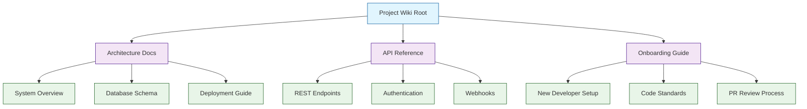
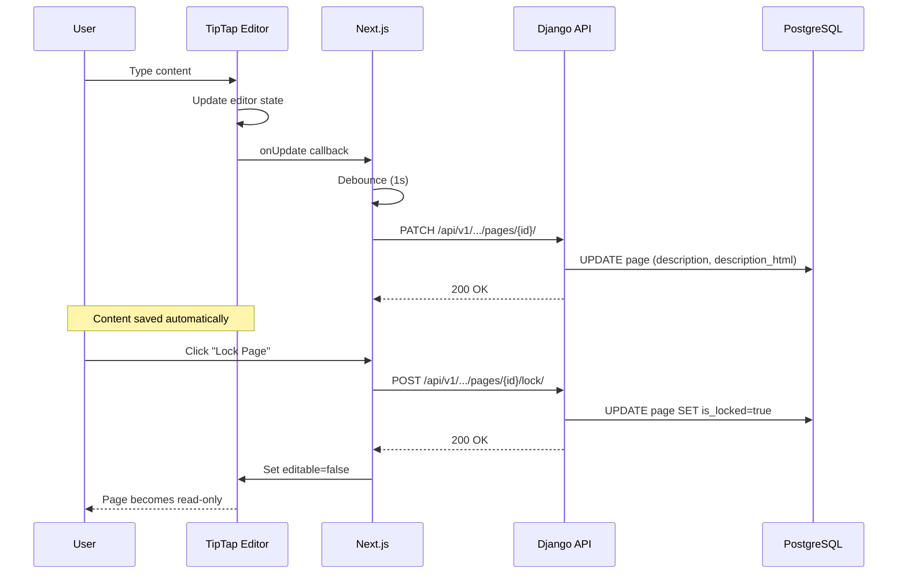

# Chapter 6: Pages and Wiki

Welcome to **Chapter 6** of the **Plane Tutorial**. This chapter covers Plane's built-in Pages feature — a collaborative wiki and documentation system integrated directly into your project management workflow.

> Build a knowledge base with collaborative pages, rich text editing, and project-linked documentation.

## What Problem Does This Solve?

Teams often maintain documentation in a separate tool (Notion, Confluence, Google Docs) that is disconnected from their issue tracker. Plane's Pages bring documentation into the same workspace as issues, cycles, and modules — eliminating context-switching and keeping knowledge close to the work it describes.

## The Page Data Model

Pages in Plane are rich-text documents stored as JSON (for the editor) and HTML (for rendering):

```python
# apiserver/plane/db/models/page.py

class Page(ProjectBaseModel):
    name = models.CharField(max_length=255)
    description = models.JSONField(default=dict, blank=True)
    description_html = models.TextField(default="<p></p>", blank=True)
    description_stripped = models.TextField(blank=True, null=True)
    owned_by = models.ForeignKey(
        "db.User",
        on_delete=models.CASCADE,
        related_name="pages",
    )
    access = models.PositiveSmallIntegerField(
        choices=((0, "Public"), (1, "Private")),
        default=0,
    )
    color = models.CharField(max_length=255, blank=True)
    labels = models.ManyToManyField(
        "db.Label",
        blank=True,
        related_name="pages",
        through="PageLabel",
    )
    is_favorite = models.BooleanField(default=False)
    is_locked = models.BooleanField(default=False)
    archived_at = models.DateTimeField(null=True, blank=True)

    class Meta:
        ordering = ("-created_at",)
        unique_together = ["project", "name"]


class PageLabel(ProjectBaseModel):
    """Junction table for page labels."""
    page = models.ForeignKey(
        Page, on_delete=models.CASCADE, related_name="page_labels"
    )
    label = models.ForeignKey(
        "db.Label", on_delete=models.CASCADE, related_name="label_pages"
    )

    class Meta:
        unique_together = ["page", "label"]


class PageFavorite(ProjectBaseModel):
    """Track user favorites for pages."""
    user = models.ForeignKey(
        "db.User", on_delete=models.CASCADE, related_name="page_favorites"
    )
    page = models.ForeignKey(
        Page, on_delete=models.CASCADE, related_name="page_favorites"
    )

    class Meta:
        unique_together = ["user", "page"]
```

## Page Hierarchy and Organization

Pages can be organized in a tree structure for building a wiki:



## Creating and Managing Pages

### Backend: Page ViewSet

```python
# apiserver/plane/api/views/page.py

from rest_framework import status
from rest_framework.response import Response
from rest_framework.decorators import action
from plane.db.models import Page, PageFavorite
from plane.api.serializers import PageSerializer


class PageViewSet(ProjectBaseViewSet):
    serializer_class = PageSerializer
    model = Page

    def get_queryset(self):
        return Page.objects.filter(
            workspace__slug=self.kwargs.get("slug"),
            project_id=self.kwargs.get("project_id"),
        ).select_related("owned_by").prefetch_related("page_labels")

    def create(self, request, slug, project_id):
        serializer = PageSerializer(data=request.data)
        if serializer.is_valid():
            serializer.save(
                project_id=project_id,
                owned_by=request.user,
            )
            return Response(serializer.data, status=status.HTTP_201_CREATED)
        return Response(serializer.errors, status=status.HTTP_400_BAD_REQUEST)

    @action(detail=True, methods=["post"])
    def lock(self, request, slug, project_id, pk):
        """Lock a page to prevent concurrent edits."""
        page = self.get_object()
        page.is_locked = True
        page.save(update_fields=["is_locked"])
        return Response({"is_locked": True})

    @action(detail=True, methods=["post"])
    def unlock(self, request, slug, project_id, pk):
        """Unlock a page for editing."""
        page = self.get_object()
        page.is_locked = False
        page.save(update_fields=["is_locked"])
        return Response({"is_locked": False})

    @action(detail=True, methods=["post"])
    def favorite(self, request, slug, project_id, pk):
        """Mark a page as favorite for the current user."""
        PageFavorite.objects.get_or_create(
            user=request.user,
            page_id=pk,
            project_id=project_id,
            workspace_id=request.workspace.id,
        )
        return Response({"is_favorite": True})

    @action(detail=True, methods=["delete"])
    def unfavorite(self, request, slug, project_id, pk):
        """Remove a page from user favorites."""
        PageFavorite.objects.filter(
            user=request.user, page_id=pk
        ).delete()
        return Response({"is_favorite": False})

    @action(detail=True, methods=["post"])
    def archive(self, request, slug, project_id, pk):
        """Soft-archive a page instead of deleting."""
        page = self.get_object()
        page.archived_at = timezone.now()
        page.save(update_fields=["archived_at"])
        return Response({"archived": True})
```

### Frontend: Rich Text Editor

Plane uses a block-based rich text editor (built on TipTap/ProseMirror) for page content:

```typescript
// web/components/pages/page-editor.tsx

import { useEditor, EditorContent } from "@tiptap/react";
import StarterKit from "@tiptap/starter-kit";
import Placeholder from "@tiptap/extension-placeholder";
import TaskList from "@tiptap/extension-task-list";
import TaskItem from "@tiptap/extension-task-item";
import Table from "@tiptap/extension-table";
import Image from "@tiptap/extension-image";

interface PageEditorProps {
  initialContent: object;
  onUpdate: (content: { json: object; html: string }) => void;
  editable: boolean;
}

export const PageEditor: React.FC<PageEditorProps> = ({
  initialContent,
  onUpdate,
  editable,
}) => {
  const editor = useEditor({
    extensions: [
      StarterKit.configure({
        heading: { levels: [1, 2, 3, 4] },
        codeBlock: { languageClassPrefix: "language-" },
      }),
      Placeholder.configure({
        placeholder: "Start writing your page...",
      }),
      TaskList,
      TaskItem.configure({ nested: true }),
      Table.configure({ resizable: true }),
      Image,
    ],
    content: initialContent,
    editable,
    onUpdate: ({ editor }) => {
      onUpdate({
        json: editor.getJSON(),
        html: editor.getHTML(),
      });
    },
  });

  return (
    <div className="prose max-w-none">
      <EditorContent editor={editor} />
    </div>
  );
};
```

### Auto-Save with Debouncing

Pages auto-save as the user types, using debounced API calls:

```typescript
// web/hooks/use-page-autosave.ts

import { useCallback, useRef } from "react";
import { debounce } from "lodash";
import { PageService } from "services/page.service";

export const usePageAutoSave = (
  workspaceSlug: string,
  projectId: string,
  pageId: string
) => {
  const pageService = new PageService();
  const lastSaved = useRef<string>("");

  const saveContent = useCallback(
    debounce(
      async (content: { json: object; html: string }) => {
        const htmlString = content.html;
        if (htmlString === lastSaved.current) return;

        await pageService.updatePage(
          workspaceSlug,
          projectId,
          pageId,
          {
            description: content.json,
            description_html: htmlString,
          }
        );
        lastSaved.current = htmlString;
      },
      1000 // Save at most once per second
    ),
    [workspaceSlug, projectId, pageId]
  );

  return { saveContent };
};
```

## Linking Pages to Issues

Pages can reference issues and vice versa, creating a connected knowledge graph:

```typescript
// web/components/pages/issue-embed.tsx

interface IssueEmbedProps {
  issueId: string;
  projectId: string;
}

export const IssueEmbed: React.FC<IssueEmbedProps> = ({
  issueId,
  projectId,
}) => {
  const { issue } = useIssueDetail(issueId);

  if (!issue) return <div className="animate-pulse h-12 bg-gray-100" />;

  return (
    <a
      href={`/projects/${projectId}/issues/${issueId}`}
      className="flex items-center gap-2 p-2 border rounded-md hover:bg-gray-50"
    >
      <PriorityIcon priority={issue.priority} />
      <span className="text-sm font-medium">
        {issue.project_detail?.identifier}-{issue.sequence_id}
      </span>
      <span className="text-sm text-gray-600 truncate">
        {issue.name}
      </span>
      <StateIcon state={issue.state_detail} />
    </a>
  );
};
```

## How It Works Under the Hood



## Page Access Control

| Access Level | Who Can View | Who Can Edit |
|:-------------|:-------------|:-------------|
| **Public** | All project members | Page owner + admins |
| **Private** | Page owner only | Page owner only |
| **Locked** | All with access | Nobody (until unlocked) |
| **Archived** | All with access | Nobody (must unarchive) |

## Key Takeaways

- Pages are rich-text documents stored as JSON (editor format) and HTML (rendered format).
- The TipTap/ProseMirror editor supports headings, code blocks, task lists, tables, and images.
- Auto-save uses debounced API calls to persist changes without manual save actions.
- Pages can be locked, favorited, labeled, and archived.
- Issue embeds create cross-references between documentation and tracked work.
- Access control supports public, private, locked, and archived states.

## Cross-References

- **Issue linking:** [Chapter 3: Issue Tracking](03-issue-tracking.md) for the issue model that pages reference.
- **AI writing:** [Chapter 5: AI Features](05-ai-features.md) for AI-assisted page content generation.
- **API access:** [Chapter 7: API and Integrations](07-api-and-integrations.md) for managing pages programmatically.

---

*Generated by [AI Codebase Knowledge Builder](https://github.com/The-Pocket/Tutorial-Codebase-Knowledge)*
