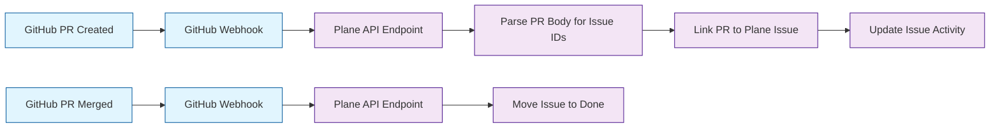
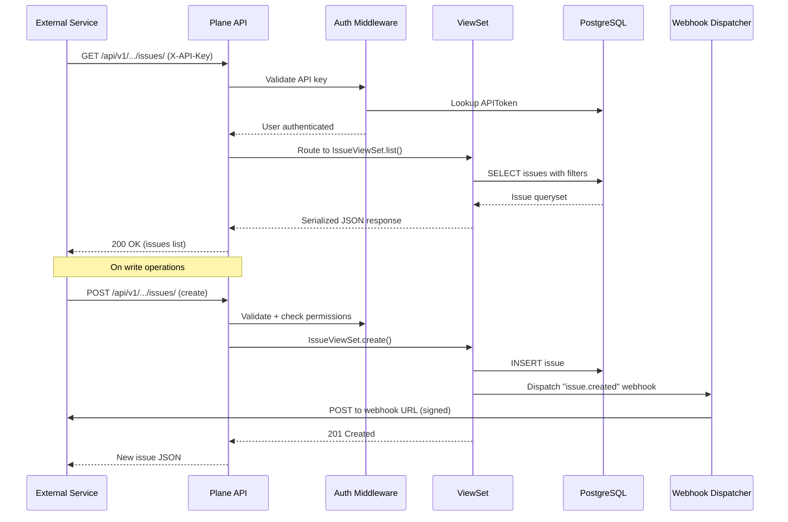

# Chapter 7: API and Integrations

Welcome to **Chapter 7** of the **Plane Tutorial**. This chapter covers Plane's REST API, webhook system, and built-in integrations with GitHub, Slack, and other external services.

> Connect Plane to your development workflow with REST APIs, webhooks, and service integrations.

## What Problem Does This Solve?

No project management tool operates in isolation. Teams need their PM tool to sync with GitHub (for PR-linked issues), Slack (for notifications), and custom internal tools. Plane provides a comprehensive REST API, outgoing webhooks, and pre-built integrations to connect your entire development workflow.

## REST API Overview

Plane exposes a RESTful API at `/api/v1/` that follows a consistent, hierarchical URL pattern:

```
/api/v1/workspaces/{slug}/
/api/v1/workspaces/{slug}/projects/
/api/v1/workspaces/{slug}/projects/{project_id}/issues/
/api/v1/workspaces/{slug}/projects/{project_id}/cycles/
/api/v1/workspaces/{slug}/projects/{project_id}/modules/
/api/v1/workspaces/{slug}/projects/{project_id}/pages/
```

### Authentication

Plane supports two authentication methods for API access:

```python
# apiserver/plane/middleware/api_authentication.py

from rest_framework.authentication import BaseAuthentication
from plane.db.models import APIToken


class APIKeyAuthentication(BaseAuthentication):
    """Authenticate using X-API-Key header."""

    def authenticate(self, request):
        api_key = request.headers.get("X-API-Key")
        if not api_key:
            return None

        try:
            token = APIToken.objects.select_related(
                "user", "workspace"
            ).get(token=api_key, is_active=True)
            return (token.user, token)
        except APIToken.DoesNotExist:
            return None


class SessionAuthentication(BaseAuthentication):
    """Authenticate using session cookies (for the web UI)."""
    pass  # Uses Django's default session auth
```

### API Token Model

```python
# apiserver/plane/db/models/api.py

class APIToken(BaseModel):
    token = models.CharField(max_length=255, unique=True)
    label = models.CharField(max_length=255)
    user = models.ForeignKey(
        "db.User",
        on_delete=models.CASCADE,
        related_name="api_tokens",
    )
    workspace = models.ForeignKey(
        "db.Workspace",
        on_delete=models.CASCADE,
        related_name="api_tokens",
    )
    is_active = models.BooleanField(default=True)
    last_used = models.DateTimeField(null=True, blank=True)
    expired_at = models.DateTimeField(null=True, blank=True)

    class Meta:
        ordering = ("-created_at",)
```

### Example: CRUD Operations via API

```bash
# List all issues in a project
curl -X GET \
  "https://plane.example.com/api/v1/workspaces/my-team/projects/{project_id}/issues/" \
  -H "X-API-Key: plane_api_xxxxxxxxxxxx" \
  -H "Content-Type: application/json"

# Create a new issue
curl -X POST \
  "https://plane.example.com/api/v1/workspaces/my-team/projects/{project_id}/issues/" \
  -H "X-API-Key: plane_api_xxxxxxxxxxxx" \
  -H "Content-Type: application/json" \
  -d '{
    "name": "Fix login timeout on mobile",
    "description_html": "<p>Users report session expires after 5 minutes on mobile browsers.</p>",
    "priority": "high",
    "state": "state-uuid-here",
    "assignees": ["user-uuid-here"],
    "labels": ["label-uuid-here"]
  }'

# Update an issue
curl -X PATCH \
  "https://plane.example.com/api/v1/workspaces/my-team/projects/{project_id}/issues/{issue_id}/" \
  -H "X-API-Key: plane_api_xxxxxxxxxxxx" \
  -H "Content-Type: application/json" \
  -d '{"priority": "urgent", "state": "in-progress-state-uuid"}'

# Delete an issue
curl -X DELETE \
  "https://plane.example.com/api/v1/workspaces/my-team/projects/{project_id}/issues/{issue_id}/" \
  -H "X-API-Key: plane_api_xxxxxxxxxxxx"
```

### Typed API Client (TypeScript)

```typescript
// Example: Custom TypeScript API client for Plane

interface PlaneClientConfig {
  baseUrl: string;
  apiKey: string;
}

class PlaneAPIClient {
  private baseUrl: string;
  private headers: Record<string, string>;

  constructor(config: PlaneClientConfig) {
    this.baseUrl = config.baseUrl;
    this.headers = {
      "X-API-Key": config.apiKey,
      "Content-Type": "application/json",
    };
  }

  async listIssues(
    workspaceSlug: string,
    projectId: string,
    params?: { state?: string; priority?: string; assignees?: string }
  ) {
    const query = new URLSearchParams(params || {}).toString();
    const url = `${this.baseUrl}/api/v1/workspaces/${workspaceSlug}/projects/${projectId}/issues/?${query}`;
    const res = await fetch(url, { headers: this.headers });
    return res.json();
  }

  async createIssue(
    workspaceSlug: string,
    projectId: string,
    data: {
      name: string;
      description_html?: string;
      priority?: string;
      state?: string;
      assignees?: string[];
      labels?: string[];
    }
  ) {
    const url = `${this.baseUrl}/api/v1/workspaces/${workspaceSlug}/projects/${projectId}/issues/`;
    const res = await fetch(url, {
      method: "POST",
      headers: this.headers,
      body: JSON.stringify(data),
    });
    return res.json();
  }

  async getIssue(
    workspaceSlug: string,
    projectId: string,
    issueId: string
  ) {
    const url = `${this.baseUrl}/api/v1/workspaces/${workspaceSlug}/projects/${projectId}/issues/${issueId}/`;
    const res = await fetch(url, { headers: this.headers });
    return res.json();
  }
}

// Usage
const plane = new PlaneAPIClient({
  baseUrl: "https://plane.example.com",
  apiKey: "plane_api_xxxxxxxxxxxx",
});

const issues = await plane.listIssues("my-team", "project-uuid");
```

## Webhooks

Plane supports outgoing webhooks that notify external services when events occur.

### Webhook Model

```python
# apiserver/plane/db/models/webhook.py

class Webhook(BaseModel):
    workspace = models.ForeignKey(
        "db.Workspace",
        on_delete=models.CASCADE,
        related_name="webhooks",
    )
    url = models.URLField()
    is_active = models.BooleanField(default=True)
    secret_key = models.CharField(max_length=255)

    # Event filters
    project = models.BooleanField(default=False)
    issue = models.BooleanField(default=False)
    module = models.BooleanField(default=False)
    cycle = models.BooleanField(default=False)
    issue_comment = models.BooleanField(default=False)

    class Meta:
        ordering = ("-created_at",)
```

### Webhook Dispatcher

```python
# apiserver/plane/bgtasks/webhook_task.py

import hashlib
import hmac
import json
import requests
from celery import shared_task
from plane.db.models import Webhook


@shared_task
def send_webhook(event, payload, workspace_id):
    """Dispatch webhook to all matching subscribers."""
    webhooks = Webhook.objects.filter(
        workspace_id=workspace_id,
        is_active=True,
    )

    # Filter by event type
    event_type = event.split(".")[0]  # e.g., "issue" from "issue.created"
    webhooks = webhooks.filter(**{event_type: True})

    for webhook in webhooks:
        body = json.dumps({
            "event": event,
            "payload": payload,
            "workspace_id": str(workspace_id),
        })

        # Sign the payload with HMAC
        signature = hmac.new(
            webhook.secret_key.encode(),
            body.encode(),
            hashlib.sha256,
        ).hexdigest()

        try:
            requests.post(
                webhook.url,
                data=body,
                headers={
                    "Content-Type": "application/json",
                    "X-Plane-Signature": signature,
                },
                timeout=10,
            )
        except requests.RequestException:
            pass  # Log failure, retry logic in production
```

### Webhook Payload Example

```json
{
  "event": "issue.created",
  "payload": {
    "id": "550e8400-e29b-41d4-a716-446655440000",
    "name": "Fix login timeout on mobile",
    "priority": "high",
    "state": {
      "id": "state-uuid",
      "name": "Todo",
      "group": "unstarted"
    },
    "assignees": [
      {"id": "user-uuid", "display_name": "Jane Doe"}
    ],
    "project": {
      "id": "project-uuid",
      "identifier": "PROJ"
    }
  },
  "workspace_id": "workspace-uuid"
}
```

## GitHub Integration

Plane syncs with GitHub to link pull requests to issues and auto-update issue states.



### GitHub Integration Model

```python
# apiserver/plane/db/models/integration.py

class Integration(BaseModel):
    PROVIDER_CHOICES = (
        ("github", "GitHub"),
        ("slack", "Slack"),
        ("gitlab", "GitLab"),
    )

    title = models.CharField(max_length=255)
    provider = models.CharField(
        max_length=50, choices=PROVIDER_CHOICES, unique=True
    )
    network = models.PositiveSmallIntegerField(default=1)
    description = models.TextField(blank=True)
    avatar_url = models.URLField(blank=True, null=True)
    redirect_url = models.URLField(blank=True, null=True)
    metadata = models.JSONField(default=dict)

    class Meta:
        ordering = ("title",)


class WorkspaceIntegration(BaseModel):
    workspace = models.ForeignKey(
        "db.Workspace",
        on_delete=models.CASCADE,
        related_name="workspace_integrations",
    )
    integration = models.ForeignKey(
        Integration,
        on_delete=models.CASCADE,
        related_name="workspace_integrations",
    )
    config = models.JSONField(default=dict)
    actor = models.ForeignKey(
        "db.User", on_delete=models.CASCADE, related_name="integrations"
    )

    class Meta:
        unique_together = ["workspace", "integration"]
```

## Slack Integration

Plane can send notifications to Slack channels when issues change:

```python
# apiserver/plane/bgtasks/slack_notification.py

from celery import shared_task
import requests


@shared_task
def send_slack_notification(
    webhook_url, issue_name, issue_url, event_type, actor_name
):
    """Send a formatted Slack notification for issue events."""
    color_map = {
        "created": "#16a34a",
        "updated": "#f59e0b",
        "completed": "#3b82f6",
        "deleted": "#ef4444",
    }

    payload = {
        "attachments": [
            {
                "color": color_map.get(event_type, "#6b7280"),
                "blocks": [
                    {
                        "type": "section",
                        "text": {
                            "type": "mrkdwn",
                            "text": (
                                f"*Issue {event_type}* by {actor_name}\n"
                                f"<{issue_url}|{issue_name}>"
                            ),
                        },
                    }
                ],
            }
        ]
    }

    requests.post(webhook_url, json=payload, timeout=10)
```

## How It Works Under the Hood



## Key Takeaways

- Plane's REST API follows a consistent hierarchical URL pattern scoped by workspace and project.
- Two auth methods: API keys (for external tools) and session cookies (for the web UI).
- Webhooks support event filtering by resource type and HMAC signature verification.
- GitHub integration links PRs to issues and can auto-transition issue states on merge.
- Slack integration sends formatted notifications for issue lifecycle events.
- All webhook dispatching runs asynchronously via Celery to keep the API responsive.

## Cross-References

- **Architecture:** [Chapter 2: System Architecture](02-system-architecture.md) for the full API layer design.
- **Issues:** [Chapter 3: Issue Tracking](03-issue-tracking.md) for issue CRUD details.
- **Deployment:** [Chapter 8: Self-Hosting and Deployment](08-self-hosting-and-deployment.md) for configuring integrations in production.

---

*Generated by [AI Codebase Knowledge Builder](https://github.com/The-Pocket/Tutorial-Codebase-Knowledge)*
