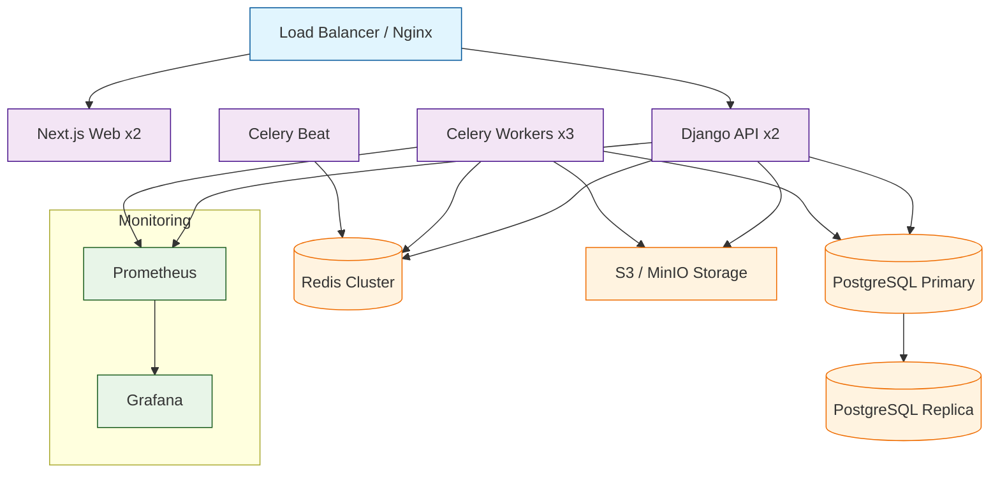
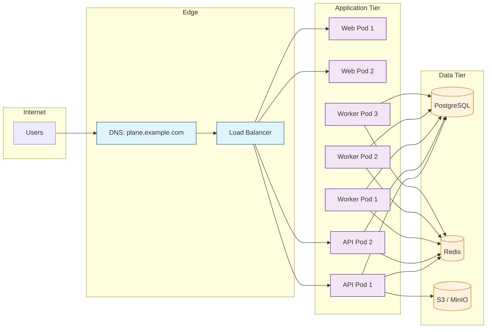

# Chapter 8: Self-Hosting and Deployment

Welcome to **Chapter 8** of the **Plane Tutorial**. This final chapter covers deploying Plane to production — from Docker Compose for small teams to Kubernetes for enterprise scale, including monitoring, backups, and security hardening.

> Deploy Plane to production with Docker, Kubernetes, and proper operational configuration.

## What Problem Does This Solve?

Running Plane locally is easy, but deploying it for a team of 50 or 500 requires careful consideration of high availability, data backups, SSL termination, resource limits, and monitoring. This chapter provides production-ready configurations for both Docker Compose and Kubernetes deployments.

## Production Architecture



## Docker Compose (Production)

For teams up to ~100 users, a single-server Docker Compose deployment works well.

### Production docker-compose.yml

```yaml
# docker-compose.prod.yml

version: "3.8"

services:
  web:
    image: makeplane/plane-frontend:stable
    restart: always
    environment:
      - NEXT_PUBLIC_API_BASE_URL=${API_BASE_URL}
    depends_on:
      - api
    deploy:
      resources:
        limits:
          memory: 1G
          cpus: "1.0"

  api:
    image: makeplane/plane-backend:stable
    restart: always
    environment:
      - DATABASE_URL=postgresql://${POSTGRES_USER}:${POSTGRES_PASSWORD}@db:5432/${POSTGRES_DB}
      - REDIS_URL=redis://redis:6379/
      - SECRET_KEY=${SECRET_KEY}
      - EMAIL_HOST=${EMAIL_HOST}
      - EMAIL_HOST_USER=${EMAIL_HOST_USER}
      - EMAIL_HOST_PASSWORD=${EMAIL_HOST_PASSWORD}
      - AWS_S3_ENDPOINT_URL=${AWS_S3_ENDPOINT_URL}
      - AWS_ACCESS_KEY_ID=${AWS_ACCESS_KEY_ID}
      - AWS_SECRET_ACCESS_KEY=${AWS_SECRET_ACCESS_KEY}
      - AWS_S3_BUCKET_NAME=${AWS_S3_BUCKET_NAME}
      - OPENAI_API_KEY=${OPENAI_API_KEY}
    depends_on:
      db:
        condition: service_healthy
      redis:
        condition: service_healthy
    deploy:
      resources:
        limits:
          memory: 2G
          cpus: "2.0"

  worker:
    image: makeplane/plane-backend:stable
    restart: always
    command: celery -A plane worker -l info --concurrency=4
    environment:
      - DATABASE_URL=postgresql://${POSTGRES_USER}:${POSTGRES_PASSWORD}@db:5432/${POSTGRES_DB}
      - REDIS_URL=redis://redis:6379/
      - SECRET_KEY=${SECRET_KEY}
    depends_on:
      - db
      - redis
    deploy:
      resources:
        limits:
          memory: 2G
          cpus: "2.0"

  beat:
    image: makeplane/plane-backend:stable
    restart: always
    command: celery -A plane beat -l info
    environment:
      - DATABASE_URL=postgresql://${POSTGRES_USER}:${POSTGRES_PASSWORD}@db:5432/${POSTGRES_DB}
      - REDIS_URL=redis://redis:6379/
    depends_on:
      - db
      - redis
    deploy:
      resources:
        limits:
          memory: 512M
          cpus: "0.5"

  db:
    image: postgres:15-alpine
    restart: always
    volumes:
      - postgres_data:/var/lib/postgresql/data
    environment:
      - POSTGRES_USER=${POSTGRES_USER}
      - POSTGRES_PASSWORD=${POSTGRES_PASSWORD}
      - POSTGRES_DB=${POSTGRES_DB}
    healthcheck:
      test: ["CMD-SHELL", "pg_isready -U ${POSTGRES_USER}"]
      interval: 10s
      timeout: 5s
      retries: 5
    deploy:
      resources:
        limits:
          memory: 2G
          cpus: "2.0"

  redis:
    image: redis:7-alpine
    restart: always
    volumes:
      - redis_data:/data
    command: redis-server --appendonly yes --maxmemory 512mb --maxmemory-policy allkeys-lru
    healthcheck:
      test: ["CMD", "redis-cli", "ping"]
      interval: 10s
      timeout: 5s
      retries: 5

  minio:
    image: minio/minio:latest
    restart: always
    command: server /data --console-address ":9001"
    volumes:
      - minio_data:/data
    environment:
      - MINIO_ROOT_USER=${AWS_ACCESS_KEY_ID}
      - MINIO_ROOT_PASSWORD=${AWS_SECRET_ACCESS_KEY}

  proxy:
    image: nginx:alpine
    restart: always
    ports:
      - "80:80"
      - "443:443"
    volumes:
      - ./nginx.conf:/etc/nginx/nginx.conf:ro
      - ./certs:/etc/nginx/certs:ro
    depends_on:
      - web
      - api

volumes:
  postgres_data:
  redis_data:
  minio_data:
```

### Nginx Configuration

```nginx
# nginx.conf

upstream web_backend {
    server web:3000;
}

upstream api_backend {
    server api:8000;
}

server {
    listen 80;
    server_name plane.example.com;
    return 301 https://$server_name$request_uri;
}

server {
    listen 443 ssl;
    server_name plane.example.com;

    ssl_certificate /etc/nginx/certs/fullchain.pem;
    ssl_certificate_key /etc/nginx/certs/privkey.pem;
    ssl_protocols TLSv1.2 TLSv1.3;

    client_max_body_size 50M;

    location / {
        proxy_pass http://web_backend;
        proxy_set_header Host $host;
        proxy_set_header X-Real-IP $remote_addr;
        proxy_set_header X-Forwarded-For $proxy_add_x_forwarded_for;
        proxy_set_header X-Forwarded-Proto $scheme;
    }

    location /api/ {
        proxy_pass http://api_backend;
        proxy_set_header Host $host;
        proxy_set_header X-Real-IP $remote_addr;
        proxy_set_header X-Forwarded-For $proxy_add_x_forwarded_for;
        proxy_set_header X-Forwarded-Proto $scheme;
    }

    location /uploads/ {
        proxy_pass http://minio:9000;
    }
}
```

### Production Environment Variables

```bash
# .env.production

# Security
SECRET_KEY=generate-a-64-character-random-string-here
CORS_ALLOWED_ORIGINS=https://plane.example.com

# Database
POSTGRES_USER=plane
POSTGRES_PASSWORD=a-strong-random-password
POSTGRES_DB=plane

# Application URLs
API_BASE_URL=https://plane.example.com/api
WEB_URL=https://plane.example.com

# Email (for invitations and notifications)
EMAIL_HOST=smtp.example.com
EMAIL_HOST_USER=plane@example.com
EMAIL_HOST_PASSWORD=email-password
EMAIL_PORT=587
EMAIL_USE_TLS=true
DEFAULT_FROM_EMAIL=plane@example.com

# Storage
AWS_S3_ENDPOINT_URL=http://minio:9000
AWS_ACCESS_KEY_ID=minioadmin
AWS_SECRET_ACCESS_KEY=minioadmin-secret
AWS_S3_BUCKET_NAME=plane-uploads

# AI (optional)
OPENAI_API_KEY=sk-...
AI_MODEL=gpt-4
```

## Kubernetes Deployment

For larger teams or organizations requiring high availability, deploy Plane on Kubernetes.

### Namespace and ConfigMap

```yaml
# k8s/namespace.yaml
apiVersion: v1
kind: Namespace
metadata:
  name: plane

---
# k8s/configmap.yaml
apiVersion: v1
kind: ConfigMap
metadata:
  name: plane-config
  namespace: plane
data:
  API_BASE_URL: "https://plane.example.com/api"
  WEB_URL: "https://plane.example.com"
  REDIS_URL: "redis://plane-redis:6379/"
  ENABLE_AI_FEATURES: "true"
```

### API Server Deployment

```yaml
# k8s/api-deployment.yaml
apiVersion: apps/v1
kind: Deployment
metadata:
  name: plane-api
  namespace: plane
spec:
  replicas: 2
  selector:
    matchLabels:
      app: plane-api
  template:
    metadata:
      labels:
        app: plane-api
    spec:
      containers:
        - name: api
          image: makeplane/plane-backend:stable
          ports:
            - containerPort: 8000
          envFrom:
            - configMapRef:
                name: plane-config
            - secretRef:
                name: plane-secrets
          resources:
            requests:
              memory: "512Mi"
              cpu: "500m"
            limits:
              memory: "2Gi"
              cpu: "2000m"
          readinessProbe:
            httpGet:
              path: /api/v1/health/
              port: 8000
            initialDelaySeconds: 15
            periodSeconds: 10
          livenessProbe:
            httpGet:
              path: /api/v1/health/
              port: 8000
            initialDelaySeconds: 30
            periodSeconds: 30
---
apiVersion: v1
kind: Service
metadata:
  name: plane-api
  namespace: plane
spec:
  selector:
    app: plane-api
  ports:
    - port: 8000
      targetPort: 8000
```

### Celery Worker Deployment

```yaml
# k8s/worker-deployment.yaml
apiVersion: apps/v1
kind: Deployment
metadata:
  name: plane-worker
  namespace: plane
spec:
  replicas: 3
  selector:
    matchLabels:
      app: plane-worker
  template:
    metadata:
      labels:
        app: plane-worker
    spec:
      containers:
        - name: worker
          image: makeplane/plane-backend:stable
          command:
            - celery
            - -A
            - plane
            - worker
            - -l
            - info
            - --concurrency=4
          envFrom:
            - configMapRef:
                name: plane-config
            - secretRef:
                name: plane-secrets
          resources:
            requests:
              memory: "512Mi"
              cpu: "500m"
            limits:
              memory: "2Gi"
              cpu: "2000m"
```

### Ingress

```yaml
# k8s/ingress.yaml
apiVersion: networking.k8s.io/v1
kind: Ingress
metadata:
  name: plane-ingress
  namespace: plane
  annotations:
    cert-manager.io/cluster-issuer: letsencrypt-prod
    nginx.ingress.kubernetes.io/proxy-body-size: "50m"
spec:
  tls:
    - hosts:
        - plane.example.com
      secretName: plane-tls
  rules:
    - host: plane.example.com
      http:
        paths:
          - path: /api
            pathType: Prefix
            backend:
              service:
                name: plane-api
                port:
                  number: 8000
          - path: /
            pathType: Prefix
            backend:
              service:
                name: plane-web
                port:
                  number: 3000
```

## Database Backups

```bash
#!/bin/bash
# scripts/backup.sh — Automated PostgreSQL backup

BACKUP_DIR="/backups/plane"
TIMESTAMP=$(date +%Y%m%d_%H%M%S)
BACKUP_FILE="${BACKUP_DIR}/plane_${TIMESTAMP}.sql.gz"

mkdir -p "$BACKUP_DIR"

# Dump and compress
docker compose exec -T db pg_dump \
  -U "$POSTGRES_USER" \
  -d "$POSTGRES_DB" \
  --format=custom \
  | gzip > "$BACKUP_FILE"

# Retain last 30 days
find "$BACKUP_DIR" -name "*.sql.gz" -mtime +30 -delete

echo "Backup saved: $BACKUP_FILE"
echo "Size: $(du -h "$BACKUP_FILE" | cut -f1)"
```

### Restore from Backup

```bash
# Restore a backup
gunzip -c /backups/plane/plane_20260321_020000.sql.gz \
  | docker compose exec -T db pg_restore \
    -U "$POSTGRES_USER" \
    -d "$POSTGRES_DB" \
    --clean \
    --if-exists
```

## Monitoring with Health Checks

### Django Health Endpoint

```python
# apiserver/plane/api/views/health.py

from rest_framework.views import APIView
from rest_framework.response import Response
from rest_framework.permissions import AllowAny
from django.db import connection
from django_redis import get_redis_connection


class HealthCheckView(APIView):
    permission_classes = [AllowAny]

    def get(self, request):
        health = {"status": "healthy", "checks": {}}

        # Database check
        try:
            with connection.cursor() as cursor:
                cursor.execute("SELECT 1")
            health["checks"]["database"] = "ok"
        except Exception as e:
            health["checks"]["database"] = str(e)
            health["status"] = "unhealthy"

        # Redis check
        try:
            redis_conn = get_redis_connection("default")
            redis_conn.ping()
            health["checks"]["redis"] = "ok"
        except Exception as e:
            health["checks"]["redis"] = str(e)
            health["status"] = "unhealthy"

        status_code = 200 if health["status"] == "healthy" else 503
        return Response(health, status=status_code)
```

## How It Works Under the Hood



## Security Hardening Checklist

| Area | Action |
|:-----|:-------|
| **Secrets** | Use a secrets manager; never commit `.env` files |
| **SSL/TLS** | Enforce HTTPS everywhere; use Let's Encrypt or internal CA |
| **Database** | Strong passwords, restrict network access, enable encryption at rest |
| **Redis** | Set `requirepass`, bind to internal network only |
| **API keys** | Rotate regularly, set expiration dates |
| **CORS** | Restrict to your domain only |
| **Rate limiting** | Configure DRF throttling for API endpoints |
| **Updates** | Pin image tags, test updates in staging first |

## Key Takeaways

- Docker Compose is sufficient for small-to-medium teams (up to ~100 users).
- Kubernetes provides horizontal scaling and high availability for larger deployments.
- Always run Nginx or a load balancer in front for SSL termination and routing.
- Automate PostgreSQL backups and test restores regularly.
- Health check endpoints enable proper load balancer and Kubernetes probe integration.
- Security hardening (secrets management, SSL, CORS, rate limiting) is essential for production.

## Cross-References

- **Getting started:** [Chapter 1: Getting Started](01-getting-started.md) for local development setup.
- **Architecture:** [Chapter 2: System Architecture](02-system-architecture.md) for understanding the services you are deploying.
- **API:** [Chapter 7: API and Integrations](07-api-and-integrations.md) for configuring integrations in production.

---

*Generated by [AI Codebase Knowledge Builder](https://github.com/The-Pocket/Tutorial-Codebase-Knowledge)*
