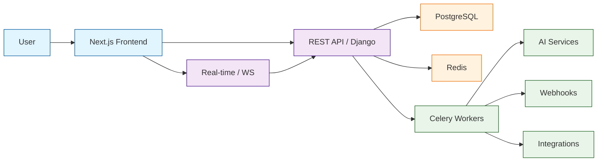

# Plane Tutorial: AI-Native Project Management

> Open-source AI-native project management that rivals Jira and Linear — with issues, cycles, modules, and wiki built in.

**Open-Source Project Management**

---

## Why This Track Matters

Plane is a fast-growing open-source alternative to Jira and Linear, designed from the ground up with AI-native capabilities. For teams building project management tools, studying Plane's architecture reveals how to structure a modern PM platform with Django, Next.js, and real-time collaboration. Its modular design — issues, cycles, modules, pages — provides a blueprint for building extensible workspace software.

This track focuses on:

- **Understand PM Architecture** — How a modern issue tracker is built with Django + Next.js
- **AI-Native Workflows** — How AI is woven into issue creation, triage, and planning
- **Self-Hosting Mastery** — Deploy and operate Plane on your own infrastructure
- **Integration Patterns** — Connect Plane with GitHub, Slack, and external services via REST APIs

## Current Snapshot (auto-updated)

- repository: [`makeplane/plane`](https://github.com/makeplane/plane)
- stars: about **48.2k**
- latest release: [`v1.3.0`](https://github.com/makeplane/plane/releases/tag/v1.3.0) (published 2026-04-06)

## Mental Model

## Chapter Guide

| # | Chapter | What You Will Learn |
|:--|:--------|:--------------------|
| 1 | [Getting Started](01-getting-started.md) | Setup, workspace creation, first project |
| 2 | [System Architecture](02-system-architecture.md) | Django backend, Next.js frontend, API structure |
| 3 | [Issue Tracking](03-issue-tracking.md) | Issues, labels, priorities, assignees, sub-issues |
| 4 | [Cycles and Modules](04-cycles-and-modules.md) | Sprint cycles, feature modules, roadmap planning |
| 5 | [AI Features](05-ai-features.md) | AI-powered issue creation, suggestions, automation |
| 6 | [Pages and Wiki](06-pages-and-wiki.md) | Built-in wiki, collaborative editing, documentation |
| 7 | [API and Integrations](07-api-and-integrations.md) | REST API, webhooks, GitHub/Slack integrations |
| 8 | [Self-Hosting and Deployment](08-self-hosting-and-deployment.md) | Docker, Kubernetes, production config |

## What You Will Learn

- **Set Up Plane** locally or on your own server with Docker
- **Navigate the Architecture** of a Django + Next.js full-stack PM tool
- **Create and Manage Issues** with priorities, labels, and sub-issues
- **Plan Sprints** using Cycles and organize features with Modules
- **Leverage AI** for issue creation, triage, and smart suggestions
- **Build a Knowledge Base** with Pages and collaborative wiki
- **Integrate External Tools** via REST API and webhooks
- **Deploy to Production** with Docker Compose and Kubernetes

## Prerequisites

- Docker and Docker Compose (for self-hosting)
- Python 3.11+ and Node.js 18+ (for development)
- Basic familiarity with Django and React/Next.js
- A PostgreSQL and Redis instance (or use the bundled Docker setup)

## Source References

- [Plane Repository](https://github.com/makeplane/plane)
- [Plane Documentation](https://docs.plane.so)
- [Awesome Code Docs](https://github.com/johnxie/awesome-code-docs)

## Related Tutorials

- [n8n AI Tutorial](../n8n-ai-tutorial/) — Workflow automation with AI-powered nodes
- [Taskade Tutorial](../taskade-tutorial/) — AI-native productivity and task management
- [Dify Tutorial](../dify-tutorial/) — Open-source LLM app development platform

## Navigation & Backlinks

- [Start Here: Chapter 1: Getting Started](01-getting-started.md)
- [Back to Main Catalog](../../README.md#-tutorial-catalog)
- [Browse A-Z Tutorial Directory](../../discoverability/tutorial-directory.md)
- [Search by Intent](../../discoverability/query-hub.md)
- [Explore Category Hubs](../../README.md#category-hubs)

## Full Chapter Map

1. [Chapter 1: Getting Started](01-getting-started.md)
2. [Chapter 2: System Architecture](02-system-architecture.md)
3. [Chapter 3: Issue Tracking](03-issue-tracking.md)
4. [Chapter 4: Cycles and Modules](04-cycles-and-modules.md)
5. [Chapter 5: AI Features](05-ai-features.md)
6. [Chapter 6: Pages and Wiki](06-pages-and-wiki.md)
7. [Chapter 7: API and Integrations](07-api-and-integrations.md)
8. [Chapter 8: Self-Hosting and Deployment](08-self-hosting-and-deployment.md)

---

*Generated by [AI Codebase Knowledge Builder](https://github.com/The-Pocket/Tutorial-Codebase-Knowledge)*
