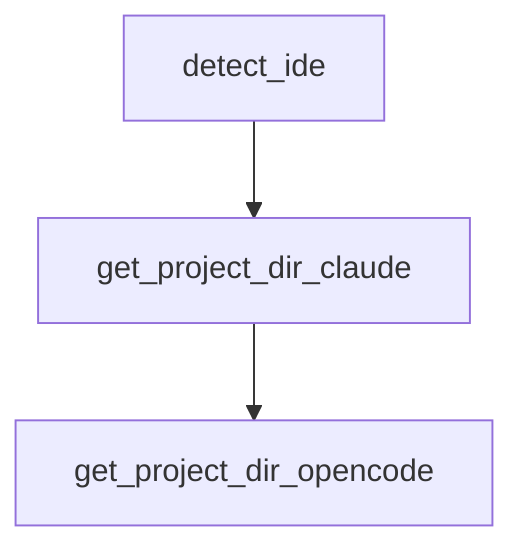

# Chapter 1: Getting Started

Welcome to **Chapter 1: Getting Started**. In this part of **Planning with Files Tutorial: Persistent Markdown Workflow Memory for AI Coding Agents**, you will build an intuitive mental model first, then move into concrete implementation details and practical production tradeoffs.


This chapter gets the skill installed and running in Claude Code quickly.

## Learning Goals

- install the plugin from marketplace
- run first planning command
- verify files are created in the correct project directory
- confirm baseline workflow is operational

## Quick Install

```bash
/plugin marketplace add OthmanAdi/planning-with-files
/plugin install planning-with-files@planning-with-files
```

## First Command

Use one of:

- `/planning-with-files:plan`
- `/planning-with-files:start`
- `/planning-with-files:status`

## Validation Checklist

- `task_plan.md` created
- `findings.md` created
- `progress.md` created
- hooks/updates behaving as expected

## Source References

- [README Quick Install](https://github.com/OthmanAdi/planning-with-files/blob/master/README.md#quick-install)
- [Quickstart Guide](https://github.com/OthmanAdi/planning-with-files/blob/master/docs/quickstart.md)

## Summary

You now have the baseline workflow installed and active.

Next: [Chapter 2: Core Philosophy and the 3-File Pattern](02-core-philosophy-and-the-3-file-pattern.md)

## Source Code Walkthrough

### `scripts/session-catchup.py`

The `detect_ide` function in [`scripts/session-catchup.py`](https://github.com/OthmanAdi/planning-with-files/blob/HEAD/scripts/session-catchup.py) handles a key part of this chapter's functionality:

```py


def detect_ide() -> str:
    """
    Detect which IDE is being used based on environment and file structure.
    Returns 'claude-code', 'opencode', or 'unknown'.
    """
    # Check for OpenCode environment
    if os.environ.get('OPENCODE_DATA_DIR'):
        return 'opencode'

    # Check for Claude Code directory
    claude_dir = Path.home() / '.claude'
    if claude_dir.exists():
        return 'claude-code'

    # Check for OpenCode directory
    opencode_dir = Path.home() / '.local' / 'share' / 'opencode'
    if opencode_dir.exists():
        return 'opencode'

    return 'unknown'


def get_project_dir_claude(project_path: str) -> Path:
    """Convert project path to Claude's storage path format."""
    sanitized = project_path.replace('/', '-')
    if not sanitized.startswith('-'):
        sanitized = '-' + sanitized
    sanitized = sanitized.replace('_', '-')
    return Path.home() / '.claude' / 'projects' / sanitized

```

This function is important because it defines how Planning with Files Tutorial: Persistent Markdown Workflow Memory for AI Coding Agents implements the patterns covered in this chapter.

### `scripts/session-catchup.py`

The `get_project_dir_claude` function in [`scripts/session-catchup.py`](https://github.com/OthmanAdi/planning-with-files/blob/HEAD/scripts/session-catchup.py) handles a key part of this chapter's functionality:

```py


def get_project_dir_claude(project_path: str) -> Path:
    """Convert project path to Claude's storage path format."""
    sanitized = project_path.replace('/', '-')
    if not sanitized.startswith('-'):
        sanitized = '-' + sanitized
    sanitized = sanitized.replace('_', '-')
    return Path.home() / '.claude' / 'projects' / sanitized


def get_project_dir_opencode(project_path: str) -> Optional[Path]:
    """
    Get OpenCode session storage directory.
    OpenCode uses: ~/.local/share/opencode/storage/session/{projectHash}/

    Note: OpenCode's structure is different - this function returns the storage root.
    Session discovery happens differently in OpenCode.
    """
    data_dir = os.environ.get('OPENCODE_DATA_DIR',
                               str(Path.home() / '.local' / 'share' / 'opencode'))
    storage_dir = Path(data_dir) / 'storage'

    if not storage_dir.exists():
        return None

    return storage_dir


def get_sessions_sorted(project_dir: Path) -> List[Path]:
    """Get all session files sorted by modification time (newest first)."""
    sessions = list(project_dir.glob('*.jsonl'))
```

This function is important because it defines how Planning with Files Tutorial: Persistent Markdown Workflow Memory for AI Coding Agents implements the patterns covered in this chapter.

### `scripts/session-catchup.py`

The `get_project_dir_opencode` function in [`scripts/session-catchup.py`](https://github.com/OthmanAdi/planning-with-files/blob/HEAD/scripts/session-catchup.py) handles a key part of this chapter's functionality:

```py


def get_project_dir_opencode(project_path: str) -> Optional[Path]:
    """
    Get OpenCode session storage directory.
    OpenCode uses: ~/.local/share/opencode/storage/session/{projectHash}/

    Note: OpenCode's structure is different - this function returns the storage root.
    Session discovery happens differently in OpenCode.
    """
    data_dir = os.environ.get('OPENCODE_DATA_DIR',
                               str(Path.home() / '.local' / 'share' / 'opencode'))
    storage_dir = Path(data_dir) / 'storage'

    if not storage_dir.exists():
        return None

    return storage_dir


def get_sessions_sorted(project_dir: Path) -> List[Path]:
    """Get all session files sorted by modification time (newest first)."""
    sessions = list(project_dir.glob('*.jsonl'))
    main_sessions = [s for s in sessions if not s.name.startswith('agent-')]
    return sorted(main_sessions, key=lambda p: p.stat().st_mtime, reverse=True)


def get_sessions_sorted_opencode(storage_dir: Path) -> List[Path]:
    """
    Get all OpenCode session files sorted by modification time.
    OpenCode stores sessions at: storage/session/{projectHash}/{sessionID}.json
    """
```

This function is important because it defines how Planning with Files Tutorial: Persistent Markdown Workflow Memory for AI Coding Agents implements the patterns covered in this chapter.


## How These Components Connect


