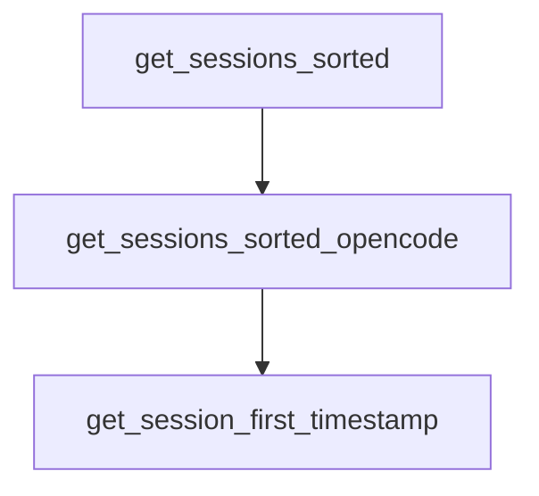

# Chapter 2: Core Philosophy and the 3-File Pattern

Welcome to **Chapter 2: Core Philosophy and the 3-File Pattern**. In this part of **Planning with Files Tutorial: Persistent Markdown Workflow Memory for AI Coding Agents**, you will build an intuitive mental model first, then move into concrete implementation details and practical production tradeoffs.


This chapter explains why durable file memory improves agent execution quality.

## Learning Goals

- understand volatile-context limitations in long tasks
- apply the 3-file model with clear ownership
- use markdown files as working memory, not just output logs
- avoid context stuffing and goal drift

## The 3-File Pattern

- `task_plan.md`: phases, checkpoints, and completion criteria
- `findings.md`: research results and key discoveries
- `progress.md`: chronological execution log and outcomes

## Core Principle

Treat context as RAM and files as disk: anything important must be persisted.

## Source References

- [README The Solution: 3-File Pattern](https://github.com/OthmanAdi/planning-with-files/blob/master/README.md#the-solution-3-file-pattern)
- [Workflow Guide](https://github.com/OthmanAdi/planning-with-files/blob/master/docs/workflow.md)
- [SKILL.md Core Pattern](https://github.com/OthmanAdi/planning-with-files/blob/master/skills/planning-with-files/SKILL.md)

## Summary

You now understand the planning model that keeps long-running tasks stable.

Next: [Chapter 3: Installation Paths Across IDEs and Agents](03-installation-paths-across-ides-and-agents.md)

## Source Code Walkthrough

### `scripts/session-catchup.py`

The `get_sessions_sorted` function in [`scripts/session-catchup.py`](https://github.com/OthmanAdi/planning-with-files/blob/HEAD/scripts/session-catchup.py) handles a key part of this chapter's functionality:

```py


def get_sessions_sorted(project_dir: Path) -> List[Path]:
    """Get all session files sorted by modification time (newest first)."""
    sessions = list(project_dir.glob('*.jsonl'))
    main_sessions = [s for s in sessions if not s.name.startswith('agent-')]
    return sorted(main_sessions, key=lambda p: p.stat().st_mtime, reverse=True)


def get_sessions_sorted_opencode(storage_dir: Path) -> List[Path]:
    """
    Get all OpenCode session files sorted by modification time.
    OpenCode stores sessions at: storage/session/{projectHash}/{sessionID}.json
    """
    session_dir = storage_dir / 'session'
    if not session_dir.exists():
        return []

    sessions = []
    for project_hash_dir in session_dir.iterdir():
        if project_hash_dir.is_dir():
            for session_file in project_hash_dir.glob('*.json'):
                sessions.append(session_file)

    return sorted(sessions, key=lambda p: p.stat().st_mtime, reverse=True)


def get_session_first_timestamp(session_file: Path) -> Optional[str]:
    """Get the timestamp of the first message in a session."""
    try:
        with open(session_file, 'r') as f:
            for line in f:
```

This function is important because it defines how Planning with Files Tutorial: Persistent Markdown Workflow Memory for AI Coding Agents implements the patterns covered in this chapter.

### `scripts/session-catchup.py`

The `get_sessions_sorted_opencode` function in [`scripts/session-catchup.py`](https://github.com/OthmanAdi/planning-with-files/blob/HEAD/scripts/session-catchup.py) handles a key part of this chapter's functionality:

```py


def get_sessions_sorted_opencode(storage_dir: Path) -> List[Path]:
    """
    Get all OpenCode session files sorted by modification time.
    OpenCode stores sessions at: storage/session/{projectHash}/{sessionID}.json
    """
    session_dir = storage_dir / 'session'
    if not session_dir.exists():
        return []

    sessions = []
    for project_hash_dir in session_dir.iterdir():
        if project_hash_dir.is_dir():
            for session_file in project_hash_dir.glob('*.json'):
                sessions.append(session_file)

    return sorted(sessions, key=lambda p: p.stat().st_mtime, reverse=True)


def get_session_first_timestamp(session_file: Path) -> Optional[str]:
    """Get the timestamp of the first message in a session."""
    try:
        with open(session_file, 'r') as f:
            for line in f:
                try:
                    data = json.loads(line)
                    ts = data.get('timestamp')
                    if ts:
                        return ts
                except:
                    continue
```

This function is important because it defines how Planning with Files Tutorial: Persistent Markdown Workflow Memory for AI Coding Agents implements the patterns covered in this chapter.

### `scripts/session-catchup.py`

The `get_session_first_timestamp` function in [`scripts/session-catchup.py`](https://github.com/OthmanAdi/planning-with-files/blob/HEAD/scripts/session-catchup.py) handles a key part of this chapter's functionality:

```py


def get_session_first_timestamp(session_file: Path) -> Optional[str]:
    """Get the timestamp of the first message in a session."""
    try:
        with open(session_file, 'r') as f:
            for line in f:
                try:
                    data = json.loads(line)
                    ts = data.get('timestamp')
                    if ts:
                        return ts
                except:
                    continue
    except:
        pass
    return None


def scan_for_planning_update(session_file: Path) -> Tuple[int, Optional[str]]:
    """
    Quickly scan a session file for planning file updates.
    Returns (line_number, filename) of last update, or (-1, None) if none found.
    """
    last_update_line = -1
    last_update_file = None

    try:
        with open(session_file, 'r') as f:
            for line_num, line in enumerate(f):
                if '"Write"' not in line and '"Edit"' not in line:
                    continue
```

This function is important because it defines how Planning with Files Tutorial: Persistent Markdown Workflow Memory for AI Coding Agents implements the patterns covered in this chapter.


## How These Components Connect


