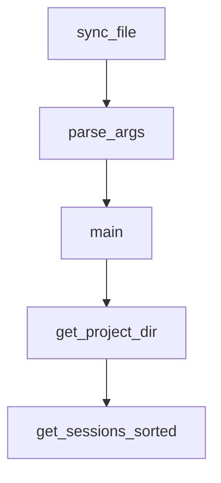

# Chapter 2: Core Philosophy and the 3-File Pattern

Welcome to **Chapter 2: Core Philosophy and the 3-File Pattern**. In this part of **Planning with Files Tutorial: Persistent Markdown Workflow Memory for AI Coding Agents**, you will build an intuitive mental model first, then move into concrete implementation details and practical production tradeoffs.


This chapter explains why durable file memory improves agent execution quality.

## Learning Goals

- understand volatile-context limitations in long tasks
- apply the 3-file model with clear ownership
- use markdown files as working memory, not just output logs
- avoid context stuffing and goal drift

## The 3-File Pattern

- `task_plan.md`: phases, checkpoints, and completion criteria
- `findings.md`: research results and key discoveries
- `progress.md`: chronological execution log and outcomes

## Core Principle

Treat context as RAM and files as disk: anything important must be persisted.

## Source References

- [README The Solution: 3-File Pattern](https://github.com/OthmanAdi/planning-with-files/blob/master/README.md#the-solution-3-file-pattern)
- [Workflow Guide](https://github.com/OthmanAdi/planning-with-files/blob/master/docs/workflow.md)
- [SKILL.md Core Pattern](https://github.com/OthmanAdi/planning-with-files/blob/master/skills/planning-with-files/SKILL.md)

## Summary

You now understand the planning model that keeps long-running tasks stable.

Next: [Chapter 3: Installation Paths Across IDEs and Agents](03-installation-paths-across-ides-and-agents.md)

## Depth Expansion Playbook

## Source Code Walkthrough

### `scripts/sync-ide-folders.py`

The `sync_file` function in [`scripts/sync-ide-folders.py`](https://github.com/OthmanAdi/planning-with-files/blob/HEAD/scripts/sync-ide-folders.py) handles a key part of this chapter's functionality:

```py


def sync_file(src, dst, *, dry_run=False):
    """Copy src to dst. Returns (action, detail) tuple.

    Actions: "updated", "created", "skipped" (already identical), "missing_src"
    """
    if not src.exists():
        return "missing_src", f"Canonical file not found: {src}"

    src_hash = file_hash(src)
    dst_hash = file_hash(dst)

    if src_hash == dst_hash:
        return "skipped", "Already up to date"

    action = "created" if dst_hash is None else "updated"

    if not dry_run:
        dst.parent.mkdir(parents=True, exist_ok=True)
        shutil.copy2(src, dst)

    return action, f"{'Would ' if dry_run else ''}{action}: {dst}"


# ─── Main ──────────────────────────────────────────────────────────

def parse_args(argv=None):
    """Parse CLI arguments for sync behavior."""
    parser = argparse.ArgumentParser(
        description=(
            "Sync shared planning-with-files assets from canonical source "
```

This function is important because it defines how Planning with Files Tutorial: Persistent Markdown Workflow Memory for AI Coding Agents implements the patterns covered in this chapter.

### `scripts/sync-ide-folders.py`

The `parse_args` function in [`scripts/sync-ide-folders.py`](https://github.com/OthmanAdi/planning-with-files/blob/HEAD/scripts/sync-ide-folders.py) handles a key part of this chapter's functionality:

```py
# ─── Main ──────────────────────────────────────────────────────────

def parse_args(argv=None):
    """Parse CLI arguments for sync behavior."""
    parser = argparse.ArgumentParser(
        description=(
            "Sync shared planning-with-files assets from canonical source "
            "to IDE-specific folders."
        )
    )
    parser.add_argument(
        "--dry-run",
        action="store_true",
        help="Preview changes without writing files.",
    )
    parser.add_argument(
        "--verify",
        action="store_true",
        help="Check for drift only; exit with code 1 if drift is found.",
    )
    return parser.parse_args(argv)


def main(argv=None):
    args = parse_args(argv)
    dry_run = args.dry_run
    verify = args.verify

    # Must run from repo root
    if not CANONICAL.exists():
        print(f"Error: Canonical source not found at {CANONICAL}/")
        print("Run this script from the repo root.")
```

This function is important because it defines how Planning with Files Tutorial: Persistent Markdown Workflow Memory for AI Coding Agents implements the patterns covered in this chapter.

### `scripts/sync-ide-folders.py`

The `main` function in [`scripts/sync-ide-folders.py`](https://github.com/OthmanAdi/planning-with-files/blob/HEAD/scripts/sync-ide-folders.py) handles a key part of this chapter's functionality:

```py
    ),

    # Kiro: maintained under .kiro/ (skill + wrappers); not synced from canonical scripts/.
    ".kiro": {},
}


# ─── Utility functions ─────────────────────────────────────────────

def file_hash(path):
    """Return SHA-256 hash of a file, or None if it doesn't exist."""
    try:
        return hashlib.sha256(Path(path).read_bytes()).hexdigest()
    except FileNotFoundError:
        return None


def sync_file(src, dst, *, dry_run=False):
    """Copy src to dst. Returns (action, detail) tuple.

    Actions: "updated", "created", "skipped" (already identical), "missing_src"
    """
    if not src.exists():
        return "missing_src", f"Canonical file not found: {src}"

    src_hash = file_hash(src)
    dst_hash = file_hash(dst)

    if src_hash == dst_hash:
        return "skipped", "Already up to date"

    action = "created" if dst_hash is None else "updated"
```

This function is important because it defines how Planning with Files Tutorial: Persistent Markdown Workflow Memory for AI Coding Agents implements the patterns covered in this chapter.

### `.opencode/skills/planning-with-files/scripts/session-catchup.py`

The `get_project_dir` function in [`.opencode/skills/planning-with-files/scripts/session-catchup.py`](https://github.com/OthmanAdi/planning-with-files/blob/HEAD/.opencode/skills/planning-with-files/scripts/session-catchup.py) handles a key part of this chapter's functionality:

```py


def get_project_dir(project_path: str) -> Path:
    """Convert project path to OpenCode's storage path format."""
    # Normalize to an absolute path to ensure a stable representation
    # .as_posix() handles '\' -> '/' conversion on Windows automatically
    resolved_str = Path(project_path).resolve().as_posix()
    
    # Sanitize path: replace separators with '-', remove ':' (Windows drives)
    sanitized = resolved_str.replace('/', '-').replace(':', '')

    # Apply legacy naming convention: leading '-' and '_' -> '-'
    if not sanitized.startswith('-'):
        sanitized = '-' + sanitized
    sanitized_name = sanitized.replace('_', '-')

    # 1. Check Legacy Location first (~/.opencode/sessions/...)
    legacy_dir = Path.home() / '.opencode' / 'sessions' / sanitized_name
    if legacy_dir.is_dir():
        return legacy_dir

    # 2. Standard Layout
    data_root_env = os.getenv('OPENCODE_DATA_DIR')
    if data_root_env:
        data_root = Path(data_root_env)
    else:
        # Respect XDG_DATA_HOME if set, otherwise use default
        xdg_root = os.getenv('XDG_DATA_HOME')
        if xdg_root:
            data_root = Path(xdg_root) / 'opencode' / 'storage'
        else:
            data_root = Path.home() / '.local' / 'share' / 'opencode' / 'storage'
```

This function is important because it defines how Planning with Files Tutorial: Persistent Markdown Workflow Memory for AI Coding Agents implements the patterns covered in this chapter.


## How These Components Connect


