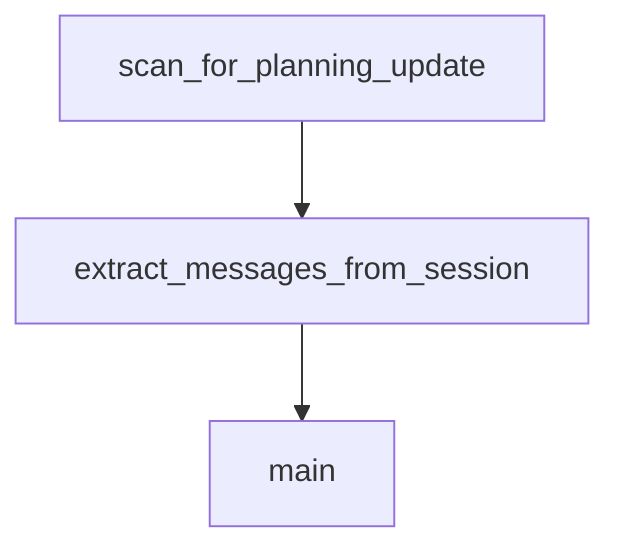

# Chapter 3: Installation Paths Across IDEs and Agents

Welcome to **Chapter 3: Installation Paths Across IDEs and Agents**. In this part of **Planning with Files Tutorial: Persistent Markdown Workflow Memory for AI Coding Agents**, you will build an intuitive mental model first, then move into concrete implementation details and practical production tradeoffs.


This chapter compares setup options across supported environments.

## Learning Goals

- choose plugin vs manual install paths correctly
- understand path conventions for different IDEs
- verify installation quickly in each environment
- avoid stale-cache and path mismatch issues

## Supported Surfaces

The repo provides setup guides for Claude Code, Codex, OpenCode, Gemini CLI, Cursor, and others.

## Installation Strategy

- use plugin install where supported for fastest baseline
- use manual/workspace installs when sharing team-local skills
- keep skill path conventions documented per runtime

## Source References

- [Installation Guide](https://github.com/OthmanAdi/planning-with-files/blob/master/docs/installation.md)
- [Codex Setup](https://github.com/OthmanAdi/planning-with-files/blob/master/docs/codex.md)
- [OpenCode Setup](https://github.com/OthmanAdi/planning-with-files/blob/master/docs/opencode.md)
- [Gemini Setup](https://github.com/OthmanAdi/planning-with-files/blob/master/docs/gemini.md)

## Summary

You now have a clear multi-environment installation model.

Next: [Chapter 4: Commands, Hooks, and Workflow Orchestration](04-commands-hooks-and-workflow-orchestration.md)

## Source Code Walkthrough

### `scripts/session-catchup.py`

The `scan_for_planning_update` function in [`scripts/session-catchup.py`](https://github.com/OthmanAdi/planning-with-files/blob/HEAD/scripts/session-catchup.py) handles a key part of this chapter's functionality:

```py


def scan_for_planning_update(session_file: Path) -> Tuple[int, Optional[str]]:
    """
    Quickly scan a session file for planning file updates.
    Returns (line_number, filename) of last update, or (-1, None) if none found.
    """
    last_update_line = -1
    last_update_file = None

    try:
        with open(session_file, 'r') as f:
            for line_num, line in enumerate(f):
                if '"Write"' not in line and '"Edit"' not in line:
                    continue

                try:
                    data = json.loads(line)
                    if data.get('type') != 'assistant':
                        continue

                    content = data.get('message', {}).get('content', [])
                    if not isinstance(content, list):
                        continue

                    for item in content:
                        if item.get('type') != 'tool_use':
                            continue
                        tool_name = item.get('name', '')
                        if tool_name not in ('Write', 'Edit'):
                            continue

```

This function is important because it defines how Planning with Files Tutorial: Persistent Markdown Workflow Memory for AI Coding Agents implements the patterns covered in this chapter.

### `scripts/session-catchup.py`

The `extract_messages_from_session` function in [`scripts/session-catchup.py`](https://github.com/OthmanAdi/planning-with-files/blob/HEAD/scripts/session-catchup.py) handles a key part of this chapter's functionality:

```py


def extract_messages_from_session(session_file: Path, after_line: int = -1) -> List[Dict]:
    """
    Extract conversation messages from a session file.
    If after_line >= 0, only extract messages after that line.
    If after_line < 0, extract all messages.
    """
    result = []

    try:
        with open(session_file, 'r') as f:
            for line_num, line in enumerate(f):
                if after_line >= 0 and line_num <= after_line:
                    continue

                try:
                    msg = json.loads(line)
                except json.JSONDecodeError:
                    continue

                msg_type = msg.get('type')
                is_meta = msg.get('isMeta', False)

                if msg_type == 'user' and not is_meta:
                    content = msg.get('message', {}).get('content', '')
                    if isinstance(content, list):
                        for item in content:
                            if isinstance(item, dict) and item.get('type') == 'text':
                                content = item.get('text', '')
                                break
                        else:
```

This function is important because it defines how Planning with Files Tutorial: Persistent Markdown Workflow Memory for AI Coding Agents implements the patterns covered in this chapter.

### `scripts/session-catchup.py`

The `main` function in [`scripts/session-catchup.py`](https://github.com/OthmanAdi/planning-with-files/blob/HEAD/scripts/session-catchup.py) handles a key part of this chapter's functionality:

```py
    """Get all session files sorted by modification time (newest first)."""
    sessions = list(project_dir.glob('*.jsonl'))
    main_sessions = [s for s in sessions if not s.name.startswith('agent-')]
    return sorted(main_sessions, key=lambda p: p.stat().st_mtime, reverse=True)


def get_sessions_sorted_opencode(storage_dir: Path) -> List[Path]:
    """
    Get all OpenCode session files sorted by modification time.
    OpenCode stores sessions at: storage/session/{projectHash}/{sessionID}.json
    """
    session_dir = storage_dir / 'session'
    if not session_dir.exists():
        return []

    sessions = []
    for project_hash_dir in session_dir.iterdir():
        if project_hash_dir.is_dir():
            for session_file in project_hash_dir.glob('*.json'):
                sessions.append(session_file)

    return sorted(sessions, key=lambda p: p.stat().st_mtime, reverse=True)


def get_session_first_timestamp(session_file: Path) -> Optional[str]:
    """Get the timestamp of the first message in a session."""
    try:
        with open(session_file, 'r') as f:
            for line in f:
                try:
                    data = json.loads(line)
                    ts = data.get('timestamp')
```

This function is important because it defines how Planning with Files Tutorial: Persistent Markdown Workflow Memory for AI Coding Agents implements the patterns covered in this chapter.


## How These Components Connect


