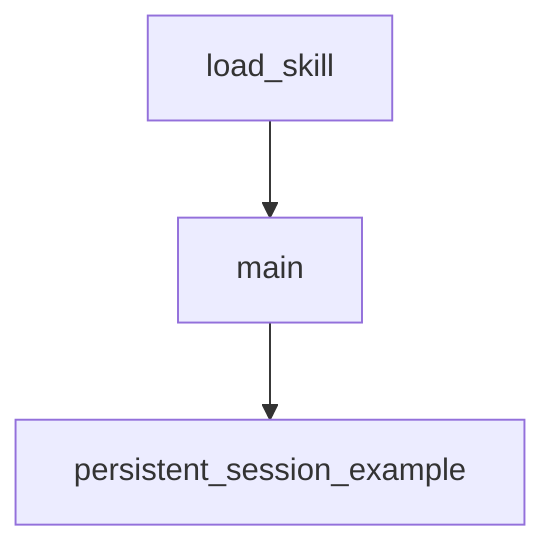

# Chapter 4: Commands, Hooks, and Workflow Orchestration

Welcome to **Chapter 4: Commands, Hooks, and Workflow Orchestration**. In this part of **Planning with Files Tutorial: Persistent Markdown Workflow Memory for AI Coding Agents**, you will build an intuitive mental model first, then move into concrete implementation details and practical production tradeoffs.


This chapter explains how command entrypoints and hooks enforce planning discipline.

## Learning Goals

- use commands for consistent task entry and status checks
- understand hook responsibilities during execution lifecycle
- apply the 2-action rule and completion checks correctly
- reduce skipped-update and missed-error behavior

## Command Surface

- `plan`: initialize or continue planning session
- `status`: quick planning progress snapshot
- `start`: original entrypoint alias

## Hook Functions

- remind on stale planning updates
- re-read plan before major actions
- verify completion before stop

## Source References

- [Commands Directory](https://github.com/OthmanAdi/planning-with-files/tree/master/commands)
- [Workflow Guide](https://github.com/OthmanAdi/planning-with-files/blob/master/docs/workflow.md)
- [README Usage Section](https://github.com/OthmanAdi/planning-with-files/blob/master/README.md#usage)

## Summary

You now know how orchestration components enforce workflow consistency.

Next: [Chapter 5: Templates, Scripts, and Session Recovery](05-templates-scripts-and-session-recovery.md)

## Source Code Walkthrough

### `examples/boxlite/quickstart.py`

The `load_skill` function in [`examples/boxlite/quickstart.py`](https://github.com/OthmanAdi/planning-with-files/blob/HEAD/examples/boxlite/quickstart.py) handles a key part of this chapter's functionality:

```py


def load_skill() -> Skill:
    """
    Build a ClaudeBox Skill from the planning-with-files SKILL.md.

    Reads the SKILL.md from your local Claude Code skills directory.
    If not installed locally, falls back to fetching from the repo.
    """
    skill_base = Path.home() / ".claude" / "skills" / "planning-with-files"
    skill_md_path = skill_base / "SKILL.md"
    check_complete_path = skill_base / "scripts" / "check-complete.sh"

    if not skill_md_path.exists():
        raise FileNotFoundError(
            "planning-with-files is not installed locally.\n"
            "Install it first:\n"
            "  /plugin marketplace add OthmanAdi/planning-with-files\n"
            "  /plugin install planning-with-files@planning-with-files"
        )

    files = {
        "/root/.claude/skills/planning-with-files/SKILL.md": skill_md_path.read_text(),
    }

    # Include the stop hook script if available
    if check_complete_path.exists():
        files["/root/.claude/skills/planning-with-files/scripts/check-complete.sh"] = (
            check_complete_path.read_text()
        )

    return Skill(
```

This function is important because it defines how Planning with Files Tutorial: Persistent Markdown Workflow Memory for AI Coding Agents implements the patterns covered in this chapter.

### `examples/boxlite/quickstart.py`

The `main` function in [`examples/boxlite/quickstart.py`](https://github.com/OthmanAdi/planning-with-files/blob/HEAD/examples/boxlite/quickstart.py) handles a key part of this chapter's functionality:

```py


async def main():
    skill = load_skill()

    print("Starting BoxLite VM with planning-with-files skill...")

    async with ClaudeBox(
        session_id="planning-demo",
        skills=[skill],
    ) as box:
        print("VM running. Invoking planning session...\n")

        result = await box.code(
            "/planning-with-files:plan\n\n"
            "Task: Build a REST API endpoint for user authentication with JWT tokens. "
            "Plan the implementation phases, identify the key files to create, "
            "and list the dependencies needed."
        )

        print("=== Claude Code Output ===")
        print(result.response)
        print("==========================")

        # Show what planning files were created inside the VM
        files_result = await box.code(
            "ls -la task_plan.md findings.md progress.md 2>/dev/null && "
            "echo '---' && head -20 task_plan.md 2>/dev/null"
        )
        print("\n=== Planning Files in VM ===")
        print(files_result.response)

```

This function is important because it defines how Planning with Files Tutorial: Persistent Markdown Workflow Memory for AI Coding Agents implements the patterns covered in this chapter.

### `examples/boxlite/quickstart.py`

The `persistent_session_example` function in [`examples/boxlite/quickstart.py`](https://github.com/OthmanAdi/planning-with-files/blob/HEAD/examples/boxlite/quickstart.py) handles a key part of this chapter's functionality:

```py


async def persistent_session_example():
    """
    Example of a multi-session workflow.
    Session 1 creates the plan. Session 2 continues from it.
    """
    skill = load_skill()

    # Session 1
    async with ClaudeBox(session_id="multi-session-demo", skills=[skill]) as box:
        await box.code(
            "/planning-with-files:plan\n\n"
            "Task: Refactor the user service to support multi-tenancy."
        )
        print("Session 1 complete. Plan created inside VM.")

    # Session 2 — same workspace, plan files intact
    async with ClaudeBox.reconnect("multi-session-demo") as box:
        result = await box.code(
            "Read task_plan.md and continue with the next incomplete phase."
        )
        print("Session 2:", result.response[:200])

    # Clean up
    await ClaudeBox.cleanup_session("multi-session-demo", remove_workspace=True)
    print("Workspace cleaned up.")


if __name__ == "__main__":
    asyncio.run(main())

```

This function is important because it defines how Planning with Files Tutorial: Persistent Markdown Workflow Memory for AI Coding Agents implements the patterns covered in this chapter.


## How These Components Connect


