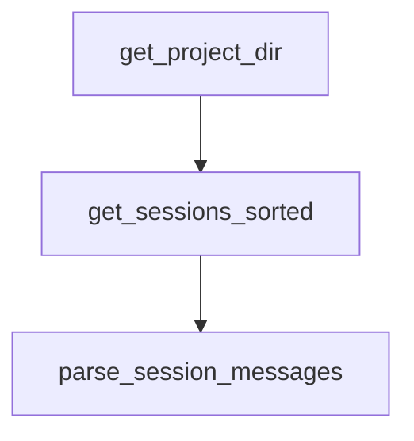

# Chapter 5: Templates, Scripts, and Session Recovery

Welcome to **Chapter 5: Templates, Scripts, and Session Recovery**. In this part of **Planning with Files Tutorial: Persistent Markdown Workflow Memory for AI Coding Agents**, you will build an intuitive mental model first, then move into concrete implementation details and practical production tradeoffs.


This chapter focuses on recovery and repeatability assets.

## Learning Goals

- use template files to standardize planning outputs
- run helper scripts for session initialization and checks
- understand automatic session-recovery behavior after `/clear`
- reduce context-loss disruption in long tasks

## Key Assets

- templates: `task_plan.md`, `findings.md`, `progress.md`
- scripts: init-session, completion checks, catchup utilities
- recovery logic: resume based on recent planning file activity

## Recovery Habit

Before resuming work, run status and catchup checks, then reconcile plan and progress files.

## Source References

- [README Session Recovery](https://github.com/OthmanAdi/planning-with-files/blob/master/README.md#session-recovery)
- [Templates Directory](https://github.com/OthmanAdi/planning-with-files/tree/master/templates)
- [Scripts Directory](https://github.com/OthmanAdi/planning-with-files/tree/master/skills/planning-with-files/scripts)

## Summary

You now have a resilience toolkit for context resets and interrupted sessions.

Next: [Chapter 6: Multi-IDE Adaptation (Codex, Gemini, OpenCode, Cursor)](06-multi-ide-adaptation-codex-gemini-opencode-cursor.md)

## Source Code Walkthrough

### `skills/planning-with-files-zht/scripts/session-catchup.py`

The `get_project_dir` function in [`skills/planning-with-files-zht/scripts/session-catchup.py`](https://github.com/OthmanAdi/planning-with-files/blob/HEAD/skills/planning-with-files-zht/scripts/session-catchup.py) handles a key part of this chapter's functionality:

```py


def get_project_dir(project_path: str) -> Tuple[Optional[Path], Optional[str]]:
    """解析目前執行環境的會話儲存路徑。"""
    sanitized = project_path.replace('/', '-')
    if not sanitized.startswith('-'):
        sanitized = '-' + sanitized
    sanitized = sanitized.replace('_', '-')

    claude_path = Path.home() / '.claude' / 'projects' / sanitized

    # Codex 將會話存放在 ~/.codex/sessions，格式不同。
    # 從 Codex 技能資料夾執行時，避免靜默掃描 Claude 路徑。
    script_path = Path(__file__).as_posix().lower()
    is_codex_variant = '/.codex/' in script_path
    codex_sessions_dir = Path.home() / '.codex' / 'sessions'
    if is_codex_variant and codex_sessions_dir.exists() and not claude_path.exists():
        return None, (
            "[planning-with-files] 會話恢復已跳過：Codex 將會話存放在 "
            "~/.codex/sessions，原生 Codex 解析尚未實作。"
        )

    return claude_path, None


def get_sessions_sorted(project_dir: Path) -> List[Path]:
    """取得所有會話檔案，按修改時間排序（最新優先）。"""
    sessions = list(project_dir.glob('*.jsonl'))
    main_sessions = [s for s in sessions if not s.name.startswith('agent-')]
    return sorted(main_sessions, key=lambda p: p.stat().st_mtime, reverse=True)


```

This function is important because it defines how Planning with Files Tutorial: Persistent Markdown Workflow Memory for AI Coding Agents implements the patterns covered in this chapter.

### `skills/planning-with-files-zht/scripts/session-catchup.py`

The `get_sessions_sorted` function in [`skills/planning-with-files-zht/scripts/session-catchup.py`](https://github.com/OthmanAdi/planning-with-files/blob/HEAD/skills/planning-with-files-zht/scripts/session-catchup.py) handles a key part of this chapter's functionality:

```py


def get_sessions_sorted(project_dir: Path) -> List[Path]:
    """取得所有會話檔案，按修改時間排序（最新優先）。"""
    sessions = list(project_dir.glob('*.jsonl'))
    main_sessions = [s for s in sessions if not s.name.startswith('agent-')]
    return sorted(main_sessions, key=lambda p: p.stat().st_mtime, reverse=True)


def parse_session_messages(session_file: Path) -> List[Dict]:
    """解析會話檔案中的所有訊息，保持順序。"""
    messages = []
    with open(session_file, 'r') as f:
        for line_num, line in enumerate(f):
            try:
                data = json.loads(line)
                data['_line_num'] = line_num
                messages.append(data)
            except json.JSONDecodeError:
                pass
    return messages


def find_last_planning_update(messages: List[Dict]) -> Tuple[int, Optional[str]]:
    """
    找出最後一次寫入/編輯規劃檔案的時間點。
    回傳 (行號, 檔案名稱) 或 (-1, None)（如果未找到）。
    """
    last_update_line = -1
    last_update_file = None

    for msg in messages:
```

This function is important because it defines how Planning with Files Tutorial: Persistent Markdown Workflow Memory for AI Coding Agents implements the patterns covered in this chapter.

### `skills/planning-with-files-zht/scripts/session-catchup.py`

The `parse_session_messages` function in [`skills/planning-with-files-zht/scripts/session-catchup.py`](https://github.com/OthmanAdi/planning-with-files/blob/HEAD/skills/planning-with-files-zht/scripts/session-catchup.py) handles a key part of this chapter's functionality:

```py


def parse_session_messages(session_file: Path) -> List[Dict]:
    """解析會話檔案中的所有訊息，保持順序。"""
    messages = []
    with open(session_file, 'r') as f:
        for line_num, line in enumerate(f):
            try:
                data = json.loads(line)
                data['_line_num'] = line_num
                messages.append(data)
            except json.JSONDecodeError:
                pass
    return messages


def find_last_planning_update(messages: List[Dict]) -> Tuple[int, Optional[str]]:
    """
    找出最後一次寫入/編輯規劃檔案的時間點。
    回傳 (行號, 檔案名稱) 或 (-1, None)（如果未找到）。
    """
    last_update_line = -1
    last_update_file = None

    for msg in messages:
        msg_type = msg.get('type')

        if msg_type == 'assistant':
            content = msg.get('message', {}).get('content', [])
            if isinstance(content, list):
                for item in content:
                    if item.get('type') == 'tool_use':
```

This function is important because it defines how Planning with Files Tutorial: Persistent Markdown Workflow Memory for AI Coding Agents implements the patterns covered in this chapter.


## How These Components Connect


