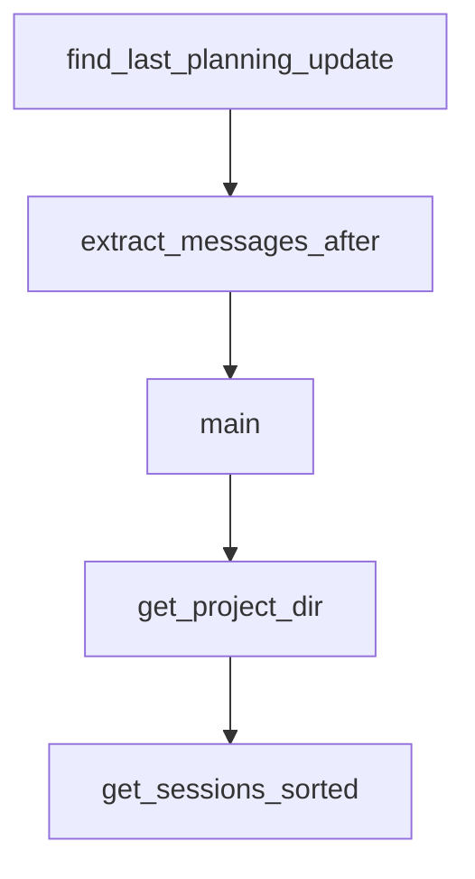

# Chapter 5: Templates, Scripts, and Session Recovery

Welcome to **Chapter 5: Templates, Scripts, and Session Recovery**. In this part of **Planning with Files Tutorial: Persistent Markdown Workflow Memory for AI Coding Agents**, you will build an intuitive mental model first, then move into concrete implementation details and practical production tradeoffs.


This chapter focuses on recovery and repeatability assets.

## Learning Goals

- use template files to standardize planning outputs
- run helper scripts for session initialization and checks
- understand automatic session-recovery behavior after `/clear`
- reduce context-loss disruption in long tasks

## Key Assets

- templates: `task_plan.md`, `findings.md`, `progress.md`
- scripts: init-session, completion checks, catchup utilities
- recovery logic: resume based on recent planning file activity

## Recovery Habit

Before resuming work, run status and catchup checks, then reconcile plan and progress files.

## Source References

- [README Session Recovery](https://github.com/OthmanAdi/planning-with-files/blob/master/README.md#session-recovery)
- [Templates Directory](https://github.com/OthmanAdi/planning-with-files/tree/master/templates)
- [Scripts Directory](https://github.com/OthmanAdi/planning-with-files/tree/master/skills/planning-with-files/scripts)

## Summary

You now have a resilience toolkit for context resets and interrupted sessions.

Next: [Chapter 6: Multi-IDE Adaptation (Codex, Gemini, OpenCode, Cursor)](06-multi-ide-adaptation-codex-gemini-opencode-cursor.md)

## Depth Expansion Playbook

## Source Code Walkthrough

### `.codebuddy/skills/planning-with-files/scripts/session-catchup.py`

The `find_last_planning_update` function in [`.codebuddy/skills/planning-with-files/scripts/session-catchup.py`](https://github.com/OthmanAdi/planning-with-files/blob/HEAD/.codebuddy/skills/planning-with-files/scripts/session-catchup.py) handles a key part of this chapter's functionality:

```py


def find_last_planning_update(messages: List[Dict]) -> Tuple[int, Optional[str]]:
    """
    Find the last time a planning file was written/edited.
    Returns (line_number, filename) or (-1, None) if not found.
    """
    last_update_line = -1
    last_update_file = None

    for msg in messages:
        msg_type = msg.get('type')

        if msg_type == 'assistant':
            content = msg.get('message', {}).get('content', [])
            if isinstance(content, list):
                for item in content:
                    if item.get('type') == 'tool_use':
                        tool_name = item.get('name', '')
                        tool_input = item.get('input', {})

                        if tool_name in ('Write', 'Edit'):
                            file_path = tool_input.get('file_path', '')
                            for pf in PLANNING_FILES:
                                if file_path.endswith(pf):
                                    last_update_line = msg['_line_num']
                                    last_update_file = pf

    return last_update_line, last_update_file


def extract_messages_after(messages: List[Dict], after_line: int) -> List[Dict]:
```

This function is important because it defines how Planning with Files Tutorial: Persistent Markdown Workflow Memory for AI Coding Agents implements the patterns covered in this chapter.

### `.codebuddy/skills/planning-with-files/scripts/session-catchup.py`

The `extract_messages_after` function in [`.codebuddy/skills/planning-with-files/scripts/session-catchup.py`](https://github.com/OthmanAdi/planning-with-files/blob/HEAD/.codebuddy/skills/planning-with-files/scripts/session-catchup.py) handles a key part of this chapter's functionality:

```py


def extract_messages_after(messages: List[Dict], after_line: int) -> List[Dict]:
    """Extract conversation messages after a certain line number."""
    result = []
    for msg in messages:
        if msg['_line_num'] <= after_line:
            continue

        msg_type = msg.get('type')
        is_meta = msg.get('isMeta', False)

        if msg_type == 'user' and not is_meta:
            content = msg.get('message', {}).get('content', '')
            if isinstance(content, list):
                for item in content:
                    if isinstance(item, dict) and item.get('type') == 'text':
                        content = item.get('text', '')
                        break
                else:
                    content = ''

            if content and isinstance(content, str):
                if content.startswith(('<local-command', '<command-', '<task-notification')):
                    continue
                if len(content) > 20:
                    result.append({'role': 'user', 'content': content, 'line': msg['_line_num']})

        elif msg_type == 'assistant':
            msg_content = msg.get('message', {}).get('content', '')
            text_content = ''
            tool_uses = []
```

This function is important because it defines how Planning with Files Tutorial: Persistent Markdown Workflow Memory for AI Coding Agents implements the patterns covered in this chapter.

### `.codebuddy/skills/planning-with-files/scripts/session-catchup.py`

The `main` function in [`.codebuddy/skills/planning-with-files/scripts/session-catchup.py`](https://github.com/OthmanAdi/planning-with-files/blob/HEAD/.codebuddy/skills/planning-with-files/scripts/session-catchup.py) handles a key part of this chapter's functionality:

```py
    """Get all session files sorted by modification time (newest first)."""
    sessions = list(project_dir.glob('*.jsonl'))
    main_sessions = [s for s in sessions if not s.name.startswith('agent-')]
    return sorted(main_sessions, key=lambda p: p.stat().st_mtime, reverse=True)


def parse_session_messages(session_file: Path) -> List[Dict]:
    """Parse all messages from a session file, preserving order."""
    messages = []
    with open(session_file, 'r', encoding='utf-8', errors='replace') as f:
        for line_num, line in enumerate(f):
            try:
                data = json.loads(line)
                data['_line_num'] = line_num
                messages.append(data)
            except json.JSONDecodeError:
                pass
    return messages


def find_last_planning_update(messages: List[Dict]) -> Tuple[int, Optional[str]]:
    """
    Find the last time a planning file was written/edited.
    Returns (line_number, filename) or (-1, None) if not found.
    """
    last_update_line = -1
    last_update_file = None

    for msg in messages:
        msg_type = msg.get('type')

        if msg_type == 'assistant':
```

This function is important because it defines how Planning with Files Tutorial: Persistent Markdown Workflow Memory for AI Coding Agents implements the patterns covered in this chapter.

### `skills/planning-with-files-zh/scripts/session-catchup.py`

The `get_project_dir` function in [`skills/planning-with-files-zh/scripts/session-catchup.py`](https://github.com/OthmanAdi/planning-with-files/blob/HEAD/skills/planning-with-files-zh/scripts/session-catchup.py) handles a key part of this chapter's functionality:

```py


def get_project_dir(project_path: str) -> Tuple[Optional[Path], Optional[str]]:
    """Resolve session storage path for the current runtime variant."""
    sanitized = project_path.replace('/', '-')
    if not sanitized.startswith('-'):
        sanitized = '-' + sanitized
    sanitized = sanitized.replace('_', '-')

    claude_path = Path.home() / '.claude' / 'projects' / sanitized

    # Codex stores sessions in ~/.codex/sessions with a different format.
    # Avoid silently scanning Claude paths when running from Codex skill folder.
    script_path = Path(__file__).as_posix().lower()
    is_codex_variant = '/.codex/' in script_path
    codex_sessions_dir = Path.home() / '.codex' / 'sessions'
    if is_codex_variant and codex_sessions_dir.exists() and not claude_path.exists():
        return None, (
            "[planning-with-files] Session catchup skipped: Codex stores sessions "
            "in ~/.codex/sessions and native Codex parsing is not implemented yet."
        )

    return claude_path, None


def get_sessions_sorted(project_dir: Path) -> List[Path]:
    """Get all session files sorted by modification time (newest first)."""
    sessions = list(project_dir.glob('*.jsonl'))
    main_sessions = [s for s in sessions if not s.name.startswith('agent-')]
    return sorted(main_sessions, key=lambda p: p.stat().st_mtime, reverse=True)


```

This function is important because it defines how Planning with Files Tutorial: Persistent Markdown Workflow Memory for AI Coding Agents implements the patterns covered in this chapter.


## How These Components Connect


