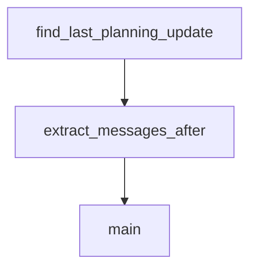

# Chapter 6: Multi-IDE Adaptation (Codex, Gemini, OpenCode, Cursor)

Welcome to **Chapter 6: Multi-IDE Adaptation (Codex, Gemini, OpenCode, Cursor)**. In this part of **Planning with Files Tutorial: Persistent Markdown Workflow Memory for AI Coding Agents**, you will build an intuitive mental model first, then move into concrete implementation details and practical production tradeoffs.


This chapter shows how to carry one planning workflow across multiple coding-agent environments.

## Learning Goals

- map equivalent skill installation paths across IDEs
- align command usage and behavior where syntax differs
- keep team onboarding docs consistent across tools
- avoid path/version drift in mixed environments

## Adaptation Pattern

- define one canonical workflow contract (files + cadence)
- map runtime-specific install/invocation syntax
- run cross-tool smoke tests on small tasks

## Source References

- [Codex Guide](https://github.com/OthmanAdi/planning-with-files/blob/master/docs/codex.md)
- [OpenCode Guide](https://github.com/OthmanAdi/planning-with-files/blob/master/docs/opencode.md)
- [Gemini Guide](https://github.com/OthmanAdi/planning-with-files/blob/master/docs/gemini.md)
- [Cursor Guide](https://github.com/OthmanAdi/planning-with-files/blob/master/docs/cursor.md)

## Summary

You now have a practical strategy for multi-IDE workflow consistency.

Next: [Chapter 7: Troubleshooting, Anti-Patterns, and Safety Checks](07-troubleshooting-anti-patterns-and-safety-checks.md)

## Source Code Walkthrough

### `skills/planning-with-files-zht/scripts/session-catchup.py`

The `find_last_planning_update` function in [`skills/planning-with-files-zht/scripts/session-catchup.py`](https://github.com/OthmanAdi/planning-with-files/blob/HEAD/skills/planning-with-files-zht/scripts/session-catchup.py) handles a key part of this chapter's functionality:

```py


def find_last_planning_update(messages: List[Dict]) -> Tuple[int, Optional[str]]:
    """
    找出最後一次寫入/編輯規劃檔案的時間點。
    回傳 (行號, 檔案名稱) 或 (-1, None)（如果未找到）。
    """
    last_update_line = -1
    last_update_file = None

    for msg in messages:
        msg_type = msg.get('type')

        if msg_type == 'assistant':
            content = msg.get('message', {}).get('content', [])
            if isinstance(content, list):
                for item in content:
                    if item.get('type') == 'tool_use':
                        tool_name = item.get('name', '')
                        tool_input = item.get('input', {})

                        if tool_name in ('Write', 'Edit'):
                            file_path = tool_input.get('file_path', '')
                            for pf in PLANNING_FILES:
                                if file_path.endswith(pf):
                                    last_update_line = msg['_line_num']
                                    last_update_file = pf

    return last_update_line, last_update_file


def extract_messages_after(messages: List[Dict], after_line: int) -> List[Dict]:
```

This function is important because it defines how Planning with Files Tutorial: Persistent Markdown Workflow Memory for AI Coding Agents implements the patterns covered in this chapter.

### `skills/planning-with-files-zht/scripts/session-catchup.py`

The `extract_messages_after` function in [`skills/planning-with-files-zht/scripts/session-catchup.py`](https://github.com/OthmanAdi/planning-with-files/blob/HEAD/skills/planning-with-files-zht/scripts/session-catchup.py) handles a key part of this chapter's functionality:

```py


def extract_messages_after(messages: List[Dict], after_line: int) -> List[Dict]:
    """擷取特定行號之後的對話訊息。"""
    result = []
    for msg in messages:
        if msg['_line_num'] <= after_line:
            continue

        msg_type = msg.get('type')
        is_meta = msg.get('isMeta', False)

        if msg_type == 'user' and not is_meta:
            content = msg.get('message', {}).get('content', '')
            if isinstance(content, list):
                for item in content:
                    if isinstance(item, dict) and item.get('type') == 'text':
                        content = item.get('text', '')
                        break
                else:
                    content = ''

            if content and isinstance(content, str):
                if content.startswith(('<local-command', '<command-', '<task-notification')):
                    continue
                if len(content) > 20:
                    result.append({'role': 'user', 'content': content, 'line': msg['_line_num']})

        elif msg_type == 'assistant':
            msg_content = msg.get('message', {}).get('content', '')
            text_content = ''
            tool_uses = []
```

This function is important because it defines how Planning with Files Tutorial: Persistent Markdown Workflow Memory for AI Coding Agents implements the patterns covered in this chapter.

### `skills/planning-with-files-zht/scripts/session-catchup.py`

The `main` function in [`skills/planning-with-files-zht/scripts/session-catchup.py`](https://github.com/OthmanAdi/planning-with-files/blob/HEAD/skills/planning-with-files-zht/scripts/session-catchup.py) handles a key part of this chapter's functionality:

```py
    """取得所有會話檔案，按修改時間排序（最新優先）。"""
    sessions = list(project_dir.glob('*.jsonl'))
    main_sessions = [s for s in sessions if not s.name.startswith('agent-')]
    return sorted(main_sessions, key=lambda p: p.stat().st_mtime, reverse=True)


def parse_session_messages(session_file: Path) -> List[Dict]:
    """解析會話檔案中的所有訊息，保持順序。"""
    messages = []
    with open(session_file, 'r') as f:
        for line_num, line in enumerate(f):
            try:
                data = json.loads(line)
                data['_line_num'] = line_num
                messages.append(data)
            except json.JSONDecodeError:
                pass
    return messages


def find_last_planning_update(messages: List[Dict]) -> Tuple[int, Optional[str]]:
    """
    找出最後一次寫入/編輯規劃檔案的時間點。
    回傳 (行號, 檔案名稱) 或 (-1, None)（如果未找到）。
    """
    last_update_line = -1
    last_update_file = None

    for msg in messages:
        msg_type = msg.get('type')

        if msg_type == 'assistant':
```

This function is important because it defines how Planning with Files Tutorial: Persistent Markdown Workflow Memory for AI Coding Agents implements the patterns covered in this chapter.


## How These Components Connect


