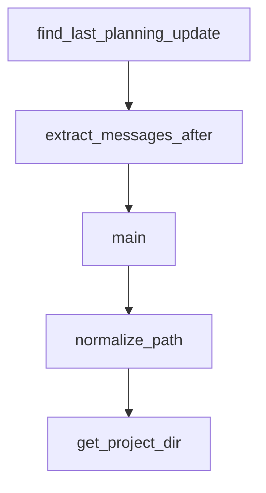

# Chapter 7: Troubleshooting, Anti-Patterns, and Safety Checks

Welcome to **Chapter 7: Troubleshooting, Anti-Patterns, and Safety Checks**. In this part of **Planning with Files Tutorial: Persistent Markdown Workflow Memory for AI Coding Agents**, you will build an intuitive mental model first, then move into concrete implementation details and practical production tradeoffs.


This chapter covers common failures and how to avoid workflow degradation.

## Learning Goals

- diagnose template/path/hook failures quickly
- recover from cache and session-persistence issues
- detect anti-patterns like stale plans and repeated failures
- apply completion and safety checks consistently

## High-Frequency Issues

- planning files written to wrong directory
- hooks not triggering due install/config mismatch
- stale plugin cache after updates
- completion blocked by unchecked tasks or missing logs

## Safety Checks

- run status before and after major work bursts
- keep error logs explicit in planning files
- enforce completion checks before marking done

## Source References

- [Troubleshooting Guide](https://github.com/OthmanAdi/planning-with-files/blob/master/docs/troubleshooting.md)
- [README Key Rules](https://github.com/OthmanAdi/planning-with-files/blob/master/README.md#key-rules)
- [SKILL.md Anti-Patterns](https://github.com/OthmanAdi/planning-with-files/blob/master/skills/planning-with-files/SKILL.md)

## Summary

You now have a robust troubleshooting and safety playbook.

Next: [Chapter 8: Contribution Workflow and Team Adoption](08-contribution-workflow-and-team-adoption.md)

## Depth Expansion Playbook

## Source Code Walkthrough

### `.factory/skills/planning-with-files/scripts/session-catchup.py`

The `find_last_planning_update` function in [`.factory/skills/planning-with-files/scripts/session-catchup.py`](https://github.com/OthmanAdi/planning-with-files/blob/HEAD/.factory/skills/planning-with-files/scripts/session-catchup.py) handles a key part of this chapter's functionality:

```py


def find_last_planning_update(messages: List[Dict]) -> Tuple[int, Optional[str]]:
    """
    Find the last time a planning file was written/edited.
    Returns (line_number, filename) or (-1, None) if not found.
    """
    last_update_line = -1
    last_update_file = None

    for msg in messages:
        msg_type = msg.get('type')

        if msg_type == 'assistant':
            content = msg.get('message', {}).get('content', [])
            if isinstance(content, list):
                for item in content:
                    if item.get('type') == 'tool_use':
                        tool_name = item.get('name', '')
                        tool_input = item.get('input', {})

                        if tool_name in ('Write', 'Edit'):
                            file_path = tool_input.get('file_path', '')
                            for pf in PLANNING_FILES:
                                if file_path.endswith(pf):
                                    last_update_line = msg['_line_num']
                                    last_update_file = pf

    return last_update_line, last_update_file


def extract_messages_after(messages: List[Dict], after_line: int) -> List[Dict]:
```

This function is important because it defines how Planning with Files Tutorial: Persistent Markdown Workflow Memory for AI Coding Agents implements the patterns covered in this chapter.

### `.factory/skills/planning-with-files/scripts/session-catchup.py`

The `extract_messages_after` function in [`.factory/skills/planning-with-files/scripts/session-catchup.py`](https://github.com/OthmanAdi/planning-with-files/blob/HEAD/.factory/skills/planning-with-files/scripts/session-catchup.py) handles a key part of this chapter's functionality:

```py


def extract_messages_after(messages: List[Dict], after_line: int) -> List[Dict]:
    """Extract conversation messages after a certain line number."""
    result = []
    for msg in messages:
        if msg['_line_num'] <= after_line:
            continue

        msg_type = msg.get('type')
        is_meta = msg.get('isMeta', False)

        if msg_type == 'user' and not is_meta:
            content = msg.get('message', {}).get('content', '')
            if isinstance(content, list):
                for item in content:
                    if isinstance(item, dict) and item.get('type') == 'text':
                        content = item.get('text', '')
                        break
                else:
                    content = ''

            if content and isinstance(content, str):
                if content.startswith(('<local-command', '<command-', '<task-notification')):
                    continue
                if len(content) > 20:
                    result.append({'role': 'user', 'content': content, 'line': msg['_line_num']})

        elif msg_type == 'assistant':
            msg_content = msg.get('message', {}).get('content', '')
            text_content = ''
            tool_uses = []
```

This function is important because it defines how Planning with Files Tutorial: Persistent Markdown Workflow Memory for AI Coding Agents implements the patterns covered in this chapter.

### `.factory/skills/planning-with-files/scripts/session-catchup.py`

The `main` function in [`.factory/skills/planning-with-files/scripts/session-catchup.py`](https://github.com/OthmanAdi/planning-with-files/blob/HEAD/.factory/skills/planning-with-files/scripts/session-catchup.py) handles a key part of this chapter's functionality:

```py
    """Get all session files sorted by modification time (newest first)."""
    sessions = list(project_dir.glob('*.jsonl'))
    main_sessions = [s for s in sessions if not s.name.startswith('agent-')]
    return sorted(main_sessions, key=lambda p: p.stat().st_mtime, reverse=True)


def parse_session_messages(session_file: Path) -> List[Dict]:
    """Parse all messages from a session file, preserving order."""
    messages = []
    with open(session_file, 'r', encoding='utf-8', errors='replace') as f:
        for line_num, line in enumerate(f):
            try:
                data = json.loads(line)
                data['_line_num'] = line_num
                messages.append(data)
            except json.JSONDecodeError:
                pass
    return messages


def find_last_planning_update(messages: List[Dict]) -> Tuple[int, Optional[str]]:
    """
    Find the last time a planning file was written/edited.
    Returns (line_number, filename) or (-1, None) if not found.
    """
    last_update_line = -1
    last_update_file = None

    for msg in messages:
        msg_type = msg.get('type')

        if msg_type == 'assistant':
```

This function is important because it defines how Planning with Files Tutorial: Persistent Markdown Workflow Memory for AI Coding Agents implements the patterns covered in this chapter.

### `.pi/skills/planning-with-files/scripts/session-catchup.py`

The `normalize_path` function in [`.pi/skills/planning-with-files/scripts/session-catchup.py`](https://github.com/OthmanAdi/planning-with-files/blob/HEAD/.pi/skills/planning-with-files/scripts/session-catchup.py) handles a key part of this chapter's functionality:

```py


def normalize_path(project_path: str) -> str:
    """Normalize project path to match Claude Code's internal representation.

    Claude Code stores session directories using the Windows-native path
    (e.g., C:\\Users\\...) sanitized with separators replaced by dashes.
    Git Bash passes /c/Users/... which produces a DIFFERENT sanitized
    string. This function converts Git Bash paths to Windows paths first.
    """
    p = project_path

    # Git Bash / MSYS2: /c/Users/... -> C:/Users/...
    if len(p) >= 3 and p[0] == '/' and p[2] == '/':
        p = p[1].upper() + ':' + p[2:]

    # Resolve to absolute path to handle relative paths and symlinks
    try:
        resolved = str(Path(p).resolve())
        # On Windows, resolve() returns C:\Users\... which is what we want
        if os.name == 'nt' or '\\' in resolved:
            p = resolved
    except (OSError, ValueError):
        pass

    return p


def get_project_dir(project_path: str) -> Tuple[Optional[Path], Optional[str]]:
    """Resolve session storage path for the current runtime variant."""
    normalized = normalize_path(project_path)

```

This function is important because it defines how Planning with Files Tutorial: Persistent Markdown Workflow Memory for AI Coding Agents implements the patterns covered in this chapter.


## How These Components Connect


