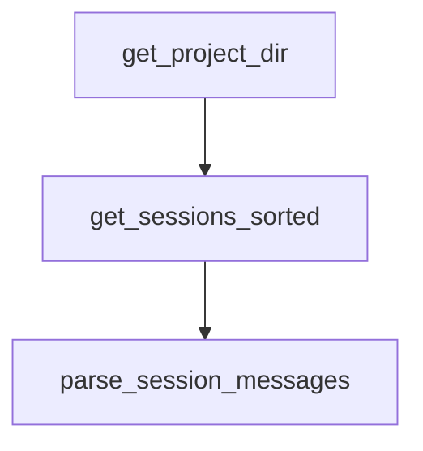

# Chapter 7: Troubleshooting, Anti-Patterns, and Safety Checks

Welcome to **Chapter 7: Troubleshooting, Anti-Patterns, and Safety Checks**. In this part of **Planning with Files Tutorial: Persistent Markdown Workflow Memory for AI Coding Agents**, you will build an intuitive mental model first, then move into concrete implementation details and practical production tradeoffs.


This chapter covers common failures and how to avoid workflow degradation.

## Learning Goals

- diagnose template/path/hook failures quickly
- recover from cache and session-persistence issues
- detect anti-patterns like stale plans and repeated failures
- apply completion and safety checks consistently

## High-Frequency Issues

- planning files written to wrong directory
- hooks not triggering due install/config mismatch
- stale plugin cache after updates
- completion blocked by unchecked tasks or missing logs

## Safety Checks

- run status before and after major work bursts
- keep error logs explicit in planning files
- enforce completion checks before marking done

## Source References

- [Troubleshooting Guide](https://github.com/OthmanAdi/planning-with-files/blob/master/docs/troubleshooting.md)
- [README Key Rules](https://github.com/OthmanAdi/planning-with-files/blob/master/README.md#key-rules)
- [SKILL.md Anti-Patterns](https://github.com/OthmanAdi/planning-with-files/blob/master/skills/planning-with-files/SKILL.md)

## Summary

You now have a robust troubleshooting and safety playbook.

Next: [Chapter 8: Contribution Workflow and Team Adoption](08-contribution-workflow-and-team-adoption.md)

## Source Code Walkthrough

### `skills/planning-with-files-zh/scripts/session-catchup.py`

The `get_project_dir` function in [`skills/planning-with-files-zh/scripts/session-catchup.py`](https://github.com/OthmanAdi/planning-with-files/blob/HEAD/skills/planning-with-files-zh/scripts/session-catchup.py) handles a key part of this chapter's functionality:

```py


def get_project_dir(project_path: str) -> Tuple[Optional[Path], Optional[str]]:
    """Resolve session storage path for the current runtime variant."""
    sanitized = project_path.replace('/', '-')
    if not sanitized.startswith('-'):
        sanitized = '-' + sanitized
    sanitized = sanitized.replace('_', '-')

    claude_path = Path.home() / '.claude' / 'projects' / sanitized

    # Codex stores sessions in ~/.codex/sessions with a different format.
    # Avoid silently scanning Claude paths when running from Codex skill folder.
    script_path = Path(__file__).as_posix().lower()
    is_codex_variant = '/.codex/' in script_path
    codex_sessions_dir = Path.home() / '.codex' / 'sessions'
    if is_codex_variant and codex_sessions_dir.exists() and not claude_path.exists():
        return None, (
            "[planning-with-files] Session catchup skipped: Codex stores sessions "
            "in ~/.codex/sessions and native Codex parsing is not implemented yet."
        )

    return claude_path, None


def get_sessions_sorted(project_dir: Path) -> List[Path]:
    """Get all session files sorted by modification time (newest first)."""
    sessions = list(project_dir.glob('*.jsonl'))
    main_sessions = [s for s in sessions if not s.name.startswith('agent-')]
    return sorted(main_sessions, key=lambda p: p.stat().st_mtime, reverse=True)


```

This function is important because it defines how Planning with Files Tutorial: Persistent Markdown Workflow Memory for AI Coding Agents implements the patterns covered in this chapter.

### `skills/planning-with-files-zh/scripts/session-catchup.py`

The `get_sessions_sorted` function in [`skills/planning-with-files-zh/scripts/session-catchup.py`](https://github.com/OthmanAdi/planning-with-files/blob/HEAD/skills/planning-with-files-zh/scripts/session-catchup.py) handles a key part of this chapter's functionality:

```py


def get_sessions_sorted(project_dir: Path) -> List[Path]:
    """Get all session files sorted by modification time (newest first)."""
    sessions = list(project_dir.glob('*.jsonl'))
    main_sessions = [s for s in sessions if not s.name.startswith('agent-')]
    return sorted(main_sessions, key=lambda p: p.stat().st_mtime, reverse=True)


def parse_session_messages(session_file: Path) -> List[Dict]:
    """Parse all messages from a session file, preserving order."""
    messages = []
    with open(session_file, 'r') as f:
        for line_num, line in enumerate(f):
            try:
                data = json.loads(line)
                data['_line_num'] = line_num
                messages.append(data)
            except json.JSONDecodeError:
                pass
    return messages


def find_last_planning_update(messages: List[Dict]) -> Tuple[int, Optional[str]]:
    """
    Find the last time a planning file was written/edited.
    Returns (line_number, filename) or (-1, None) if not found.
    """
    last_update_line = -1
    last_update_file = None

    for msg in messages:
```

This function is important because it defines how Planning with Files Tutorial: Persistent Markdown Workflow Memory for AI Coding Agents implements the patterns covered in this chapter.

### `skills/planning-with-files-zh/scripts/session-catchup.py`

The `parse_session_messages` function in [`skills/planning-with-files-zh/scripts/session-catchup.py`](https://github.com/OthmanAdi/planning-with-files/blob/HEAD/skills/planning-with-files-zh/scripts/session-catchup.py) handles a key part of this chapter's functionality:

```py


def parse_session_messages(session_file: Path) -> List[Dict]:
    """Parse all messages from a session file, preserving order."""
    messages = []
    with open(session_file, 'r') as f:
        for line_num, line in enumerate(f):
            try:
                data = json.loads(line)
                data['_line_num'] = line_num
                messages.append(data)
            except json.JSONDecodeError:
                pass
    return messages


def find_last_planning_update(messages: List[Dict]) -> Tuple[int, Optional[str]]:
    """
    Find the last time a planning file was written/edited.
    Returns (line_number, filename) or (-1, None) if not found.
    """
    last_update_line = -1
    last_update_file = None

    for msg in messages:
        msg_type = msg.get('type')

        if msg_type == 'assistant':
            content = msg.get('message', {}).get('content', [])
            if isinstance(content, list):
                for item in content:
                    if item.get('type') == 'tool_use':
```

This function is important because it defines how Planning with Files Tutorial: Persistent Markdown Workflow Memory for AI Coding Agents implements the patterns covered in this chapter.


## How These Components Connect


