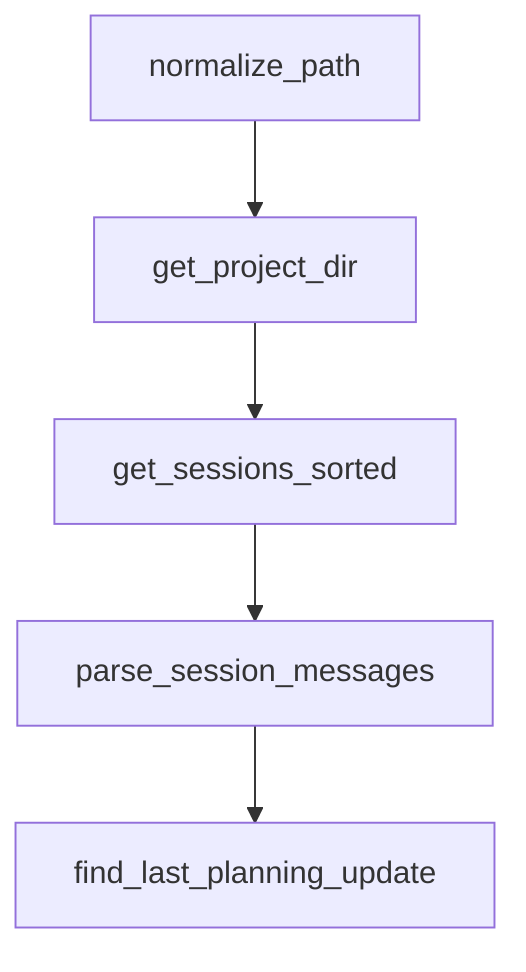

# Chapter 8: Contribution Workflow and Team Adoption

Welcome to **Chapter 8: Contribution Workflow and Team Adoption**. In this part of **Planning with Files Tutorial: Persistent Markdown Workflow Memory for AI Coding Agents**, you will build an intuitive mental model first, then move into concrete implementation details and practical production tradeoffs.


This chapter explains how to scale and evolve planning-with-files in teams.

## Learning Goals

- contribute improvements with clear compatibility notes
- standardize team onboarding and workflow contracts
- evaluate forks/extensions and adopt safely
- maintain shared quality expectations across environments

## Team Adoption Pattern

1. publish standard template and command usage policy
2. define review checks for plan/findings/progress quality
3. document IDE-specific install and support steps
4. add recovery and troubleshooting runbook to team docs

## Contribution Guidance

- keep changes scoped and backward-compatible where possible
- document behavior changes in release/changelog notes
- include examples for new rules, templates, or scripts

## Source References

- [Contributing Section](https://github.com/OthmanAdi/planning-with-files/blob/master/README.md#contributing)
- [Contributors List](https://github.com/OthmanAdi/planning-with-files/blob/master/CONTRIBUTORS.md)
- [Releases](https://github.com/OthmanAdi/planning-with-files/releases)

## Summary

You now have an end-to-end model for deploying planning-with-files across teams.

Next steps:

- define team-level template quality standards
- run pilot adoption on one active project
- contribute one improvement with docs and compatibility notes

## Depth Expansion Playbook

## Source Code Walkthrough

### `.gemini/skills/planning-with-files/scripts/session-catchup.py`

The `normalize_path` function in [`.gemini/skills/planning-with-files/scripts/session-catchup.py`](https://github.com/OthmanAdi/planning-with-files/blob/HEAD/.gemini/skills/planning-with-files/scripts/session-catchup.py) handles a key part of this chapter's functionality:

```py


def normalize_path(project_path: str) -> str:
    """Normalize project path to match Claude Code's internal representation.

    Claude Code stores session directories using the Windows-native path
    (e.g., C:\\Users\\...) sanitized with separators replaced by dashes.
    Git Bash passes /c/Users/... which produces a DIFFERENT sanitized
    string. This function converts Git Bash paths to Windows paths first.
    """
    p = project_path

    # Git Bash / MSYS2: /c/Users/... -> C:/Users/...
    if len(p) >= 3 and p[0] == '/' and p[2] == '/':
        p = p[1].upper() + ':' + p[2:]

    # Resolve to absolute path to handle relative paths and symlinks
    try:
        resolved = str(Path(p).resolve())
        # On Windows, resolve() returns C:\Users\... which is what we want
        if os.name == 'nt' or '\\' in resolved:
            p = resolved
    except (OSError, ValueError):
        pass

    return p


def get_project_dir(project_path: str) -> Tuple[Optional[Path], Optional[str]]:
    """Resolve session storage path for the current runtime variant."""
    normalized = normalize_path(project_path)

```

This function is important because it defines how Planning with Files Tutorial: Persistent Markdown Workflow Memory for AI Coding Agents implements the patterns covered in this chapter.

### `.gemini/skills/planning-with-files/scripts/session-catchup.py`

The `get_project_dir` function in [`.gemini/skills/planning-with-files/scripts/session-catchup.py`](https://github.com/OthmanAdi/planning-with-files/blob/HEAD/.gemini/skills/planning-with-files/scripts/session-catchup.py) handles a key part of this chapter's functionality:

```py


def get_project_dir(project_path: str) -> Tuple[Optional[Path], Optional[str]]:
    """Resolve session storage path for the current runtime variant."""
    normalized = normalize_path(project_path)

    # Claude Code's sanitization: replace path separators and : with -
    sanitized = normalized.replace('\\', '-').replace('/', '-').replace(':', '-')
    sanitized = sanitized.replace('_', '-')
    # Strip leading dash if present (Unix absolute paths start with /)
    if sanitized.startswith('-'):
        sanitized = sanitized[1:]

    claude_path = Path.home() / '.claude' / 'projects' / sanitized

    # Codex stores sessions in ~/.codex/sessions with a different format.
    # Avoid silently scanning Claude paths when running from Codex skill folder.
    script_path = Path(__file__).as_posix().lower()
    is_codex_variant = '/.codex/' in script_path
    codex_sessions_dir = Path.home() / '.codex' / 'sessions'
    if is_codex_variant and codex_sessions_dir.exists() and not claude_path.exists():
        return None, (
            "[planning-with-files] Session catchup skipped: Codex stores sessions "
            "in ~/.codex/sessions and native Codex parsing is not implemented yet."
        )

    return claude_path, None


def get_sessions_sorted(project_dir: Path) -> List[Path]:
    """Get all session files sorted by modification time (newest first)."""
    sessions = list(project_dir.glob('*.jsonl'))
```

This function is important because it defines how Planning with Files Tutorial: Persistent Markdown Workflow Memory for AI Coding Agents implements the patterns covered in this chapter.

### `.gemini/skills/planning-with-files/scripts/session-catchup.py`

The `get_sessions_sorted` function in [`.gemini/skills/planning-with-files/scripts/session-catchup.py`](https://github.com/OthmanAdi/planning-with-files/blob/HEAD/.gemini/skills/planning-with-files/scripts/session-catchup.py) handles a key part of this chapter's functionality:

```py


def get_sessions_sorted(project_dir: Path) -> List[Path]:
    """Get all session files sorted by modification time (newest first)."""
    sessions = list(project_dir.glob('*.jsonl'))
    main_sessions = [s for s in sessions if not s.name.startswith('agent-')]
    return sorted(main_sessions, key=lambda p: p.stat().st_mtime, reverse=True)


def parse_session_messages(session_file: Path) -> List[Dict]:
    """Parse all messages from a session file, preserving order."""
    messages = []
    with open(session_file, 'r', encoding='utf-8', errors='replace') as f:
        for line_num, line in enumerate(f):
            try:
                data = json.loads(line)
                data['_line_num'] = line_num
                messages.append(data)
            except json.JSONDecodeError:
                pass
    return messages


def find_last_planning_update(messages: List[Dict]) -> Tuple[int, Optional[str]]:
    """
    Find the last time a planning file was written/edited.
    Returns (line_number, filename) or (-1, None) if not found.
    """
    last_update_line = -1
    last_update_file = None

    for msg in messages:
```

This function is important because it defines how Planning with Files Tutorial: Persistent Markdown Workflow Memory for AI Coding Agents implements the patterns covered in this chapter.

### `.gemini/skills/planning-with-files/scripts/session-catchup.py`

The `parse_session_messages` function in [`.gemini/skills/planning-with-files/scripts/session-catchup.py`](https://github.com/OthmanAdi/planning-with-files/blob/HEAD/.gemini/skills/planning-with-files/scripts/session-catchup.py) handles a key part of this chapter's functionality:

```py


def parse_session_messages(session_file: Path) -> List[Dict]:
    """Parse all messages from a session file, preserving order."""
    messages = []
    with open(session_file, 'r', encoding='utf-8', errors='replace') as f:
        for line_num, line in enumerate(f):
            try:
                data = json.loads(line)
                data['_line_num'] = line_num
                messages.append(data)
            except json.JSONDecodeError:
                pass
    return messages


def find_last_planning_update(messages: List[Dict]) -> Tuple[int, Optional[str]]:
    """
    Find the last time a planning file was written/edited.
    Returns (line_number, filename) or (-1, None) if not found.
    """
    last_update_line = -1
    last_update_file = None

    for msg in messages:
        msg_type = msg.get('type')

        if msg_type == 'assistant':
            content = msg.get('message', {}).get('content', [])
            if isinstance(content, list):
                for item in content:
                    if item.get('type') == 'tool_use':
```

This function is important because it defines how Planning with Files Tutorial: Persistent Markdown Workflow Memory for AI Coding Agents implements the patterns covered in this chapter.


## How These Components Connect


