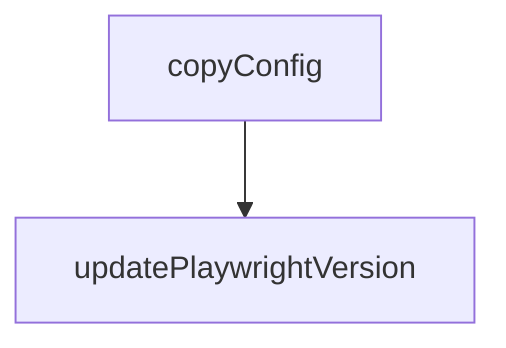

# Chapter 1: Getting Started

Welcome to **Chapter 1: Getting Started**. In this part of **Playwright MCP Tutorial: Browser Automation for Coding Agents Through MCP**, you will build an intuitive mental model first, then move into concrete implementation details and practical production tradeoffs.


This chapter gets Playwright MCP installed and validated with a minimal host configuration.

## Learning Goals

- add Playwright MCP with standard `npx` config
- verify browser tool availability in your host
- run first navigation/snapshot actions successfully
- establish a clean baseline for deeper configuration

## Standard Config Baseline

```json
{
  "mcpServers": {
    "playwright": {
      "command": "npx",
      "args": ["@playwright/mcp@latest"]
    }
  }
}
```

## First Validation Loop

1. connect server in your host client
2. run `browser_navigate` to a known URL
3. run `browser_snapshot`
4. run one simple interaction (click or fill)

## Source References

- [README: Getting Started](https://github.com/microsoft/playwright-mcp/blob/main/README.md#getting-started)

## Summary

You now have Playwright MCP connected and executing basic browser tasks.

Next: [Chapter 2: Operating Model: Accessibility Snapshots](02-operating-model-accessibility-snapshots.md)

## Depth Expansion Playbook

## Source Code Walkthrough

### `roll.js`

The `copyConfig` function in [`roll.js`](https://github.com/microsoft/playwright-mcp/blob/HEAD/roll.js) handles a key part of this chapter's functionality:

```js
const { execSync } = require('child_process');

function copyConfig() {
  const src = path.join(__dirname, '..', 'playwright', 'packages', 'playwright-core', 'src', 'tools', 'mcp', 'config.d.ts');
  const dst = path.join(__dirname, 'packages', 'playwright-mcp', 'config.d.ts');
  let content = fs.readFileSync(src, 'utf-8');
  content = content.replace(
    "import type * as playwright from 'playwright-core';",
    "import type * as playwright from 'playwright';"
  );
  fs.writeFileSync(dst, content);
  console.log(`Copied config.d.ts from ${src} to ${dst}`);
}

function updatePlaywrightVersion(version) {
  const packagesDir = path.join(__dirname, 'packages');
  const files = [path.join(__dirname, 'package.json')];
  for (const entry of fs.readdirSync(packagesDir, { withFileTypes: true })) {
    const pkgJson = path.join(packagesDir, entry.name, 'package.json');
    if (fs.existsSync(pkgJson))
      files.push(pkgJson);
  }

  for (const file of files) {
    const json = JSON.parse(fs.readFileSync(file, 'utf-8'));
    let updated = false;
    for (const section of ['dependencies', 'devDependencies']) {
      for (const pkg of ['@playwright/test', 'playwright', 'playwright-core']) {
        if (json[section]?.[pkg]) {
          json[section][pkg] = version;
          updated = true;
        }
```

This function is important because it defines how Playwright MCP Tutorial: Browser Automation for Coding Agents Through MCP implements the patterns covered in this chapter.

### `roll.js`

The `updatePlaywrightVersion` function in [`roll.js`](https://github.com/microsoft/playwright-mcp/blob/HEAD/roll.js) handles a key part of this chapter's functionality:

```js
}

function updatePlaywrightVersion(version) {
  const packagesDir = path.join(__dirname, 'packages');
  const files = [path.join(__dirname, 'package.json')];
  for (const entry of fs.readdirSync(packagesDir, { withFileTypes: true })) {
    const pkgJson = path.join(packagesDir, entry.name, 'package.json');
    if (fs.existsSync(pkgJson))
      files.push(pkgJson);
  }

  for (const file of files) {
    const json = JSON.parse(fs.readFileSync(file, 'utf-8'));
    let updated = false;
    for (const section of ['dependencies', 'devDependencies']) {
      for (const pkg of ['@playwright/test', 'playwright', 'playwright-core']) {
        if (json[section]?.[pkg]) {
          json[section][pkg] = version;
          updated = true;
        }
      }
    }
    if (updated) {
      fs.writeFileSync(file, JSON.stringify(json, null, 2) + '\n');
      console.log(`Updated ${file}`);
    }
  }

  execSync('npm install', { cwd: __dirname, stdio: 'inherit' });
}

function doRoll(version) {
```

This function is important because it defines how Playwright MCP Tutorial: Browser Automation for Coding Agents Through MCP implements the patterns covered in this chapter.


## How These Components Connect


