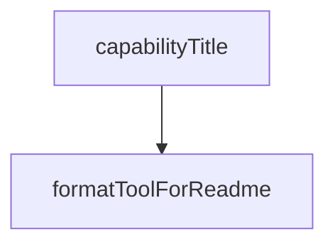

# Chapter 1: Getting Started

Welcome to **Chapter 1: Getting Started**. In this part of **Playwright MCP Tutorial: Browser Automation for Coding Agents Through MCP**, you will build an intuitive mental model first, then move into concrete implementation details and practical production tradeoffs.


This chapter gets Playwright MCP installed and validated with a minimal host configuration.

## Learning Goals

- add Playwright MCP with standard `npx` config
- verify browser tool availability in your host
- run first navigation/snapshot actions successfully
- establish a clean baseline for deeper configuration

## Standard Config Baseline

```json
{
  "mcpServers": {
    "playwright": {
      "command": "npx",
      "args": ["@playwright/mcp@latest"]
    }
  }
}
```

## First Validation Loop

1. connect server in your host client
2. run `browser_navigate` to a known URL
3. run `browser_snapshot`
4. run one simple interaction (click or fill)

## Source References

- [README: Getting Started](https://github.com/microsoft/playwright-mcp/blob/main/README.md#getting-started)

## Summary

You now have Playwright MCP connected and executing basic browser tasks.

Next: [Chapter 2: Operating Model: Accessibility Snapshots](02-operating-model-accessibility-snapshots.md)

## Source Code Walkthrough

### `packages/playwright-mcp/update-readme.js`

The `capabilityTitle` function in [`packages/playwright-mcp/update-readme.js`](https://github.com/microsoft/playwright-mcp/blob/HEAD/packages/playwright-mcp/update-readme.js) handles a key part of this chapter's functionality:

```js
const toolsByCapability = {};
for (const capability of Object.keys(capabilities)) {
  const title = capabilityTitle(capability);
  let tools = browserTools.filter(tool => tool.capability === capability && !tool.skillOnly);
  tools = (toolsByCapability[title] || []).concat(tools);
  toolsByCapability[title] = tools;
}
for (const [, tools] of Object.entries(toolsByCapability))
  tools.sort((a, b) => a.schema.name.localeCompare(b.schema.name));

/**
 * @param {string} capability
 * @returns {string}
 */
function capabilityTitle(capability) {
  const title = capabilities[capability];
  return capability.startsWith('core') ? title : `${title} (opt-in via --caps=${capability})`;
}

/**
 * @param {any} tool
 * @returns {string[]}
 */
function formatToolForReadme(tool) {
  const lines = /** @type {string[]} */ ([]);
  lines.push(`<!-- NOTE: This has been generated via ${path.basename(__filename)} -->`);
  lines.push(``);
  lines.push(`- **${tool.name}**`);
  lines.push(`  - Title: ${tool.title}`);
  lines.push(`  - Description: ${tool.description}`);

  const inputSchema = /** @type {any} */ (tool.inputSchema ? tool.inputSchema.toJSONSchema() : {});
```

This function is important because it defines how Playwright MCP Tutorial: Browser Automation for Coding Agents Through MCP implements the patterns covered in this chapter.

### `packages/playwright-mcp/update-readme.js`

The `formatToolForReadme` function in [`packages/playwright-mcp/update-readme.js`](https://github.com/microsoft/playwright-mcp/blob/HEAD/packages/playwright-mcp/update-readme.js) handles a key part of this chapter's functionality:

```js
 * @returns {string[]}
 */
function formatToolForReadme(tool) {
  const lines = /** @type {string[]} */ ([]);
  lines.push(`<!-- NOTE: This has been generated via ${path.basename(__filename)} -->`);
  lines.push(``);
  lines.push(`- **${tool.name}**`);
  lines.push(`  - Title: ${tool.title}`);
  lines.push(`  - Description: ${tool.description}`);

  const inputSchema = /** @type {any} */ (tool.inputSchema ? tool.inputSchema.toJSONSchema() : {});
  const requiredParams = inputSchema.required || [];
  if (inputSchema.properties && Object.keys(inputSchema.properties).length) {
    lines.push(`  - Parameters:`);
    Object.entries(inputSchema.properties).forEach(([name, param]) => {
      const optional = !requiredParams.includes(name);
      const meta = /** @type {string[]} */ ([]);
      if (param.type)
        meta.push(param.type);
      if (optional)
        meta.push('optional');
      lines.push(`    - \`${name}\` ${meta.length ? `(${meta.join(', ')})` : ''}: ${param.description}`);
    });
  } else {
    lines.push(`  - Parameters: None`);
  }
  lines.push(`  - Read-only: **${tool.type === 'readOnly'}**`);
  lines.push('');
  return lines;
}

/**
```

This function is important because it defines how Playwright MCP Tutorial: Browser Automation for Coding Agents Through MCP implements the patterns covered in this chapter.


## How These Components Connect


