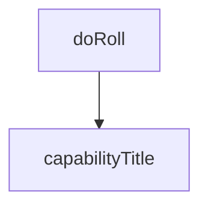

# Chapter 2: Operating Model: Accessibility Snapshots

Welcome to **Chapter 2: Operating Model: Accessibility Snapshots**. In this part of **Playwright MCP Tutorial: Browser Automation for Coding Agents Through MCP**, you will build an intuitive mental model first, then move into concrete implementation details and practical production tradeoffs.


This chapter explains why Playwright MCP emphasizes structured accessibility snapshots instead of image-first control.

## Learning Goals

- understand snapshot-first interaction mechanics
- map snapshot references to deterministic tool inputs
- reduce fragile visual automation behaviors
- decide when screenshots are diagnostic vs operational

## Core Principle

Use `browser_snapshot` as the primary interaction surface, then reference exact nodes for actions. This reduces ambiguity and improves reproducibility.

## Practical Guidance

| Situation | Preferred Approach |
|:----------|:-------------------|
| planning an interaction | snapshot and inspect references |
| executing click/type/select | pass exact `ref` from snapshot |
| debugging layout issues | use screenshot as supplemental artifact |

## Source References

- [README: Playwright MCP vs Playwright CLI](https://github.com/microsoft/playwright-mcp/blob/main/README.md#playwright-mcp-vs-playwright-cli)
- [README: Tools](https://github.com/microsoft/playwright-mcp/blob/main/README.md#tools)

## Summary

You now have the core interaction model for deterministic browser automation.

Next: [Chapter 3: Installation Across Host Clients](03-installation-across-host-clients.md)

## Depth Expansion Playbook

## Source Code Walkthrough

### `roll.js`

The `doRoll` function in [`roll.js`](https://github.com/microsoft/playwright-mcp/blob/HEAD/roll.js) handles a key part of this chapter's functionality:

```js
}

function doRoll(version) {
  updatePlaywrightVersion(version);
  copyConfig();
  // update readme
  execSync('npm run lint', { cwd: __dirname, stdio: 'inherit' });
}

let version = process.argv[2];
if (!version) {
  version = execSync('npm info playwright@next version', { encoding: 'utf-8' }).trim();
  console.log(`Using next playwright version: ${version}`);
}
doRoll(version);

```

This function is important because it defines how Playwright MCP Tutorial: Browser Automation for Coding Agents Through MCP implements the patterns covered in this chapter.

### `packages/playwright-mcp/update-readme.js`

The `capabilityTitle` function in [`packages/playwright-mcp/update-readme.js`](https://github.com/microsoft/playwright-mcp/blob/HEAD/packages/playwright-mcp/update-readme.js) handles a key part of this chapter's functionality:

```js
const toolsByCapability = {};
for (const capability of Object.keys(capabilities)) {
  const title = capabilityTitle(capability);
  let tools = browserTools.filter(tool => tool.capability === capability && !tool.skillOnly);
  tools = (toolsByCapability[title] || []).concat(tools);
  toolsByCapability[title] = tools;
}
for (const [, tools] of Object.entries(toolsByCapability))
  tools.sort((a, b) => a.schema.name.localeCompare(b.schema.name));

/**
 * @param {string} capability
 * @returns {string}
 */
function capabilityTitle(capability) {
  const title = capabilities[capability];
  return capability.startsWith('core') ? title : `${title} (opt-in via --caps=${capability})`;
}

/**
 * @param {any} tool
 * @returns {string[]}
 */
function formatToolForReadme(tool) {
  const lines = /** @type {string[]} */ ([]);
  lines.push(`<!-- NOTE: This has been generated via ${path.basename(__filename)} -->`);
  lines.push(``);
  lines.push(`- **${tool.name}**`);
  lines.push(`  - Title: ${tool.title}`);
  lines.push(`  - Description: ${tool.description}`);

  const inputSchema = /** @type {any} */ (tool.inputSchema ? tool.inputSchema.toJSONSchema() : {});
```

This function is important because it defines how Playwright MCP Tutorial: Browser Automation for Coding Agents Through MCP implements the patterns covered in this chapter.


## How These Components Connect


