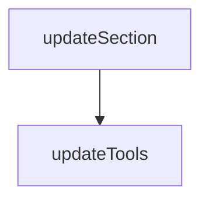

# Chapter 2: Operating Model: Accessibility Snapshots

Welcome to **Chapter 2: Operating Model: Accessibility Snapshots**. In this part of **Playwright MCP Tutorial: Browser Automation for Coding Agents Through MCP**, you will build an intuitive mental model first, then move into concrete implementation details and practical production tradeoffs.


This chapter explains why Playwright MCP emphasizes structured accessibility snapshots instead of image-first control.

## Learning Goals

- understand snapshot-first interaction mechanics
- map snapshot references to deterministic tool inputs
- reduce fragile visual automation behaviors
- decide when screenshots are diagnostic vs operational

## Core Principle

Use `browser_snapshot` as the primary interaction surface, then reference exact nodes for actions. This reduces ambiguity and improves reproducibility.

## Practical Guidance

| Situation | Preferred Approach |
|:----------|:-------------------|
| planning an interaction | snapshot and inspect references |
| executing click/type/select | pass exact `ref` from snapshot |
| debugging layout issues | use screenshot as supplemental artifact |

## Source References

- [README: Playwright MCP vs Playwright CLI](https://github.com/microsoft/playwright-mcp/blob/main/README.md#playwright-mcp-vs-playwright-cli)
- [README: Tools](https://github.com/microsoft/playwright-mcp/blob/main/README.md#tools)

## Summary

You now have the core interaction model for deterministic browser automation.

Next: [Chapter 3: Installation Across Host Clients](03-installation-across-host-clients.md)

## Source Code Walkthrough

### `packages/playwright-mcp/update-readme.js`

The `updateSection` function in [`packages/playwright-mcp/update-readme.js`](https://github.com/microsoft/playwright-mcp/blob/HEAD/packages/playwright-mcp/update-readme.js) handles a key part of this chapter's functionality:

```js
 * @returns {Promise<string>}
 */
async function updateSection(content, startMarker, endMarker, generatedLines) {
  const startMarkerIndex = content.indexOf(startMarker);
  const endMarkerIndex = content.indexOf(endMarker);
  if (startMarkerIndex === -1 || endMarkerIndex === -1)
    throw new Error('Markers for generated section not found in README');

  return [
    content.slice(0, startMarkerIndex + startMarker.length),
    '',
    generatedLines.join('\n'),
    '',
    content.slice(endMarkerIndex),
  ].join('\n');
}

/**
 * @param {string} content
 * @returns {Promise<string>}
 */
async function updateTools(content) {
  console.log('Loading tool information from compiled modules...');

  const generatedLines = /** @type {string[]} */ ([]);
  for (const [capability, tools] of Object.entries(toolsByCapability)) {
    console.log('Updating tools for capability:', capability);
    generatedLines.push(`<details>\n<summary><b>${capability}</b></summary>`);
    generatedLines.push('');
    for (const tool of tools)
      generatedLines.push(...formatToolForReadme(tool.schema));
    generatedLines.push(`</details>`);
```

This function is important because it defines how Playwright MCP Tutorial: Browser Automation for Coding Agents Through MCP implements the patterns covered in this chapter.

### `packages/playwright-mcp/update-readme.js`

The `updateTools` function in [`packages/playwright-mcp/update-readme.js`](https://github.com/microsoft/playwright-mcp/blob/HEAD/packages/playwright-mcp/update-readme.js) handles a key part of this chapter's functionality:

```js
 * @returns {Promise<string>}
 */
async function updateTools(content) {
  console.log('Loading tool information from compiled modules...');

  const generatedLines = /** @type {string[]} */ ([]);
  for (const [capability, tools] of Object.entries(toolsByCapability)) {
    console.log('Updating tools for capability:', capability);
    generatedLines.push(`<details>\n<summary><b>${capability}</b></summary>`);
    generatedLines.push('');
    for (const tool of tools)
      generatedLines.push(...formatToolForReadme(tool.schema));
    generatedLines.push(`</details>`);
    generatedLines.push('');
  }

  const startMarker = `<!--- Tools generated by ${path.basename(__filename)} -->`;
  const endMarker = `<!--- End of tools generated section -->`;
  return updateSection(content, startMarker, endMarker, generatedLines);
}

/**
 * @param {string} content
 * @returns {Promise<string>}
 */
async function updateOptions(content) {
  console.log('Listing options...');
  execSync('node cli.js --help > help.txt');
  const output = fs.readFileSync('help.txt');
  fs.unlinkSync('help.txt');
  const lines = output.toString().split('\n');
  const firstLine = lines.findIndex(line => line.includes('--version'));
```

This function is important because it defines how Playwright MCP Tutorial: Browser Automation for Coding Agents Through MCP implements the patterns covered in this chapter.


## How These Components Connect


