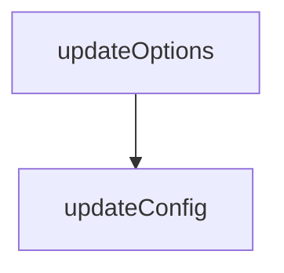

# Chapter 3: Installation Across Host Clients

Welcome to **Chapter 3: Installation Across Host Clients**. In this part of **Playwright MCP Tutorial: Browser Automation for Coding Agents Through MCP**, you will build an intuitive mental model first, then move into concrete implementation details and practical production tradeoffs.


This chapter shows how to reuse one conceptual setup across multiple MCP host clients.

## Learning Goals

- map standard configuration to host-specific install flows
- avoid host-specific assumptions that break portability
- keep one canonical server profile across environments
- accelerate team onboarding across mixed toolchains

## Host Coverage in README

The upstream README provides setup patterns for Claude, Codex, Cursor, Copilot, Goose, Gemini CLI, Warp, Windsurf, and more.

## Portability Pattern

- maintain a canonical `npx @playwright/mcp@latest` baseline
- only vary config syntax required by each host
- keep capability and security flags consistent across hosts

## Source References

- [README: Client Installation Sections](https://github.com/microsoft/playwright-mcp/blob/main/README.md#getting-started)
- [Codex MCP Config Example](https://github.com/microsoft/playwright-mcp/blob/main/README.md#for-openai-codex)

## Summary

You now have a host-portable installation strategy for Playwright MCP.

Next: [Chapter 4: Configuration, Capabilities, and Runtime Modes](04-configuration-capabilities-and-runtime-modes.md)

## Source Code Walkthrough

### `packages/playwright-mcp/update-readme.js`

The `updateOptions` function in [`packages/playwright-mcp/update-readme.js`](https://github.com/microsoft/playwright-mcp/blob/HEAD/packages/playwright-mcp/update-readme.js) handles a key part of this chapter's functionality:

```js
 * @returns {Promise<string>}
 */
async function updateOptions(content) {
  console.log('Listing options...');
  execSync('node cli.js --help > help.txt');
  const output = fs.readFileSync('help.txt');
  fs.unlinkSync('help.txt');
  const lines = output.toString().split('\n');
  const firstLine = lines.findIndex(line => line.includes('--version'));
  lines.splice(0, firstLine + 1);
  const lastLine = lines.findIndex(line => line.includes('--help'));
  lines.splice(lastLine);

  /**
   * @type {{ name: string, value: string }[]}
   */
  const options = [];
  for (let line of lines) {
    if (line.startsWith('  --')) {
      const l = line.substring('  --'.length);
      const gapIndex = l.indexOf('  ');
      const name = l.substring(0, gapIndex).trim();
      const value = l.substring(gapIndex).trim();
      options.push({ name, value });
    } else {
      const value = line.trim();
      options[options.length - 1].value += ' ' + value;
    }
  }

  const table = [];
  table.push(`| Option | Description |`);
```

This function is important because it defines how Playwright MCP Tutorial: Browser Automation for Coding Agents Through MCP implements the patterns covered in this chapter.

### `packages/playwright-mcp/update-readme.js`

The `updateConfig` function in [`packages/playwright-mcp/update-readme.js`](https://github.com/microsoft/playwright-mcp/blob/HEAD/packages/playwright-mcp/update-readme.js) handles a key part of this chapter's functionality:

```js
 * @returns {Promise<string>}
 */
async function updateConfig(content) {
  console.log('Updating config schema from config.d.ts...');
  const configPath = path.join(__dirname, 'config.d.ts');
  const configContent = await fs.promises.readFile(configPath, 'utf-8');

  // Extract the Config type definition
  const configTypeMatch = configContent.match(/export type Config = (\{[\s\S]*?\n\});/);
  if (!configTypeMatch)
    throw new Error('Config type not found in config.d.ts');

  const configType = configTypeMatch[1]; // Use capture group to get just the object definition

  const startMarker = `<!--- Config generated by ${path.basename(__filename)} -->`;
  const endMarker = `<!--- End of config generated section -->`;
  return updateSection(content, startMarker, endMarker, [
    '```typescript',
    configType,
    '```',
  ]);
}

/**
 * @param {string} filePath
 */
async function copyToPackage(filePath) {
  await fs.promises.copyFile(path.join(__dirname, '../../', filePath), path.join(__dirname, filePath));
  console.log(`${filePath} copied successfully`);
}

async function updateReadme() {
```

This function is important because it defines how Playwright MCP Tutorial: Browser Automation for Coding Agents Through MCP implements the patterns covered in this chapter.


## How These Components Connect


