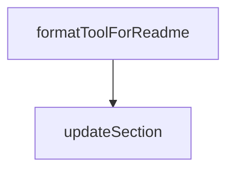

# Chapter 3: Installation Across Host Clients

Welcome to **Chapter 3: Installation Across Host Clients**. In this part of **Playwright MCP Tutorial: Browser Automation for Coding Agents Through MCP**, you will build an intuitive mental model first, then move into concrete implementation details and practical production tradeoffs.


This chapter shows how to reuse one conceptual setup across multiple MCP host clients.

## Learning Goals

- map standard configuration to host-specific install flows
- avoid host-specific assumptions that break portability
- keep one canonical server profile across environments
- accelerate team onboarding across mixed toolchains

## Host Coverage in README

The upstream README provides setup patterns for Claude, Codex, Cursor, Copilot, Goose, Gemini CLI, Warp, Windsurf, and more.

## Portability Pattern

- maintain a canonical `npx @playwright/mcp@latest` baseline
- only vary config syntax required by each host
- keep capability and security flags consistent across hosts

## Source References

- [README: Client Installation Sections](https://github.com/microsoft/playwright-mcp/blob/main/README.md#getting-started)
- [Codex MCP Config Example](https://github.com/microsoft/playwright-mcp/blob/main/README.md#for-openai-codex)

## Summary

You now have a host-portable installation strategy for Playwright MCP.

Next: [Chapter 4: Configuration, Capabilities, and Runtime Modes](04-configuration-capabilities-and-runtime-modes.md)

## Depth Expansion Playbook

## Source Code Walkthrough

### `packages/playwright-mcp/update-readme.js`

The `formatToolForReadme` function in [`packages/playwright-mcp/update-readme.js`](https://github.com/microsoft/playwright-mcp/blob/HEAD/packages/playwright-mcp/update-readme.js) handles a key part of this chapter's functionality:

```js
 * @returns {string[]}
 */
function formatToolForReadme(tool) {
  const lines = /** @type {string[]} */ ([]);
  lines.push(`<!-- NOTE: This has been generated via ${path.basename(__filename)} -->`);
  lines.push(``);
  lines.push(`- **${tool.name}**`);
  lines.push(`  - Title: ${tool.title}`);
  lines.push(`  - Description: ${tool.description}`);

  const inputSchema = /** @type {any} */ (tool.inputSchema ? tool.inputSchema.toJSONSchema() : {});
  const requiredParams = inputSchema.required || [];
  if (inputSchema.properties && Object.keys(inputSchema.properties).length) {
    lines.push(`  - Parameters:`);
    Object.entries(inputSchema.properties).forEach(([name, param]) => {
      const optional = !requiredParams.includes(name);
      const meta = /** @type {string[]} */ ([]);
      if (param.type)
        meta.push(param.type);
      if (optional)
        meta.push('optional');
      lines.push(`    - \`${name}\` ${meta.length ? `(${meta.join(', ')})` : ''}: ${param.description}`);
    });
  } else {
    lines.push(`  - Parameters: None`);
  }
  lines.push(`  - Read-only: **${tool.type === 'readOnly'}**`);
  lines.push('');
  return lines;
}

/**
```

This function is important because it defines how Playwright MCP Tutorial: Browser Automation for Coding Agents Through MCP implements the patterns covered in this chapter.

### `packages/playwright-mcp/update-readme.js`

The `updateSection` function in [`packages/playwright-mcp/update-readme.js`](https://github.com/microsoft/playwright-mcp/blob/HEAD/packages/playwright-mcp/update-readme.js) handles a key part of this chapter's functionality:

```js
 * @returns {Promise<string>}
 */
async function updateSection(content, startMarker, endMarker, generatedLines) {
  const startMarkerIndex = content.indexOf(startMarker);
  const endMarkerIndex = content.indexOf(endMarker);
  if (startMarkerIndex === -1 || endMarkerIndex === -1)
    throw new Error('Markers for generated section not found in README');

  return [
    content.slice(0, startMarkerIndex + startMarker.length),
    '',
    generatedLines.join('\n'),
    '',
    content.slice(endMarkerIndex),
  ].join('\n');
}

/**
 * @param {string} content
 * @returns {Promise<string>}
 */
async function updateTools(content) {
  console.log('Loading tool information from compiled modules...');

  const generatedLines = /** @type {string[]} */ ([]);
  for (const [capability, tools] of Object.entries(toolsByCapability)) {
    console.log('Updating tools for capability:', capability);
    generatedLines.push(`<details>\n<summary><b>${capability}</b></summary>`);
    generatedLines.push('');
    for (const tool of tools)
      generatedLines.push(...formatToolForReadme(tool.schema));
    generatedLines.push(`</details>`);
```

This function is important because it defines how Playwright MCP Tutorial: Browser Automation for Coding Agents Through MCP implements the patterns covered in this chapter.


## How These Components Connect


