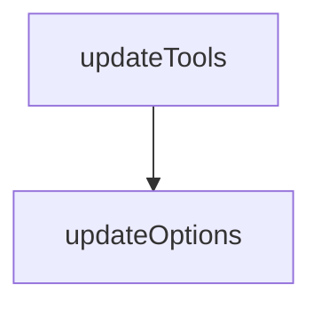

# Chapter 4: Configuration, Capabilities, and Runtime Modes

Welcome to **Chapter 4: Configuration, Capabilities, and Runtime Modes**. In this part of **Playwright MCP Tutorial: Browser Automation for Coding Agents Through MCP**, you will build an intuitive mental model first, then move into concrete implementation details and practical production tradeoffs.


This chapter covers high-impact runtime flags and capability controls.

## Learning Goals

- tune browser, snapshot, and output settings for your workload
- understand capability flags (`vision`, `pdf`, `devtools`)
- pick headed/headless and shared/isolated modes intentionally
- reduce flaky runs through explicit runtime defaults

## High-Impact Configuration Areas

| Area | Key Flags |
|:-----|:----------|
| browser runtime | `--browser`, `--headless`, `--viewport-size` |
| security/network boundaries | `--allowed-origins`, `--blocked-origins` |
| session mode | `--isolated`, `--shared-browser-context`, `--storage-state` |
| response shape | `--snapshot-mode`, `--output-mode`, `--save-trace` |

## Source References

- [README: Configuration](https://github.com/microsoft/playwright-mcp/blob/main/README.md#configuration)
- [README: Configuration File](https://github.com/microsoft/playwright-mcp/blob/main/README.md#configuration-file)

## Summary

You now know which configuration levers matter most for stable operation.

Next: [Chapter 5: Profile State, Extension, and Auth Sessions](05-profile-state-extension-and-auth-sessions.md)

## Depth Expansion Playbook

## Source Code Walkthrough

### `packages/playwright-mcp/update-readme.js`

The `updateTools` function in [`packages/playwright-mcp/update-readme.js`](https://github.com/microsoft/playwright-mcp/blob/HEAD/packages/playwright-mcp/update-readme.js) handles a key part of this chapter's functionality:

```js
 * @returns {Promise<string>}
 */
async function updateTools(content) {
  console.log('Loading tool information from compiled modules...');

  const generatedLines = /** @type {string[]} */ ([]);
  for (const [capability, tools] of Object.entries(toolsByCapability)) {
    console.log('Updating tools for capability:', capability);
    generatedLines.push(`<details>\n<summary><b>${capability}</b></summary>`);
    generatedLines.push('');
    for (const tool of tools)
      generatedLines.push(...formatToolForReadme(tool.schema));
    generatedLines.push(`</details>`);
    generatedLines.push('');
  }

  const startMarker = `<!--- Tools generated by ${path.basename(__filename)} -->`;
  const endMarker = `<!--- End of tools generated section -->`;
  return updateSection(content, startMarker, endMarker, generatedLines);
}

/**
 * @param {string} content
 * @returns {Promise<string>}
 */
async function updateOptions(content) {
  console.log('Listing options...');
  execSync('node cli.js --help > help.txt');
  const output = fs.readFileSync('help.txt');
  fs.unlinkSync('help.txt');
  const lines = output.toString().split('\n');
  const firstLine = lines.findIndex(line => line.includes('--version'));
```

This function is important because it defines how Playwright MCP Tutorial: Browser Automation for Coding Agents Through MCP implements the patterns covered in this chapter.

### `packages/playwright-mcp/update-readme.js`

The `updateOptions` function in [`packages/playwright-mcp/update-readme.js`](https://github.com/microsoft/playwright-mcp/blob/HEAD/packages/playwright-mcp/update-readme.js) handles a key part of this chapter's functionality:

```js
 * @returns {Promise<string>}
 */
async function updateOptions(content) {
  console.log('Listing options...');
  execSync('node cli.js --help > help.txt');
  const output = fs.readFileSync('help.txt');
  fs.unlinkSync('help.txt');
  const lines = output.toString().split('\n');
  const firstLine = lines.findIndex(line => line.includes('--version'));
  lines.splice(0, firstLine + 1);
  const lastLine = lines.findIndex(line => line.includes('--help'));
  lines.splice(lastLine);

  /**
   * @type {{ name: string, value: string }[]}
   */
  const options = [];
  for (let line of lines) {
    if (line.startsWith('  --')) {
      const l = line.substring('  --'.length);
      const gapIndex = l.indexOf('  ');
      const name = l.substring(0, gapIndex).trim();
      const value = l.substring(gapIndex).trim();
      options.push({ name, value });
    } else {
      const value = line.trim();
      options[options.length - 1].value += ' ' + value;
    }
  }

  const table = [];
  table.push(`| Option | Description |`);
```

This function is important because it defines how Playwright MCP Tutorial: Browser Automation for Coding Agents Through MCP implements the patterns covered in this chapter.


## How These Components Connect


