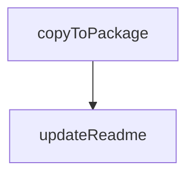

# Chapter 4: Configuration, Capabilities, and Runtime Modes

Welcome to **Chapter 4: Configuration, Capabilities, and Runtime Modes**. In this part of **Playwright MCP Tutorial: Browser Automation for Coding Agents Through MCP**, you will build an intuitive mental model first, then move into concrete implementation details and practical production tradeoffs.


This chapter covers high-impact runtime flags and capability controls.

## Learning Goals

- tune browser, snapshot, and output settings for your workload
- understand capability flags (`vision`, `pdf`, `devtools`)
- pick headed/headless and shared/isolated modes intentionally
- reduce flaky runs through explicit runtime defaults

## High-Impact Configuration Areas

| Area | Key Flags |
|:-----|:----------|
| browser runtime | `--browser`, `--headless`, `--viewport-size` |
| security/network boundaries | `--allowed-origins`, `--blocked-origins` |
| session mode | `--isolated`, `--shared-browser-context`, `--storage-state` |
| response shape | `--snapshot-mode`, `--output-mode`, `--save-trace` |

## Source References

- [README: Configuration](https://github.com/microsoft/playwright-mcp/blob/main/README.md#configuration)
- [README: Configuration File](https://github.com/microsoft/playwright-mcp/blob/main/README.md#configuration-file)

## Summary

You now know which configuration levers matter most for stable operation.

Next: [Chapter 5: Profile State, Extension, and Auth Sessions](05-profile-state-extension-and-auth-sessions.md)

## Source Code Walkthrough

### `packages/playwright-mcp/update-readme.js`

The `copyToPackage` function in [`packages/playwright-mcp/update-readme.js`](https://github.com/microsoft/playwright-mcp/blob/HEAD/packages/playwright-mcp/update-readme.js) handles a key part of this chapter's functionality:

```js
 * @param {string} filePath
 */
async function copyToPackage(filePath) {
  await fs.promises.copyFile(path.join(__dirname, '../../', filePath), path.join(__dirname, filePath));
  console.log(`${filePath} copied successfully`);
}

async function updateReadme() {
  const readmePath = path.join(__dirname, '../../README.md');
  const readmeContent = await fs.promises.readFile(readmePath, 'utf-8');
  const withTools = await updateTools(readmeContent);
  const withOptions = await updateOptions(withTools);
  const withConfig = await updateConfig(withOptions);
  await fs.promises.writeFile(readmePath, withConfig, 'utf-8');
  console.log('README updated successfully');

  await copyToPackage('README.md');
  await copyToPackage('LICENSE');
}

updateReadme().catch(err => {
  console.error('Error updating README:', err);
  process.exit(1);
});

```

This function is important because it defines how Playwright MCP Tutorial: Browser Automation for Coding Agents Through MCP implements the patterns covered in this chapter.

### `packages/playwright-mcp/update-readme.js`

The `updateReadme` function in [`packages/playwright-mcp/update-readme.js`](https://github.com/microsoft/playwright-mcp/blob/HEAD/packages/playwright-mcp/update-readme.js) handles a key part of this chapter's functionality:

```js
}

async function updateReadme() {
  const readmePath = path.join(__dirname, '../../README.md');
  const readmeContent = await fs.promises.readFile(readmePath, 'utf-8');
  const withTools = await updateTools(readmeContent);
  const withOptions = await updateOptions(withTools);
  const withConfig = await updateConfig(withOptions);
  await fs.promises.writeFile(readmePath, withConfig, 'utf-8');
  console.log('README updated successfully');

  await copyToPackage('README.md');
  await copyToPackage('LICENSE');
}

updateReadme().catch(err => {
  console.error('Error updating README:', err);
  process.exit(1);
});

```

This function is important because it defines how Playwright MCP Tutorial: Browser Automation for Coding Agents Through MCP implements the patterns covered in this chapter.


## How These Components Connect


