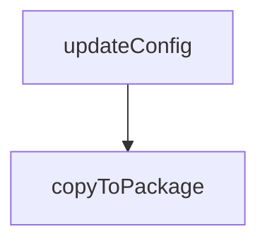

# Chapter 5: Profile State, Extension, and Auth Sessions

Welcome to **Chapter 5: Profile State, Extension, and Auth Sessions**. In this part of **Playwright MCP Tutorial: Browser Automation for Coding Agents Through MCP**, you will build an intuitive mental model first, then move into concrete implementation details and practical production tradeoffs.


This chapter explains how to handle authenticated browser contexts safely and reliably.

## Learning Goals

- choose between persistent profile, isolated contexts, and extension mode
- connect to existing browser sessions when needed
- use storage state patterns safely for automation
- avoid leaking sensitive session material in shared environments

## State Strategy

| Mode | Best For | Caution |
|:-----|:---------|:--------|
| persistent profile | ongoing personal workflows | avoid mixing unrelated automations |
| isolated mode | reproducible test-style runs | requires explicit auth state injection |
| extension mode | leveraging already logged-in browser state | protect extension token and profile scope |

## Source References

- [README: User Profile](https://github.com/microsoft/playwright-mcp/blob/main/README.md#user-profile)
- [README: Initial State](https://github.com/microsoft/playwright-mcp/blob/main/README.md#initial-state)
- [Chrome Extension Guide](https://github.com/microsoft/playwright-mcp/blob/main/packages/extension/README.md)

## Summary

You now have a practical model for handling auth/session continuity in browser automation.

Next: [Chapter 6: Standalone and Docker Deployment](06-standalone-and-docker-deployment.md)

## Depth Expansion Playbook

## Source Code Walkthrough

### `packages/playwright-mcp/update-readme.js`

The `updateConfig` function in [`packages/playwright-mcp/update-readme.js`](https://github.com/microsoft/playwright-mcp/blob/HEAD/packages/playwright-mcp/update-readme.js) handles a key part of this chapter's functionality:

```js
 * @returns {Promise<string>}
 */
async function updateConfig(content) {
  console.log('Updating config schema from config.d.ts...');
  const configPath = path.join(__dirname, 'config.d.ts');
  const configContent = await fs.promises.readFile(configPath, 'utf-8');

  // Extract the Config type definition
  const configTypeMatch = configContent.match(/export type Config = (\{[\s\S]*?\n\});/);
  if (!configTypeMatch)
    throw new Error('Config type not found in config.d.ts');

  const configType = configTypeMatch[1]; // Use capture group to get just the object definition

  const startMarker = `<!--- Config generated by ${path.basename(__filename)} -->`;
  const endMarker = `<!--- End of config generated section -->`;
  return updateSection(content, startMarker, endMarker, [
    '```typescript',
    configType,
    '```',
  ]);
}

/**
 * @param {string} filePath
 */
async function copyToPackage(filePath) {
  await fs.promises.copyFile(path.join(__dirname, '../../', filePath), path.join(__dirname, filePath));
  console.log(`${filePath} copied successfully`);
}

async function updateReadme() {
```

This function is important because it defines how Playwright MCP Tutorial: Browser Automation for Coding Agents Through MCP implements the patterns covered in this chapter.

### `packages/playwright-mcp/update-readme.js`

The `copyToPackage` function in [`packages/playwright-mcp/update-readme.js`](https://github.com/microsoft/playwright-mcp/blob/HEAD/packages/playwright-mcp/update-readme.js) handles a key part of this chapter's functionality:

```js
 * @param {string} filePath
 */
async function copyToPackage(filePath) {
  await fs.promises.copyFile(path.join(__dirname, '../../', filePath), path.join(__dirname, filePath));
  console.log(`${filePath} copied successfully`);
}

async function updateReadme() {
  const readmePath = path.join(__dirname, '../../README.md');
  const readmeContent = await fs.promises.readFile(readmePath, 'utf-8');
  const withTools = await updateTools(readmeContent);
  const withOptions = await updateOptions(withTools);
  const withConfig = await updateConfig(withOptions);
  await fs.promises.writeFile(readmePath, withConfig, 'utf-8');
  console.log('README updated successfully');

  await copyToPackage('README.md');
  await copyToPackage('LICENSE');
}

updateReadme().catch(err => {
  console.error('Error updating README:', err);
  process.exit(1);
});

```

This function is important because it defines how Playwright MCP Tutorial: Browser Automation for Coding Agents Through MCP implements the patterns covered in this chapter.


## How These Components Connect


