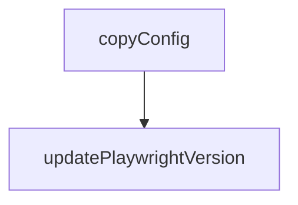

# Chapter 5: Profile State, Extension, and Auth Sessions

Welcome to **Chapter 5: Profile State, Extension, and Auth Sessions**. In this part of **Playwright MCP Tutorial: Browser Automation for Coding Agents Through MCP**, you will build an intuitive mental model first, then move into concrete implementation details and practical production tradeoffs.


This chapter explains how to handle authenticated browser contexts safely and reliably.

## Learning Goals

- choose between persistent profile, isolated contexts, and extension mode
- connect to existing browser sessions when needed
- use storage state patterns safely for automation
- avoid leaking sensitive session material in shared environments

## State Strategy

| Mode | Best For | Caution |
|:-----|:---------|:--------|
| persistent profile | ongoing personal workflows | avoid mixing unrelated automations |
| isolated mode | reproducible test-style runs | requires explicit auth state injection |
| extension mode | leveraging already logged-in browser state | protect extension token and profile scope |

## Source References

- [README: User Profile](https://github.com/microsoft/playwright-mcp/blob/main/README.md#user-profile)
- [README: Initial State](https://github.com/microsoft/playwright-mcp/blob/main/README.md#initial-state)
- [Chrome Extension Guide](https://github.com/microsoft/playwright-mcp/blob/main/packages/extension/README.md)

## Summary

You now have a practical model for handling auth/session continuity in browser automation.

Next: [Chapter 6: Standalone and Docker Deployment](06-standalone-and-docker-deployment.md)

## Source Code Walkthrough

### `roll.js`

The `copyConfig` function in [`roll.js`](https://github.com/microsoft/playwright-mcp/blob/HEAD/roll.js) handles a key part of this chapter's functionality:

```js
const { execSync } = require('child_process');

function copyConfig() {
  const src = path.join(__dirname, '..', 'playwright', 'packages', 'playwright-core', 'src', 'tools', 'mcp', 'config.d.ts');
  const dst = path.join(__dirname, 'packages', 'playwright-mcp', 'config.d.ts');
  let content = fs.readFileSync(src, 'utf-8');
  content = content.replace(
    "import type * as playwright from 'playwright-core';",
    "import type * as playwright from 'playwright';"
  );
  fs.writeFileSync(dst, content);
  console.log(`Copied config.d.ts from ${src} to ${dst}`);
}

function updatePlaywrightVersion(version) {
  const packagesDir = path.join(__dirname, 'packages');
  const files = [path.join(__dirname, 'package.json')];
  for (const entry of fs.readdirSync(packagesDir, { withFileTypes: true })) {
    const pkgJson = path.join(packagesDir, entry.name, 'package.json');
    if (fs.existsSync(pkgJson))
      files.push(pkgJson);
  }

  for (const file of files) {
    const json = JSON.parse(fs.readFileSync(file, 'utf-8'));
    let updated = false;
    for (const section of ['dependencies', 'devDependencies']) {
      for (const pkg of ['@playwright/test', 'playwright', 'playwright-core']) {
        if (json[section]?.[pkg]) {
          json[section][pkg] = version;
          updated = true;
        }
```

This function is important because it defines how Playwright MCP Tutorial: Browser Automation for Coding Agents Through MCP implements the patterns covered in this chapter.

### `roll.js`

The `updatePlaywrightVersion` function in [`roll.js`](https://github.com/microsoft/playwright-mcp/blob/HEAD/roll.js) handles a key part of this chapter's functionality:

```js
}

function updatePlaywrightVersion(version) {
  const packagesDir = path.join(__dirname, 'packages');
  const files = [path.join(__dirname, 'package.json')];
  for (const entry of fs.readdirSync(packagesDir, { withFileTypes: true })) {
    const pkgJson = path.join(packagesDir, entry.name, 'package.json');
    if (fs.existsSync(pkgJson))
      files.push(pkgJson);
  }

  for (const file of files) {
    const json = JSON.parse(fs.readFileSync(file, 'utf-8'));
    let updated = false;
    for (const section of ['dependencies', 'devDependencies']) {
      for (const pkg of ['@playwright/test', 'playwright', 'playwright-core']) {
        if (json[section]?.[pkg]) {
          json[section][pkg] = version;
          updated = true;
        }
      }
    }
    if (updated) {
      fs.writeFileSync(file, JSON.stringify(json, null, 2) + '\n');
      console.log(`Updated ${file}`);
    }
  }

  execSync('npm install', { cwd: __dirname, stdio: 'inherit' });
}

function doRoll(version) {
```

This function is important because it defines how Playwright MCP Tutorial: Browser Automation for Coding Agents Through MCP implements the patterns covered in this chapter.


## How These Components Connect


