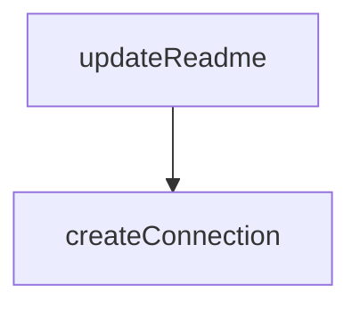

# Chapter 6: Standalone and Docker Deployment

Welcome to **Chapter 6: Standalone and Docker Deployment**. In this part of **Playwright MCP Tutorial: Browser Automation for Coding Agents Through MCP**, you will build an intuitive mental model first, then move into concrete implementation details and practical production tradeoffs.


This chapter covers deployment modes beyond basic stdio invocation.

## Learning Goals

- run Playwright MCP as a standalone HTTP MCP endpoint
- use Docker mode for cleaner host/runtime boundaries
- understand headless constraints in containerized mode
- connect clients to stable local MCP endpoints

## Deployment Patterns

| Pattern | Example | Best For |
|:--------|:--------|:---------|
| standalone local server | `npx @playwright/mcp@latest --port 8931` | multi-client local development |
| Docker hosted server | `mcr.microsoft.com/playwright/mcp` | cleaner runtime isolation |
| local stdio | default `npx` mode | simplest host integrations |

## Source References

- [README: Standalone MCP Server](https://github.com/microsoft/playwright-mcp/blob/main/README.md#standalone-mcp-server)
- [README: Docker Configuration](https://github.com/microsoft/playwright-mcp/blob/main/README.md#docker)
- [Dockerfile](https://github.com/microsoft/playwright-mcp/blob/main/Dockerfile)

## Summary

You now have options for scaling Playwright MCP beyond default client-managed execution.

Next: [Chapter 7: Tooling Surface and Automation Patterns](07-tooling-surface-and-automation-patterns.md)

## Depth Expansion Playbook

## Source Code Walkthrough

### `packages/playwright-mcp/update-readme.js`

The `updateReadme` function in [`packages/playwright-mcp/update-readme.js`](https://github.com/microsoft/playwright-mcp/blob/HEAD/packages/playwright-mcp/update-readme.js) handles a key part of this chapter's functionality:

```js
}

async function updateReadme() {
  const readmePath = path.join(__dirname, '../../README.md');
  const readmeContent = await fs.promises.readFile(readmePath, 'utf-8');
  const withTools = await updateTools(readmeContent);
  const withOptions = await updateOptions(withTools);
  const withConfig = await updateConfig(withOptions);
  await fs.promises.writeFile(readmePath, withConfig, 'utf-8');
  console.log('README updated successfully');

  await copyToPackage('README.md');
  await copyToPackage('LICENSE');
}

updateReadme().catch(err => {
  console.error('Error updating README:', err);
  process.exit(1);
});

```

This function is important because it defines how Playwright MCP Tutorial: Browser Automation for Coding Agents Through MCP implements the patterns covered in this chapter.

### `packages/playwright-mcp/index.d.ts`

The `createConnection` function in [`packages/playwright-mcp/index.d.ts`](https://github.com/microsoft/playwright-mcp/blob/HEAD/packages/playwright-mcp/index.d.ts) handles a key part of this chapter's functionality:

```ts
import type { BrowserContext } from 'playwright';

export declare function createConnection(config?: Config, contextGetter?: () => Promise<BrowserContext>): Promise<Server>;
export {};

```

This function is important because it defines how Playwright MCP Tutorial: Browser Automation for Coding Agents Through MCP implements the patterns covered in this chapter.


## How These Components Connect


