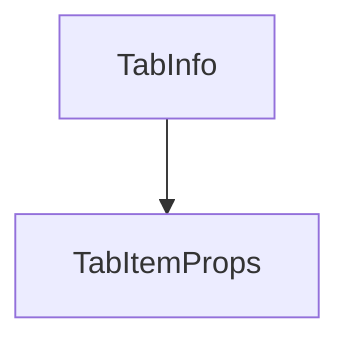

# Chapter 7: Tooling Surface and Automation Patterns

Welcome to **Chapter 7: Tooling Surface and Automation Patterns**. In this part of **Playwright MCP Tutorial: Browser Automation for Coding Agents Through MCP**, you will build an intuitive mental model first, then move into concrete implementation details and practical production tradeoffs.


This chapter translates the full tool catalog into reliable automation patterns.

## Learning Goals

- group tools by workflow stage (observe, act, verify, export)
- design robust loops with snapshot-first actioning
- prefer verification tools over fragile visual assumptions
- build smaller, testable automation steps

## Useful Tool Grouping

| Stage | Representative Tools |
|:------|:---------------------|
| observe | `browser_snapshot`, `browser_console_messages`, `browser_network_requests` |
| act | `browser_click`, `browser_fill_form`, `browser_type`, `browser_select_option` |
| verify | `browser_verify_element_visible`, `browser_verify_text_visible`, `browser_verify_value` |
| artifacts | `browser_take_screenshot`, `browser_pdf_save`, traces/log outputs |

## Source References

- [README: Tools](https://github.com/microsoft/playwright-mcp/blob/main/README.md#tools)
- [README: Key Features](https://github.com/microsoft/playwright-mcp/blob/main/README.md#key-features)

## Summary

You now have a repeatable pattern for stable browser automation loops in agent workflows.

Next: [Chapter 8: Troubleshooting, Security, and Contribution](08-troubleshooting-security-and-contribution.md)

## Source Code Walkthrough

### `packages/extension/src/ui/tabItem.tsx`

The `TabInfo` interface in [`packages/extension/src/ui/tabItem.tsx`](https://github.com/microsoft/playwright-mcp/blob/HEAD/packages/extension/src/ui/tabItem.tsx) handles a key part of this chapter's functionality:

```tsx
import React from 'react';

export interface TabInfo {
  id: number;
  windowId: number;
  title: string;
  url: string;
  favIconUrl?: string;
}

export const Button: React.FC<{ variant: 'primary' | 'default' | 'reject'; onClick: () => void; children: React.ReactNode }> = ({
  variant,
  onClick,
  children
}) => {
  return (
    <button className={`button ${variant}`} onClick={onClick}>
      {children}
    </button>
  );
};


export interface TabItemProps {
  tab: TabInfo;
  onClick?: () => void;
  button?: React.ReactNode;
}

export const TabItem: React.FC<TabItemProps> = ({
  tab,
  onClick,
```

This interface is important because it defines how Playwright MCP Tutorial: Browser Automation for Coding Agents Through MCP implements the patterns covered in this chapter.

### `packages/extension/src/ui/tabItem.tsx`

The `TabItemProps` interface in [`packages/extension/src/ui/tabItem.tsx`](https://github.com/microsoft/playwright-mcp/blob/HEAD/packages/extension/src/ui/tabItem.tsx) handles a key part of this chapter's functionality:

```tsx


export interface TabItemProps {
  tab: TabInfo;
  onClick?: () => void;
  button?: React.ReactNode;
}

export const TabItem: React.FC<TabItemProps> = ({
  tab,
  onClick,
  button
}) => {
  return (
    <div className='tab-item' onClick={onClick} style={onClick ? { cursor: 'pointer' } : undefined}>
      <rect width="16" height="16" fill="%23f6f8fa"/></svg>'}
        alt=''
        className='tab-favicon'
      />
      <div className='tab-content'>
        <div className='tab-title'>
          {tab.title || 'Untitled'}
        </div>
        <div className='tab-url'>{tab.url}</div>
      </div>
      {button}
    </div>
  );
};

```

This interface is important because it defines how Playwright MCP Tutorial: Browser Automation for Coding Agents Through MCP implements the patterns covered in this chapter.


## How These Components Connect


