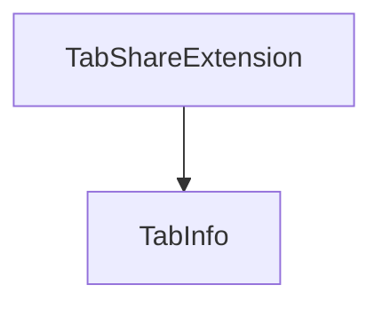

# Chapter 7: Tooling Surface and Automation Patterns

Welcome to **Chapter 7: Tooling Surface and Automation Patterns**. In this part of **Playwright MCP Tutorial: Browser Automation for Coding Agents Through MCP**, you will build an intuitive mental model first, then move into concrete implementation details and practical production tradeoffs.


This chapter translates the full tool catalog into reliable automation patterns.

## Learning Goals

- group tools by workflow stage (observe, act, verify, export)
- design robust loops with snapshot-first actioning
- prefer verification tools over fragile visual assumptions
- build smaller, testable automation steps

## Useful Tool Grouping

| Stage | Representative Tools |
|:------|:---------------------|
| observe | `browser_snapshot`, `browser_console_messages`, `browser_network_requests` |
| act | `browser_click`, `browser_fill_form`, `browser_type`, `browser_select_option` |
| verify | `browser_verify_element_visible`, `browser_verify_text_visible`, `browser_verify_value` |
| artifacts | `browser_take_screenshot`, `browser_pdf_save`, traces/log outputs |

## Source References

- [README: Tools](https://github.com/microsoft/playwright-mcp/blob/main/README.md#tools)
- [README: Key Features](https://github.com/microsoft/playwright-mcp/blob/main/README.md#key-features)

## Summary

You now have a repeatable pattern for stable browser automation loops in agent workflows.

Next: [Chapter 8: Troubleshooting, Security, and Contribution](08-troubleshooting-security-and-contribution.md)

## Depth Expansion Playbook

## Source Code Walkthrough

### `packages/extension/src/background.ts`

The `TabShareExtension` class in [`packages/extension/src/background.ts`](https://github.com/microsoft/playwright-mcp/blob/HEAD/packages/extension/src/background.ts) handles a key part of this chapter's functionality:

```ts
};

class TabShareExtension {
  private _activeConnection: RelayConnection | undefined;
  private _connectedTabId: number | null = null;
  private _pendingTabSelection = new Map<number, { connection: RelayConnection, timerId?: number }>();

  constructor() {
    chrome.tabs.onRemoved.addListener(this._onTabRemoved.bind(this));
    chrome.tabs.onUpdated.addListener(this._onTabUpdated.bind(this));
    chrome.tabs.onActivated.addListener(this._onTabActivated.bind(this));
    chrome.runtime.onMessage.addListener(this._onMessage.bind(this));
    chrome.action.onClicked.addListener(this._onActionClicked.bind(this));
  }

  // Promise-based message handling is not supported in Chrome: https://issues.chromium.org/issues/40753031
  private _onMessage(message: PageMessage, sender: chrome.runtime.MessageSender, sendResponse: (response: any) => void) {
    switch (message.type) {
      case 'connectToMCPRelay':
        this._connectToRelay(sender.tab!.id!, message.mcpRelayUrl).then(
            () => sendResponse({ success: true }),
            (error: any) => sendResponse({ success: false, error: error.message }));
        return true;
      case 'getTabs':
        this._getTabs().then(
            tabs => sendResponse({ success: true, tabs, currentTabId: sender.tab?.id }),
            (error: any) => sendResponse({ success: false, error: error.message }));
        return true;
      case 'connectToTab':
        const tabId = message.tabId || sender.tab?.id!;
        const windowId = message.windowId || sender.tab?.windowId!;
        this._connectTab(sender.tab!.id!, tabId, windowId, message.mcpRelayUrl!).then(
```

This class is important because it defines how Playwright MCP Tutorial: Browser Automation for Coding Agents Through MCP implements the patterns covered in this chapter.

### `packages/extension/src/ui/tabItem.tsx`

The `TabInfo` interface in [`packages/extension/src/ui/tabItem.tsx`](https://github.com/microsoft/playwright-mcp/blob/HEAD/packages/extension/src/ui/tabItem.tsx) handles a key part of this chapter's functionality:

```tsx
import React from 'react';

export interface TabInfo {
  id: number;
  windowId: number;
  title: string;
  url: string;
  favIconUrl?: string;
}

export const Button: React.FC<{ variant: 'primary' | 'default' | 'reject'; onClick: () => void; children: React.ReactNode }> = ({
  variant,
  onClick,
  children
}) => {
  return (
    <button className={`button ${variant}`} onClick={onClick}>
      {children}
    </button>
  );
};


export interface TabItemProps {
  tab: TabInfo;
  onClick?: () => void;
  button?: React.ReactNode;
}

export const TabItem: React.FC<TabItemProps> = ({
  tab,
  onClick,
```

This interface is important because it defines how Playwright MCP Tutorial: Browser Automation for Coding Agents Through MCP implements the patterns covered in this chapter.


## How These Components Connect


