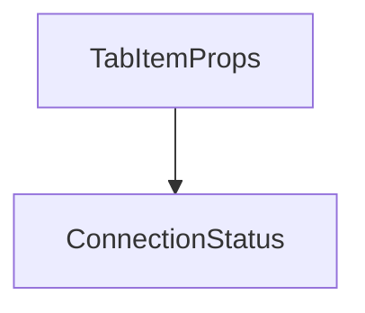

# Chapter 8: Troubleshooting, Security, and Contribution

Welcome to **Chapter 8: Troubleshooting, Security, and Contribution**. In this part of **Playwright MCP Tutorial: Browser Automation for Coding Agents Through MCP**, you will build an intuitive mental model first, then move into concrete implementation details and practical production tradeoffs.


This chapter covers practical troubleshooting and safe evolution of Playwright MCP usage.

## Learning Goals

- debug common runtime/setup issues quickly
- apply safe defaults for credentials and browser state
- understand upstream contribution and source layout
- plan upgrades with minimal disruption

## Troubleshooting Baseline

1. verify host config syntax first
2. validate browser install/runtime mode
3. reproduce with minimal config and one deterministic action
4. add capabilities and complex state incrementally

## Source References

- [README](https://github.com/microsoft/playwright-mcp/blob/main/README.md)
- [Security Policy](https://github.com/microsoft/playwright-mcp/blob/main/SECURITY.md)
- [Contributing Guide](https://github.com/microsoft/playwright-mcp/blob/main/CONTRIBUTING.md)
- [Source Location Note](https://github.com/microsoft/playwright-mcp/blob/main/packages/playwright-mcp/src/README.md)

## Summary

You now have an end-to-end operating model for integrating Playwright MCP into production coding-agent workflows.

Next steps:

- standardize one baseline config per host used by your team
- build one deterministic snapshot-first browser workflow and reuse it
- audit session and credential handling before broad rollout

## Depth Expansion Playbook

## Source Code Walkthrough

### `packages/extension/src/ui/tabItem.tsx`

The `TabItemProps` interface in [`packages/extension/src/ui/tabItem.tsx`](https://github.com/microsoft/playwright-mcp/blob/HEAD/packages/extension/src/ui/tabItem.tsx) handles a key part of this chapter's functionality:

```tsx


export interface TabItemProps {
  tab: TabInfo;
  onClick?: () => void;
  button?: React.ReactNode;
}

export const TabItem: React.FC<TabItemProps> = ({
  tab,
  onClick,
  button
}) => {
  return (
    <div className='tab-item' onClick={onClick} style={onClick ? { cursor: 'pointer' } : undefined}>
      <rect width="16" height="16" fill="%23f6f8fa"/></svg>'}
        alt=''
        className='tab-favicon'
      />
      <div className='tab-content'>
        <div className='tab-title'>
          {tab.title || 'Untitled'}
        </div>
        <div className='tab-url'>{tab.url}</div>
      </div>
      {button}
    </div>
  );
};

```

This interface is important because it defines how Playwright MCP Tutorial: Browser Automation for Coding Agents Through MCP implements the patterns covered in this chapter.

### `packages/extension/src/ui/status.tsx`

The `ConnectionStatus` interface in [`packages/extension/src/ui/status.tsx`](https://github.com/microsoft/playwright-mcp/blob/HEAD/packages/extension/src/ui/status.tsx) handles a key part of this chapter's functionality:

```tsx
import { AuthTokenSection } from './authToken';

interface ConnectionStatus {
  isConnected: boolean;
  connectedTabId: number | null;
  connectedTab?: TabInfo;
}

const StatusApp: React.FC = () => {
  const [status, setStatus] = useState<ConnectionStatus>({
    isConnected: false,
    connectedTabId: null
  });

  useEffect(() => {
    void loadStatus();
  }, []);

  const loadStatus = async () => {
    // Get current connection status from background script
    const { connectedTabId } = await chrome.runtime.sendMessage({ type: 'getConnectionStatus' });
    if (connectedTabId) {
      const tab = await chrome.tabs.get(connectedTabId);
      setStatus({
        isConnected: true,
        connectedTabId,
        connectedTab: {
          id: tab.id!,
          windowId: tab.windowId!,
          title: tab.title!,
          url: tab.url!,
          favIconUrl: tab.favIconUrl
```

This interface is important because it defines how Playwright MCP Tutorial: Browser Automation for Coding Agents Through MCP implements the patterns covered in this chapter.


## How These Components Connect


