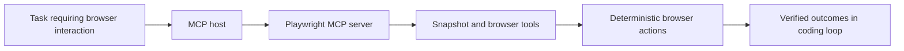

# Playwright MCP Tutorial: Browser Automation for Coding Agents Through MCP

> Learn how to use `microsoft/playwright-mcp` to give AI coding agents structured browser automation with accessibility snapshots, deterministic actions, and portable MCP host integrations.

## Why This Track Matters

`playwright-mcp` is one of the most adopted MCP servers for browser interaction and is increasingly used to pair UI-level verification with coding-agent loops.

This track focuses on:

- installing Playwright MCP quickly across major hosts
- selecting runtime modes (default, extension, standalone, docker)
- tuning configuration for reliability, security, and cost
- building practical automation flows with the tool surface

## Current Snapshot (Verified February 12, 2026)

- repository: [`microsoft/playwright-mcp`](https://github.com/microsoft/playwright-mcp)
- stars: about **27.0k**
- latest release: [`v0.0.64`](https://github.com/microsoft/playwright-mcp/releases/tag/v0.0.64)
- recent activity: updates on **February 9, 2026**
- project positioning: official Playwright MCP server for structured browser automation in agent workflows

## Mental Model

## Chapter Guide

| Chapter | Key Question | Outcome |
|:--------|:-------------|:--------|
| [01 - Getting Started](01-getting-started.md) | How do I install and verify Playwright MCP quickly? | Working browser automation baseline |
| [02 - Operating Model: Accessibility Snapshots](02-operating-model-accessibility-snapshots.md) | Why does snapshot-driven interaction matter for agents? | Better automation mental model |
| [03 - Installation Across Host Clients](03-installation-across-host-clients.md) | How does setup differ across Claude, Codex, Cursor, and others? | Faster cross-host adoption |
| [04 - Configuration, Capabilities, and Runtime Modes](04-configuration-capabilities-and-runtime-modes.md) | Which flags and capabilities should I tune first? | Stable and safer runtime profile |
| [05 - Profile State, Extension, and Auth Sessions](05-profile-state-extension-and-auth-sessions.md) | How do I handle authenticated workflows and existing sessions? | Better real-world browser continuity |
| [06 - Standalone and Docker Deployment](06-standalone-and-docker-deployment.md) | How do I run Playwright MCP outside default stdio mode? | Deployment flexibility |
| [07 - Tooling Surface and Automation Patterns](07-tooling-surface-and-automation-patterns.md) | How do I compose tools into reliable automation loops? | Higher execution reliability |
| [08 - Troubleshooting, Security, and Contribution](08-troubleshooting-security-and-contribution.md) | How do I debug failures and evolve usage safely? | Production-oriented operations playbook |

## What You Will Learn

- how to run Playwright MCP consistently across major coding-agent hosts
- how to tune browser runtime behavior for your environment
- how to compose snapshot-first browser actions for robust automation
- how to handle security and troubleshooting concerns in production usage

## Source References

- [Playwright MCP Repository](https://github.com/microsoft/playwright-mcp)
- [README](https://github.com/microsoft/playwright-mcp/blob/main/README.md)
- [Chrome Extension Guide](https://github.com/microsoft/playwright-mcp/blob/main/packages/extension/README.md)
- [Playwright MCP Releases](https://github.com/microsoft/playwright-mcp/releases)
- [Security Policy](https://github.com/microsoft/playwright-mcp/blob/main/SECURITY.md)

## Related Tutorials

- [Chrome DevTools MCP Tutorial](../chrome-devtools-mcp-tutorial/)
- [OpenCode Tutorial](../opencode-tutorial/)
- [Codex CLI Tutorial](../codex-cli-tutorial/)
- [Claude Code Tutorial](../claude-code-tutorial/)

---

Start with [Chapter 1: Getting Started](01-getting-started.md).
