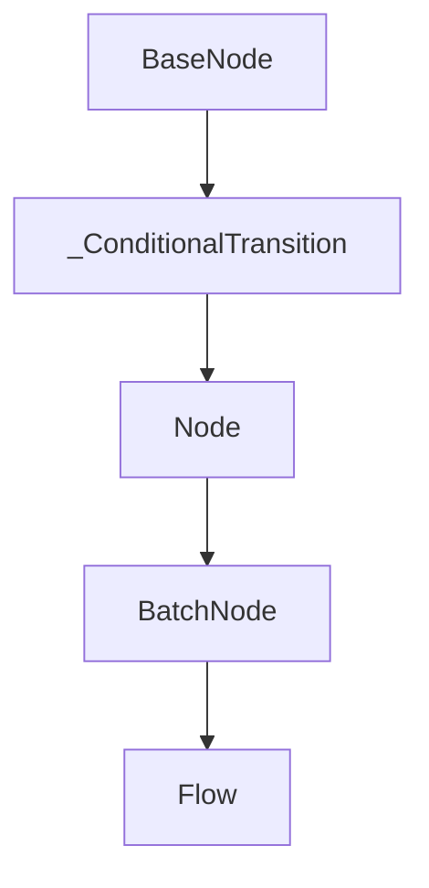

# Chapter 1: Getting Started

Welcome to **Chapter 1: Getting Started**. In this part of **PocketFlow Tutorial: Minimal LLM Framework with Graph-Based Power**, you will build an intuitive mental model first, then move into concrete implementation details and practical production tradeoffs.


This chapter gets PocketFlow installed and running through a minimal graph workflow.

## Learning Goals

- install PocketFlow with `pip`
- run a first graph-based flow
- understand the zero-dependency philosophy
- locate core docs and cookbook examples

## Quick Start

```bash
pip install pocketflow
```

## Source References

- [PocketFlow README](https://github.com/The-Pocket/PocketFlow)
- [PocketFlow Documentation](https://the-pocket.github.io/PocketFlow/)

## Summary

You now have a runnable PocketFlow setup and know where to find core patterns.

Next: [Chapter 2: Core Graph Abstraction](02-core-graph-abstraction.md)

## Source Code Walkthrough

### `pocketflow/__init__.py`

The `BaseNode` class in [`pocketflow/__init__.py`](https://github.com/The-Pocket/PocketFlow/blob/HEAD/pocketflow/__init__.py) handles a key part of this chapter's functionality:

```py
import asyncio, warnings, copy, time

class BaseNode:
    def __init__(self): self.params,self.successors={},{}
    def set_params(self,params): self.params=params
    def next(self,node,action="default"):
        if action in self.successors: warnings.warn(f"Overwriting successor for action '{action}'")
        self.successors[action]=node; return node
    def prep(self,shared): pass
    def exec(self,prep_res): pass
    def post(self,shared,prep_res,exec_res): pass
    def _exec(self,prep_res): return self.exec(prep_res)
    def _run(self,shared): p=self.prep(shared); e=self._exec(p); return self.post(shared,p,e)
    def run(self,shared): 
        if self.successors: warnings.warn("Node won't run successors. Use Flow.")  
        return self._run(shared)
    def __rshift__(self,other): return self.next(other)
    def __sub__(self,action):
        if isinstance(action,str): return _ConditionalTransition(self,action)
        raise TypeError("Action must be a string")

class _ConditionalTransition:
    def __init__(self,src,action): self.src,self.action=src,action
    def __rshift__(self,tgt): return self.src.next(tgt,self.action)

class Node(BaseNode):
    def __init__(self,max_retries=1,wait=0): super().__init__(); self.max_retries,self.wait=max_retries,wait
    def exec_fallback(self,prep_res,exc): raise exc
    def _exec(self,prep_res):
        for self.cur_retry in range(self.max_retries):
            try: return self.exec(prep_res)
            except Exception as e:
```

This class is important because it defines how PocketFlow Tutorial: Minimal LLM Framework with Graph-Based Power implements the patterns covered in this chapter.

### `pocketflow/__init__.py`

The `_ConditionalTransition` class in [`pocketflow/__init__.py`](https://github.com/The-Pocket/PocketFlow/blob/HEAD/pocketflow/__init__.py) handles a key part of this chapter's functionality:

```py
    def __rshift__(self,other): return self.next(other)
    def __sub__(self,action):
        if isinstance(action,str): return _ConditionalTransition(self,action)
        raise TypeError("Action must be a string")

class _ConditionalTransition:
    def __init__(self,src,action): self.src,self.action=src,action
    def __rshift__(self,tgt): return self.src.next(tgt,self.action)

class Node(BaseNode):
    def __init__(self,max_retries=1,wait=0): super().__init__(); self.max_retries,self.wait=max_retries,wait
    def exec_fallback(self,prep_res,exc): raise exc
    def _exec(self,prep_res):
        for self.cur_retry in range(self.max_retries):
            try: return self.exec(prep_res)
            except Exception as e:
                if self.cur_retry==self.max_retries-1: return self.exec_fallback(prep_res,e)
                if self.wait>0: time.sleep(self.wait)

class BatchNode(Node):
    def _exec(self,items): return [super(BatchNode,self)._exec(i) for i in (items or [])]

class Flow(BaseNode):
    def __init__(self,start=None): super().__init__(); self.start_node=start
    def start(self,start): self.start_node=start; return start
    def get_next_node(self,curr,action):
        nxt=curr.successors.get(action or "default")
        if not nxt and curr.successors: warnings.warn(f"Flow ends: '{action}' not found in {list(curr.successors)}")
        return nxt
    def _orch(self,shared,params=None):
        curr,p,last_action =copy.copy(self.start_node),(params or {**self.params}),None
        while curr: curr.set_params(p); last_action=curr._run(shared); curr=copy.copy(self.get_next_node(curr,last_action))
```

This class is important because it defines how PocketFlow Tutorial: Minimal LLM Framework with Graph-Based Power implements the patterns covered in this chapter.

### `pocketflow/__init__.py`

The `Node` class in [`pocketflow/__init__.py`](https://github.com/The-Pocket/PocketFlow/blob/HEAD/pocketflow/__init__.py) handles a key part of this chapter's functionality:

```py
import asyncio, warnings, copy, time

class BaseNode:
    def __init__(self): self.params,self.successors={},{}
    def set_params(self,params): self.params=params
    def next(self,node,action="default"):
        if action in self.successors: warnings.warn(f"Overwriting successor for action '{action}'")
        self.successors[action]=node; return node
    def prep(self,shared): pass
    def exec(self,prep_res): pass
    def post(self,shared,prep_res,exec_res): pass
    def _exec(self,prep_res): return self.exec(prep_res)
    def _run(self,shared): p=self.prep(shared); e=self._exec(p); return self.post(shared,p,e)
    def run(self,shared): 
        if self.successors: warnings.warn("Node won't run successors. Use Flow.")  
        return self._run(shared)
    def __rshift__(self,other): return self.next(other)
    def __sub__(self,action):
        if isinstance(action,str): return _ConditionalTransition(self,action)
        raise TypeError("Action must be a string")

class _ConditionalTransition:
    def __init__(self,src,action): self.src,self.action=src,action
    def __rshift__(self,tgt): return self.src.next(tgt,self.action)

class Node(BaseNode):
    def __init__(self,max_retries=1,wait=0): super().__init__(); self.max_retries,self.wait=max_retries,wait
    def exec_fallback(self,prep_res,exc): raise exc
    def _exec(self,prep_res):
        for self.cur_retry in range(self.max_retries):
            try: return self.exec(prep_res)
            except Exception as e:
```

This class is important because it defines how PocketFlow Tutorial: Minimal LLM Framework with Graph-Based Power implements the patterns covered in this chapter.

### `pocketflow/__init__.py`

The `BatchNode` class in [`pocketflow/__init__.py`](https://github.com/The-Pocket/PocketFlow/blob/HEAD/pocketflow/__init__.py) handles a key part of this chapter's functionality:

```py
                if self.wait>0: time.sleep(self.wait)

class BatchNode(Node):
    def _exec(self,items): return [super(BatchNode,self)._exec(i) for i in (items or [])]

class Flow(BaseNode):
    def __init__(self,start=None): super().__init__(); self.start_node=start
    def start(self,start): self.start_node=start; return start
    def get_next_node(self,curr,action):
        nxt=curr.successors.get(action or "default")
        if not nxt and curr.successors: warnings.warn(f"Flow ends: '{action}' not found in {list(curr.successors)}")
        return nxt
    def _orch(self,shared,params=None):
        curr,p,last_action =copy.copy(self.start_node),(params or {**self.params}),None
        while curr: curr.set_params(p); last_action=curr._run(shared); curr=copy.copy(self.get_next_node(curr,last_action))
        return last_action
    def _run(self,shared): p=self.prep(shared); o=self._orch(shared); return self.post(shared,p,o)
    def post(self,shared,prep_res,exec_res): return exec_res

class BatchFlow(Flow):
    def _run(self,shared):
        pr=self.prep(shared) or []
        for bp in pr: self._orch(shared,{**self.params,**bp})
        return self.post(shared,pr,None)

class AsyncNode(Node):
    async def prep_async(self,shared): pass
    async def exec_async(self,prep_res): pass
    async def exec_fallback_async(self,prep_res,exc): raise exc
    async def post_async(self,shared,prep_res,exec_res): pass
    async def _exec(self,prep_res): 
        for self.cur_retry in range(self.max_retries):
```

This class is important because it defines how PocketFlow Tutorial: Minimal LLM Framework with Graph-Based Power implements the patterns covered in this chapter.


## How These Components Connect


