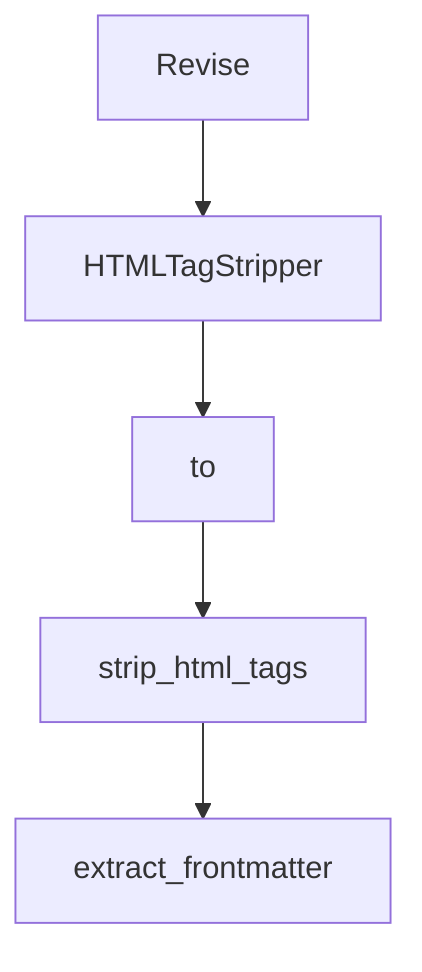

# Chapter 2: Core Graph Abstraction

Welcome to **Chapter 2: Core Graph Abstraction**. In this part of **PocketFlow Tutorial: Minimal LLM Framework with Graph-Based Power**, you will build an intuitive mental model first, then move into concrete implementation details and practical production tradeoffs.


PocketFlow's core abstraction is a graph that models control flow and execution transitions.

## Why Graph First

- makes control flow explicit
- keeps framework surface area small
- enables composition into higher-level patterns

## Summary

You now understand how the graph abstraction underpins all PocketFlow capabilities.

Next: [Chapter 3: Agent and Workflow Patterns](03-agent-and-workflow-patterns.md)

## Source Code Walkthrough

### `cookbook/pocketflow-code-generator/nodes.py`

The `Revise` class in [`cookbook/pocketflow-code-generator/nodes.py`](https://github.com/The-Pocket/PocketFlow/blob/HEAD/cookbook/pocketflow-code-generator/nodes.py) handles a key part of this chapter's functionality:

```py
            return "failure"

class Revise(Node):
    def prep(self, shared):
        failed_tests = [r for r in shared["test_results"] if not r["passed"]]
        return {
            "problem": shared["problem"],
            "test_cases": shared["test_cases"],
            "function_code": shared["function_code"],
            "failed_tests": failed_tests
        }

    def exec(self, inputs):
        # Format current test cases nicely
        formatted_tests = ""
        for i, test in enumerate(inputs['test_cases'], 1):
            formatted_tests += f"{i}. {test['name']}\n"
            formatted_tests += f"   input: {test['input']}\n"
            formatted_tests += f"   expected: {test['expected']}\n\n"
        
        # Format failed tests nicely
        formatted_failures = ""
        for i, result in enumerate(inputs['failed_tests'], 1):
            test_case = result['test_case']
            formatted_failures += f"{i}. {test_case['name']}:\n"
            if result['error']:
                formatted_failures += f"   error: {result['error']}\n"
            else:
                formatted_failures += f"   output: {result['actual']}\n"
            formatted_failures += f"   expected: {result['expected']}\n\n"

        prompt = f"""Problem: {inputs['problem']}
```

This class is important because it defines how PocketFlow Tutorial: Minimal LLM Framework with Graph-Based Power implements the patterns covered in this chapter.

### `utils/update_pocketflow_mdc.py`

The `HTMLTagStripper` class in [`utils/update_pocketflow_mdc.py`](https://github.com/The-Pocket/PocketFlow/blob/HEAD/utils/update_pocketflow_mdc.py) handles a key part of this chapter's functionality:

```py
import html.parser

class HTMLTagStripper(html.parser.HTMLParser):
    """HTML Parser subclass to strip HTML tags from content"""
    def __init__(self):
        super().__init__()
        self.reset()
        self.strict = False
        self.convert_charrefs = True
        self.text = []
    
    def handle_data(self, data):
        self.text.append(data)
    
    def get_text(self):
        return ''.join(self.text)

def strip_html_tags(html_content):
    """Remove HTML tags from content"""
    stripper = HTMLTagStripper()
    stripper.feed(html_content)
    return stripper.get_text()

def extract_frontmatter(file_path):
    """Extract title, parent, and nav_order from markdown frontmatter"""
    frontmatter = {}
    try:
        with open(file_path, 'r', encoding='utf-8') as f:
            content = f.read()
            
            # Extract frontmatter between --- markers
            fm_match = re.search(r'^---\s*(.+?)\s*---', content, re.DOTALL)
```

This class is important because it defines how PocketFlow Tutorial: Minimal LLM Framework with Graph-Based Power implements the patterns covered in this chapter.

### `utils/update_pocketflow_mdc.py`

The `to` class in [`utils/update_pocketflow_mdc.py`](https://github.com/The-Pocket/PocketFlow/blob/HEAD/utils/update_pocketflow_mdc.py) handles a key part of this chapter's functionality:

```py
#!/usr/bin/env python3
"""
Script to generate MDC files from the PocketFlow docs folder, creating one MDC file per MD file.

Usage:
    python update_pocketflow_mdc.py [--docs-dir PATH] [--rules-dir PATH]
"""

import os
import re
import shutil
from pathlib import Path
import sys
import html.parser

class HTMLTagStripper(html.parser.HTMLParser):
    """HTML Parser subclass to strip HTML tags from content"""
    def __init__(self):
        super().__init__()
        self.reset()
        self.strict = False
        self.convert_charrefs = True
        self.text = []
    
    def handle_data(self, data):
        self.text.append(data)
    
    def get_text(self):
        return ''.join(self.text)

def strip_html_tags(html_content):
    """Remove HTML tags from content"""
```

This class is important because it defines how PocketFlow Tutorial: Minimal LLM Framework with Graph-Based Power implements the patterns covered in this chapter.

### `utils/update_pocketflow_mdc.py`

The `strip_html_tags` function in [`utils/update_pocketflow_mdc.py`](https://github.com/The-Pocket/PocketFlow/blob/HEAD/utils/update_pocketflow_mdc.py) handles a key part of this chapter's functionality:

```py
        return ''.join(self.text)

def strip_html_tags(html_content):
    """Remove HTML tags from content"""
    stripper = HTMLTagStripper()
    stripper.feed(html_content)
    return stripper.get_text()

def extract_frontmatter(file_path):
    """Extract title, parent, and nav_order from markdown frontmatter"""
    frontmatter = {}
    try:
        with open(file_path, 'r', encoding='utf-8') as f:
            content = f.read()
            
            # Extract frontmatter between --- markers
            fm_match = re.search(r'^---\s*(.+?)\s*---', content, re.DOTALL)
            if fm_match:
                frontmatter_text = fm_match.group(1)
                
                # Extract fields
                title_match = re.search(r'title:\s*"?([^"\n]+)"?', frontmatter_text)
                parent_match = re.search(r'parent:\s*"?([^"\n]+)"?', frontmatter_text)
                nav_order_match = re.search(r'nav_order:\s*(\d+)', frontmatter_text)
                
                if title_match:
                    frontmatter['title'] = title_match.group(1)
                if parent_match:
                    frontmatter['parent'] = parent_match.group(1)
                if nav_order_match:
                    frontmatter['nav_order'] = int(nav_order_match.group(1))
    except Exception as e:
```

This function is important because it defines how PocketFlow Tutorial: Minimal LLM Framework with Graph-Based Power implements the patterns covered in this chapter.


## How These Components Connect


