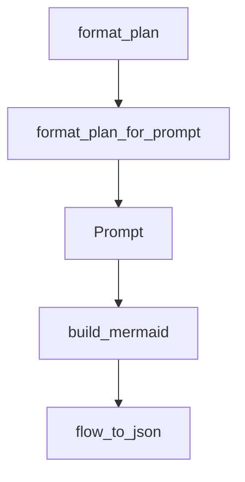

# Chapter 3: Agent and Workflow Patterns

Welcome to **Chapter 3: Agent and Workflow Patterns**. In this part of **PocketFlow Tutorial: Minimal LLM Framework with Graph-Based Power**, you will build an intuitive mental model first, then move into concrete implementation details and practical production tradeoffs.


PocketFlow supports agent and workflow designs through reusable graph composition patterns.

## Pattern Set

| Pattern | Use Case |
|:--------|:---------|
| workflow | deterministic stage execution |
| agent | tool-calling and iterative reasoning |
| batch | repeated item processing |

## Summary

You now have composition patterns for turning simple nodes into full agent workflows.

Next: [Chapter 4: RAG and Knowledge Patterns](04-rag-and-knowledge-patterns.md)

## Depth Expansion Playbook

## Source Code Walkthrough

### `cookbook/pocketflow-thinking/nodes.py`

The `format_plan` function in [`cookbook/pocketflow-thinking/nodes.py`](https://github.com/The-Pocket/PocketFlow/blob/HEAD/cookbook/pocketflow-thinking/nodes.py) handles a key part of this chapter's functionality:

```py

# Helper function to format structured plan for printing
def format_plan(plan_items, indent_level=0):
    indent = "  " * indent_level
    output = []
    if isinstance(plan_items, list):
        for item in plan_items:
            if isinstance(item, dict):
                status = item.get('status', 'Unknown')
                desc = item.get('description', 'No description')
                result = item.get('result', '')
                mark = item.get('mark', '') # For verification etc.

                # Format the main step line
                line = f"{indent}- [{status}] {desc}"
                if result:
                    line += f": {result}"
                if mark:
                    line += f" ({mark})"
                output.append(line)

                # Recursively format sub-steps if they exist
                sub_steps = item.get('sub_steps')
                if sub_steps:
                    output.append(format_plan(sub_steps, indent_level + 1))
            elif isinstance(item, str): # Basic fallback for string items
                 output.append(f"{indent}- {item}")
            else: # Fallback for unexpected types
                 output.append(f"{indent}- {str(item)}")

    elif isinstance(plan_items, str): # Handle case where plan is just an error string
        output.append(f"{indent}{plan_items}")
```

This function is important because it defines how PocketFlow Tutorial: Minimal LLM Framework with Graph-Based Power implements the patterns covered in this chapter.

### `cookbook/pocketflow-thinking/nodes.py`

The `format_plan_for_prompt` function in [`cookbook/pocketflow-thinking/nodes.py`](https://github.com/The-Pocket/PocketFlow/blob/HEAD/cookbook/pocketflow-thinking/nodes.py) handles a key part of this chapter's functionality:

```py

# Helper function to format structured plan for the prompt (simplified view)
def format_plan_for_prompt(plan_items, indent_level=0):
    indent = "  " * indent_level
    output = []
    # Simplified formatting for prompt clarity
    if isinstance(plan_items, list):
        for item in plan_items:
            if isinstance(item, dict):
                status = item.get('status', 'Unknown')
                desc = item.get('description', 'No description')
                line = f"{indent}- [{status}] {desc}"
                output.append(line)
                sub_steps = item.get('sub_steps')
                if sub_steps:
                    # Indicate nesting without full recursive display in prompt
                    output.append(format_plan_for_prompt(sub_steps, indent_level + 1))
            else: # Fallback
                 output.append(f"{indent}- {str(item)}")
    else:
        output.append(f"{indent}{str(plan_items)}")
    return "\n".join(output)


class ChainOfThoughtNode(Node):
    def prep(self, shared):
        problem = shared.get("problem", "")
        thoughts = shared.get("thoughts", [])
        current_thought_number = shared.get("current_thought_number", 0)

        shared["current_thought_number"] = current_thought_number + 1

```

This function is important because it defines how PocketFlow Tutorial: Minimal LLM Framework with Graph-Based Power implements the patterns covered in this chapter.

### `cookbook/pocketflow-thinking/nodes.py`

The `Prompt` interface in [`cookbook/pocketflow-thinking/nodes.py`](https://github.com/The-Pocket/PocketFlow/blob/HEAD/cookbook/pocketflow-thinking/nodes.py) handles a key part of this chapter's functionality:

```py
        is_first_thought = prep_res["is_first_thought"]

        # --- Construct Prompt ---
        # Instructions updated for dictionary structure
        instruction_base = textwrap.dedent(f"""
            Your task is to generate the next thought (Thought {current_thought_number}).

            Instructions:
            1.  **Evaluate Previous Thought:** If not the first thought, start `current_thinking` by evaluating Thought {current_thought_number - 1}. State: "Evaluation of Thought {current_thought_number - 1}: [Correct/Minor Issues/Major Error - explain]". Address errors first.
            2.  **Execute Step:** Execute the first step in the plan with `status: Pending`.
            3.  **Maintain Plan (Structure):** Generate an updated `planning` list. Each item should be a dictionary with keys: `description` (string), `status` (string: "Pending", "Done", "Verification Needed"), and optionally `result` (string, concise summary when Done) or `mark` (string, reason for Verification Needed). Sub-steps are represented by a `sub_steps` key containing a *list* of these dictionaries.
            4.  **Update Current Step Status:** In the updated plan, change the `status` of the executed step to "Done" and add a `result` key with a concise summary. If verification is needed based on evaluation, change status to "Verification Needed" and add a `mark`.
            5.  **Refine Plan (Sub-steps):** If a "Pending" step is complex, add a `sub_steps` key to its dictionary containing a list of new step dictionaries (status: "Pending") breaking it down. Keep the parent step's status "Pending" until all sub-steps are "Done".
            6.  **Refine Plan (Errors):** Modify the plan logically based on evaluation findings (e.g., change status, add correction steps).
            7.  **Final Step:** Ensure the plan progresses towards a final step dictionary like `{{'description': "Conclusion", 'status': "Pending"}}`.
            8.  **Termination:** Set `next_thought_needed` to `false` ONLY when executing the step with `description: "Conclusion"`.
        """)

        # Context remains largely the same
        if is_first_thought:
            instruction_context = textwrap.dedent("""
                **This is the first thought:** Create an initial plan as a list of dictionaries (keys: description, status). Include sub-steps via the `sub_steps` key if needed. Then, execute the first step in `current_thinking` and provide the updated plan (marking step 1 `status: Done` with a `result`).
            """)
        else:
            instruction_context = textwrap.dedent(f"""
                **Previous Plan (Simplified View):**
                {last_plan_text}

                Start `current_thinking` by evaluating Thought {current_thought_number - 1}. Then, proceed with the first step where `status: Pending`. Update the plan structure (list of dictionaries) reflecting evaluation, execution, and refinements.
            """)

        # Output format example updated for dictionary structure
```

This interface is important because it defines how PocketFlow Tutorial: Minimal LLM Framework with Graph-Based Power implements the patterns covered in this chapter.

### `cookbook/pocketflow-visualization/visualize.py`

The `build_mermaid` function in [`cookbook/pocketflow-visualization/visualize.py`](https://github.com/The-Pocket/PocketFlow/blob/HEAD/cookbook/pocketflow-visualization/visualize.py) handles a key part of this chapter's functionality:

```py


def build_mermaid(start):
    ids, visited, lines = {}, set(), ["graph LR"]
    ctr = 1

    def get_id(n):
        nonlocal ctr
        return (
            ids[n] if n in ids else (ids.setdefault(n, f"N{ctr}"), (ctr := ctr + 1))[0]
        )

    def link(a, b, action=None):
        if action:
            lines.append(f"    {a} -->|{action}| {b}")
        else:
            lines.append(f"    {a} --> {b}")

    def walk(node, parent=None, action=None):
        if node in visited:
            return parent and link(parent, get_id(node), action)
        visited.add(node)
        if isinstance(node, Flow):
            node.start_node and parent and link(parent, get_id(node.start_node), action)
            lines.append(
                f"\n    subgraph sub_flow_{get_id(node)}[{type(node).__name__}]"
            )
            node.start_node and walk(node.start_node)
            for act, nxt in node.successors.items():
                node.start_node and walk(nxt, get_id(node.start_node), act) or (
                    parent and link(parent, get_id(nxt), action)
                ) or walk(nxt, None, act)
```

This function is important because it defines how PocketFlow Tutorial: Minimal LLM Framework with Graph-Based Power implements the patterns covered in this chapter.


## How These Components Connect


