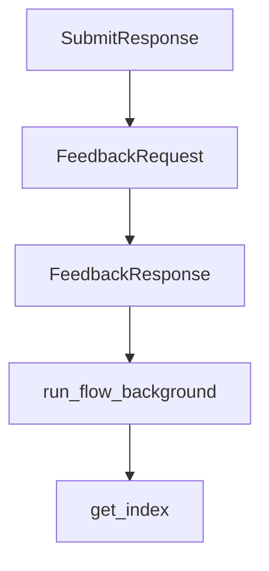

# Chapter 3: Agent and Workflow Patterns

Welcome to **Chapter 3: Agent and Workflow Patterns**. In this part of **PocketFlow Tutorial: Minimal LLM Framework with Graph-Based Power**, you will build an intuitive mental model first, then move into concrete implementation details and practical production tradeoffs.


PocketFlow supports agent and workflow designs through reusable graph composition patterns.

## Pattern Set

| Pattern | Use Case |
|:--------|:---------|
| workflow | deterministic stage execution |
| agent | tool-calling and iterative reasoning |
| batch | repeated item processing |

## Summary

You now have composition patterns for turning simple nodes into full agent workflows.

Next: [Chapter 4: RAG and Knowledge Patterns](04-rag-and-knowledge-patterns.md)

## Source Code Walkthrough

### `cookbook/pocketflow-fastapi-hitl/server.py`

The `SubmitResponse` class in [`cookbook/pocketflow-fastapi-hitl/server.py`](https://github.com/The-Pocket/PocketFlow/blob/HEAD/cookbook/pocketflow-fastapi-hitl/server.py) handles a key part of this chapter's functionality:

```py
    data: str = Field(..., min_length=1, description="Input data for the task")

class SubmitResponse(BaseModel):
    message: str = "Task submitted"
    task_id: str

class FeedbackRequest(BaseModel):
    feedback: Literal["approved", "rejected"] # Use Literal for specific choices

class FeedbackResponse(BaseModel):
    message: str

# --- FastAPI Routes ---
@app.get("/", response_class=HTMLResponse, include_in_schema=False)
async def get_index(request: Request):
    """Serves the main HTML frontend."""
    if templates is None:
        raise HTTPException(status_code=500, detail="Templates directory not configured.")
    return templates.TemplateResponse("index.html", {"request": request})

@app.post("/submit", response_model=SubmitResponse, status_code=status.HTTP_202_ACCEPTED)
async def submit_task(
    submit_request: SubmitRequest, # Use Pydantic model for validation
    background_tasks: BackgroundTasks # Inject BackgroundTasks instance
):
    """
    Submits a new task. The actual processing runs in the background.
    Returns immediately with the task ID.
    """
    task_id = str(uuid.uuid4())
    feedback_event = asyncio.Event()
    status_queue = asyncio.Queue()
```

This class is important because it defines how PocketFlow Tutorial: Minimal LLM Framework with Graph-Based Power implements the patterns covered in this chapter.

### `cookbook/pocketflow-fastapi-hitl/server.py`

The `FeedbackRequest` class in [`cookbook/pocketflow-fastapi-hitl/server.py`](https://github.com/The-Pocket/PocketFlow/blob/HEAD/cookbook/pocketflow-fastapi-hitl/server.py) handles a key part of this chapter's functionality:

```py
    task_id: str

class FeedbackRequest(BaseModel):
    feedback: Literal["approved", "rejected"] # Use Literal for specific choices

class FeedbackResponse(BaseModel):
    message: str

# --- FastAPI Routes ---
@app.get("/", response_class=HTMLResponse, include_in_schema=False)
async def get_index(request: Request):
    """Serves the main HTML frontend."""
    if templates is None:
        raise HTTPException(status_code=500, detail="Templates directory not configured.")
    return templates.TemplateResponse("index.html", {"request": request})

@app.post("/submit", response_model=SubmitResponse, status_code=status.HTTP_202_ACCEPTED)
async def submit_task(
    submit_request: SubmitRequest, # Use Pydantic model for validation
    background_tasks: BackgroundTasks # Inject BackgroundTasks instance
):
    """
    Submits a new task. The actual processing runs in the background.
    Returns immediately with the task ID.
    """
    task_id = str(uuid.uuid4())
    feedback_event = asyncio.Event()
    status_queue = asyncio.Queue()

    shared = {
        "task_input": submit_request.data,
        "processed_output": None,
```

This class is important because it defines how PocketFlow Tutorial: Minimal LLM Framework with Graph-Based Power implements the patterns covered in this chapter.

### `cookbook/pocketflow-fastapi-hitl/server.py`

The `FeedbackResponse` class in [`cookbook/pocketflow-fastapi-hitl/server.py`](https://github.com/The-Pocket/PocketFlow/blob/HEAD/cookbook/pocketflow-fastapi-hitl/server.py) handles a key part of this chapter's functionality:

```py
    feedback: Literal["approved", "rejected"] # Use Literal for specific choices

class FeedbackResponse(BaseModel):
    message: str

# --- FastAPI Routes ---
@app.get("/", response_class=HTMLResponse, include_in_schema=False)
async def get_index(request: Request):
    """Serves the main HTML frontend."""
    if templates is None:
        raise HTTPException(status_code=500, detail="Templates directory not configured.")
    return templates.TemplateResponse("index.html", {"request": request})

@app.post("/submit", response_model=SubmitResponse, status_code=status.HTTP_202_ACCEPTED)
async def submit_task(
    submit_request: SubmitRequest, # Use Pydantic model for validation
    background_tasks: BackgroundTasks # Inject BackgroundTasks instance
):
    """
    Submits a new task. The actual processing runs in the background.
    Returns immediately with the task ID.
    """
    task_id = str(uuid.uuid4())
    feedback_event = asyncio.Event()
    status_queue = asyncio.Queue()

    shared = {
        "task_input": submit_request.data,
        "processed_output": None,
        "feedback": None,
        "review_event": feedback_event,
        "sse_queue": status_queue,
```

This class is important because it defines how PocketFlow Tutorial: Minimal LLM Framework with Graph-Based Power implements the patterns covered in this chapter.

### `cookbook/pocketflow-fastapi-hitl/server.py`

The `run_flow_background` function in [`cookbook/pocketflow-fastapi-hitl/server.py`](https://github.com/The-Pocket/PocketFlow/blob/HEAD/cookbook/pocketflow-fastapi-hitl/server.py) handles a key part of this chapter's functionality:

```py
# This function remains mostly the same, as it defines the work to be done.
# It will be scheduled by FastAPI's BackgroundTasks now.
async def run_flow_background(task_id: str, flow, shared: Dict[str, Any]):
    """Runs the flow in background, uses queue in shared for SSE."""
    # Check if task exists (might have been cancelled/deleted)
    if task_id not in tasks:
        print(f"Background task {task_id}: Task not found, aborting.")
        return
    queue = shared.get("sse_queue")
    if not queue:
        print(f"ERROR: Task {task_id} missing sse_queue in shared store!")
        tasks[task_id]["status"] = "failed"
        # Cannot report failure via SSE if queue is missing
        return

    tasks[task_id]["status"] = "running"
    await queue.put({"status": "running"})
    print(f"Task {task_id}: Background flow starting.")

    final_status = "unknown"
    error_message = None
    try:
        # Execute the potentially long-running PocketFlow
        await flow.run_async(shared)

        # Determine final status based on shared state after flow completion
        if shared.get("final_result") is not None:
            final_status = "completed"
        else:
            # If flow ends without setting final_result
            final_status = "finished_incomplete"
        print(f"Task {task_id}: Flow finished with status: {final_status}")
```

This function is important because it defines how PocketFlow Tutorial: Minimal LLM Framework with Graph-Based Power implements the patterns covered in this chapter.


## How These Components Connect


