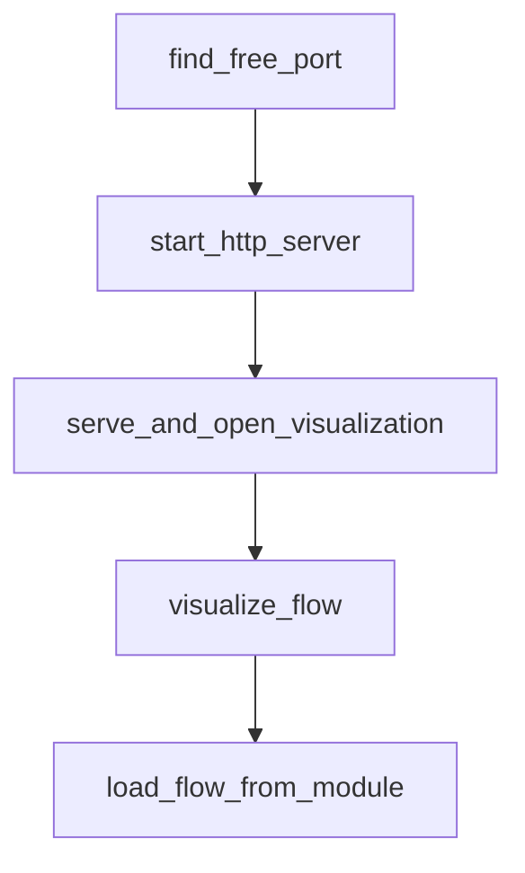

# Chapter 4: RAG and Knowledge Patterns

Welcome to **Chapter 4: RAG and Knowledge Patterns**. In this part of **PocketFlow Tutorial: Minimal LLM Framework with Graph-Based Power**, you will build an intuitive mental model first, then move into concrete implementation details and practical production tradeoffs.


RAG can be implemented in PocketFlow with explicit retrieval and synthesis node boundaries.

## RAG Flow

1. retrieval from source
2. context filtering
3. generation with grounded context
4. response validation

## Summary

You now know how to model retrieval workflows with clear graph boundaries.

Next: [Chapter 5: Multi-Agent and Supervision](05-multi-agent-and-supervision.md)

## Source Code Walkthrough

### `cookbook/pocketflow-visualization/visualize.py`

The `find_free_port` function in [`cookbook/pocketflow-visualization/visualize.py`](https://github.com/The-Pocket/PocketFlow/blob/HEAD/cookbook/pocketflow-visualization/visualize.py) handles a key part of this chapter's functionality:

```py


def find_free_port():
    """Find a free port on localhost."""
    with socket.socket(socket.AF_INET, socket.SOCK_STREAM) as s:
        s.bind(("", 0))
        s.setsockopt(socket.SOL_SOCKET, socket.SO_REUSEADDR, 1)
        return s.getsockname()[1]


def start_http_server(directory, port=None):
    """Start an HTTP server in the given directory.

    Args:
        directory: Directory to serve files from
        port: Port to use (finds a free port if None)

    Returns:
        tuple: (server_thread, port)
    """
    if port is None:
        port = find_free_port()

    # Get the absolute path of the directory
    directory = str(Path(directory).absolute())

    # Change to the directory to serve files
    os.chdir(directory)

    # Create HTTP server
    handler = http.server.SimpleHTTPRequestHandler
    httpd = socketserver.TCPServer(("", port), handler)
```

This function is important because it defines how PocketFlow Tutorial: Minimal LLM Framework with Graph-Based Power implements the patterns covered in this chapter.

### `cookbook/pocketflow-visualization/visualize.py`

The `start_http_server` function in [`cookbook/pocketflow-visualization/visualize.py`](https://github.com/The-Pocket/PocketFlow/blob/HEAD/cookbook/pocketflow-visualization/visualize.py) handles a key part of this chapter's functionality:

```py


def start_http_server(directory, port=None):
    """Start an HTTP server in the given directory.

    Args:
        directory: Directory to serve files from
        port: Port to use (finds a free port if None)

    Returns:
        tuple: (server_thread, port)
    """
    if port is None:
        port = find_free_port()

    # Get the absolute path of the directory
    directory = str(Path(directory).absolute())

    # Change to the directory to serve files
    os.chdir(directory)

    # Create HTTP server
    handler = http.server.SimpleHTTPRequestHandler
    httpd = socketserver.TCPServer(("", port), handler)

    # Start server in a separate thread
    server_thread = threading.Thread(target=httpd.serve_forever)
    server_thread.daemon = (
        True  # This makes the thread exit when the main program exits
    )
    server_thread.start()

```

This function is important because it defines how PocketFlow Tutorial: Minimal LLM Framework with Graph-Based Power implements the patterns covered in this chapter.

### `cookbook/pocketflow-visualization/visualize.py`

The `serve_and_open_visualization` function in [`cookbook/pocketflow-visualization/visualize.py`](https://github.com/The-Pocket/PocketFlow/blob/HEAD/cookbook/pocketflow-visualization/visualize.py) handles a key part of this chapter's functionality:

```py


def serve_and_open_visualization(html_path, auto_open=True):
    """Serve the HTML file and open it in a browser.

    Args:
        html_path: Path to the HTML file
        auto_open: Whether to automatically open the browser

    Returns:
        tuple: (server_thread, url)
    """
    # Get the directory and filename
    directory = os.path.dirname(os.path.abspath(html_path))
    filename = os.path.basename(html_path)

    # Start the server
    server_thread, port = start_http_server(directory)

    # Build the URL
    url = f"http://localhost:{port}/{filename}"

    # Open the URL in a browser
    if auto_open:
        print(f"Opening {url} in your browser...")
        webbrowser.open(url)
    else:
        print(f"Visualization available at {url}")

    return server_thread, url


```

This function is important because it defines how PocketFlow Tutorial: Minimal LLM Framework with Graph-Based Power implements the patterns covered in this chapter.

### `cookbook/pocketflow-visualization/visualize.py`

The `visualize_flow` function in [`cookbook/pocketflow-visualization/visualize.py`](https://github.com/The-Pocket/PocketFlow/blob/HEAD/cookbook/pocketflow-visualization/visualize.py) handles a key part of this chapter's functionality:

```py


def visualize_flow(
    flow: Flow,
    flow_name: str,
    serve: bool = True,
    auto_open: bool = True,
    output_dir: str = "./viz",
    html_title: Optional[str] = None,
) -> Union[str, Tuple[str, Any, str]]:
    """Helper function to visualize a flow with both mermaid and D3.js

    Args:
        flow: Flow object to visualize
        flow_name: Name of the flow (used for filename and display)
        serve: Whether to start a server for the visualization
        auto_open: Whether to automatically open in browser
        output_dir: Directory to save visualization files
        html_title: Custom title for the HTML page (defaults to flow_name if None)

    Returns:
        str or tuple: Path to HTML file, or (path, server_thread, url) if serve=True
    """
    print(f"\n--- {flow_name} Mermaid Diagram ---")
    print(build_mermaid(start=flow))

    print(f"\n--- {flow_name} D3.js Visualization ---")
    json_data = flow_to_json(flow)

    # Create the visualization
    output_filename = f"{flow_name.lower().replace(' ', '_')}"

```

This function is important because it defines how PocketFlow Tutorial: Minimal LLM Framework with Graph-Based Power implements the patterns covered in this chapter.


## How These Components Connect


