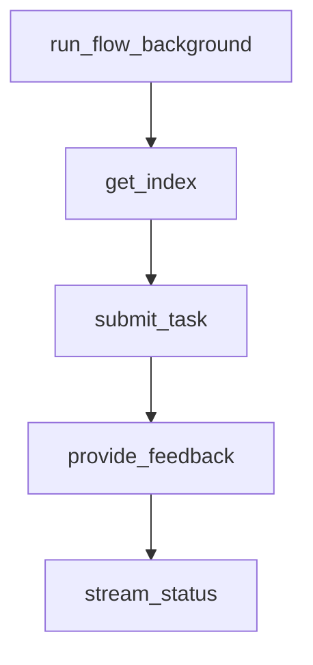

# Chapter 4: RAG and Knowledge Patterns

Welcome to **Chapter 4: RAG and Knowledge Patterns**. In this part of **PocketFlow Tutorial: Minimal LLM Framework with Graph-Based Power**, you will build an intuitive mental model first, then move into concrete implementation details and practical production tradeoffs.


RAG can be implemented in PocketFlow with explicit retrieval and synthesis node boundaries.

## RAG Flow

1. retrieval from source
2. context filtering
3. generation with grounded context
4. response validation

## Summary

You now know how to model retrieval workflows with clear graph boundaries.

Next: [Chapter 5: Multi-Agent and Supervision](05-multi-agent-and-supervision.md)

## Depth Expansion Playbook

## Source Code Walkthrough

### `cookbook/pocketflow-fastapi-hitl/server.py`

The `run_flow_background` function in [`cookbook/pocketflow-fastapi-hitl/server.py`](https://github.com/The-Pocket/PocketFlow/blob/HEAD/cookbook/pocketflow-fastapi-hitl/server.py) handles a key part of this chapter's functionality:

```py
# This function remains mostly the same, as it defines the work to be done.
# It will be scheduled by FastAPI's BackgroundTasks now.
async def run_flow_background(task_id: str, flow, shared: Dict[str, Any]):
    """Runs the flow in background, uses queue in shared for SSE."""
    # Check if task exists (might have been cancelled/deleted)
    if task_id not in tasks:
        print(f"Background task {task_id}: Task not found, aborting.")
        return
    queue = shared.get("sse_queue")
    if not queue:
        print(f"ERROR: Task {task_id} missing sse_queue in shared store!")
        tasks[task_id]["status"] = "failed"
        # Cannot report failure via SSE if queue is missing
        return

    tasks[task_id]["status"] = "running"
    await queue.put({"status": "running"})
    print(f"Task {task_id}: Background flow starting.")

    final_status = "unknown"
    error_message = None
    try:
        # Execute the potentially long-running PocketFlow
        await flow.run_async(shared)

        # Determine final status based on shared state after flow completion
        if shared.get("final_result") is not None:
            final_status = "completed"
        else:
            # If flow ends without setting final_result
            final_status = "finished_incomplete"
        print(f"Task {task_id}: Flow finished with status: {final_status}")
```

This function is important because it defines how PocketFlow Tutorial: Minimal LLM Framework with Graph-Based Power implements the patterns covered in this chapter.

### `cookbook/pocketflow-fastapi-hitl/server.py`

The `get_index` function in [`cookbook/pocketflow-fastapi-hitl/server.py`](https://github.com/The-Pocket/PocketFlow/blob/HEAD/cookbook/pocketflow-fastapi-hitl/server.py) handles a key part of this chapter's functionality:

```py
# --- FastAPI Routes ---
@app.get("/", response_class=HTMLResponse, include_in_schema=False)
async def get_index(request: Request):
    """Serves the main HTML frontend."""
    if templates is None:
        raise HTTPException(status_code=500, detail="Templates directory not configured.")
    return templates.TemplateResponse("index.html", {"request": request})

@app.post("/submit", response_model=SubmitResponse, status_code=status.HTTP_202_ACCEPTED)
async def submit_task(
    submit_request: SubmitRequest, # Use Pydantic model for validation
    background_tasks: BackgroundTasks # Inject BackgroundTasks instance
):
    """
    Submits a new task. The actual processing runs in the background.
    Returns immediately with the task ID.
    """
    task_id = str(uuid.uuid4())
    feedback_event = asyncio.Event()
    status_queue = asyncio.Queue()

    shared = {
        "task_input": submit_request.data,
        "processed_output": None,
        "feedback": None,
        "review_event": feedback_event,
        "sse_queue": status_queue,
        "final_result": None,
        "task_id": task_id
    }

    flow = create_feedback_flow()
```

This function is important because it defines how PocketFlow Tutorial: Minimal LLM Framework with Graph-Based Power implements the patterns covered in this chapter.

### `cookbook/pocketflow-fastapi-hitl/server.py`

The `submit_task` function in [`cookbook/pocketflow-fastapi-hitl/server.py`](https://github.com/The-Pocket/PocketFlow/blob/HEAD/cookbook/pocketflow-fastapi-hitl/server.py) handles a key part of this chapter's functionality:

```py

@app.post("/submit", response_model=SubmitResponse, status_code=status.HTTP_202_ACCEPTED)
async def submit_task(
    submit_request: SubmitRequest, # Use Pydantic model for validation
    background_tasks: BackgroundTasks # Inject BackgroundTasks instance
):
    """
    Submits a new task. The actual processing runs in the background.
    Returns immediately with the task ID.
    """
    task_id = str(uuid.uuid4())
    feedback_event = asyncio.Event()
    status_queue = asyncio.Queue()

    shared = {
        "task_input": submit_request.data,
        "processed_output": None,
        "feedback": None,
        "review_event": feedback_event,
        "sse_queue": status_queue,
        "final_result": None,
        "task_id": task_id
    }

    flow = create_feedback_flow()

    # Store task state BEFORE scheduling background task
    tasks[task_id] = {
        "shared": shared,
        "status": "pending",
        "task_obj": None # Placeholder for the asyncio Task created by BackgroundTasks
    }
```

This function is important because it defines how PocketFlow Tutorial: Minimal LLM Framework with Graph-Based Power implements the patterns covered in this chapter.

### `cookbook/pocketflow-fastapi-hitl/server.py`

The `provide_feedback` function in [`cookbook/pocketflow-fastapi-hitl/server.py`](https://github.com/The-Pocket/PocketFlow/blob/HEAD/cookbook/pocketflow-fastapi-hitl/server.py) handles a key part of this chapter's functionality:

```py

@app.post("/feedback/{task_id}", response_model=FeedbackResponse)
async def provide_feedback(task_id: str, feedback_request: FeedbackRequest):
    """Provides feedback (approved/rejected) to potentially unblock a waiting task."""
    if task_id not in tasks:
        raise HTTPException(status_code=status.HTTP_404_NOT_FOUND, detail="Task not found")

    task_info = tasks[task_id]
    shared = task_info["shared"]
    queue = shared.get("sse_queue")
    review_event = shared.get("review_event")

    async def report_error(message, status_code=status.HTTP_400_BAD_REQUEST):
        # Helper to log, put status on queue, and raise HTTP exception
        print(f"Task {task_id}: Feedback error - {message}")
        if queue: await queue.put({"status": "feedback_error", "error": message})
        raise HTTPException(status_code=status_code, detail=message)

    if not review_event:
        # This indicates an internal setup error if the task exists but has no event
        await report_error("Task not configured for feedback", status.HTTP_500_INTERNAL_SERVER_ERROR)
    if review_event.is_set():
        # Prevent processing feedback multiple times or if the task isn't waiting
        await report_error("Task not awaiting feedback or feedback already sent", status.HTTP_409_CONFLICT)

    feedback = feedback_request.feedback # Already validated by Pydantic
    print(f"Task {task_id}: Received feedback via POST: {feedback}")

    # Update status *before* setting the event, so client sees 'processing' first
    if queue: await queue.put({"status": "processing_feedback", "feedback_value": feedback})
    tasks[task_id]["status"] = "processing_feedback" # Update central status tracker

```

This function is important because it defines how PocketFlow Tutorial: Minimal LLM Framework with Graph-Based Power implements the patterns covered in this chapter.


## How These Components Connect


