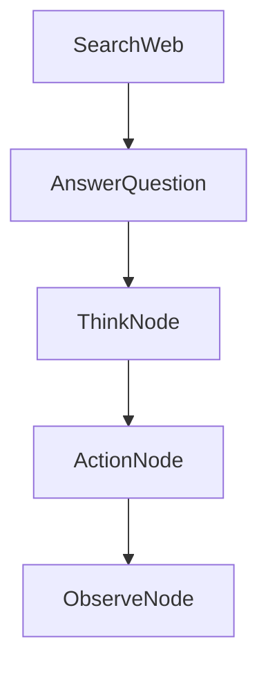

# Chapter 5: Multi-Agent and Supervision

Welcome to **Chapter 5: Multi-Agent and Supervision**. In this part of **PocketFlow Tutorial: Minimal LLM Framework with Graph-Based Power**, you will build an intuitive mental model first, then move into concrete implementation details and practical production tradeoffs.


Multi-agent and supervisor patterns in PocketFlow are built through graph composition and handoff rules.

## Reliability Tips

- keep specialist scopes narrow
- log handoff reasons
- add supervisory validation on risky outputs

## Summary

You now have a baseline for orchestrating multiple agents with supervision loops.

Next: [Chapter 6: Streaming, HITL, and Interrupts](06-streaming-hitl-and-interrupts.md)

## Depth Expansion Playbook

## Source Code Walkthrough

### `cookbook/pocketflow-agent/nodes.py`

The `SearchWeb` class in [`cookbook/pocketflow-agent/nodes.py`](https://github.com/The-Pocket/PocketFlow/blob/HEAD/cookbook/pocketflow-agent/nodes.py) handles a key part of this chapter's functionality:

```py
        return exec_res["action"]

class SearchWeb(Node):
    def prep(self, shared):
        """Get the search query from the shared store."""
        return shared["search_query"]
        
    def exec(self, search_query):
        """Search the web for the given query."""
        # Call the search utility function
        print(f"🌐 Searching the web for: {search_query}")
        results = search_web_duckduckgo(search_query)
        return results
    
    def post(self, shared, prep_res, exec_res):
        """Save the search results and go back to the decision node."""
        # Add the search results to the context in the shared store
        previous = shared.get("context", "")
        shared["context"] = previous + "\n\nSEARCH: " + shared["search_query"] + "\nRESULTS: " + exec_res
        
        print(f"📚 Found information, analyzing results...")
        
        # Always go back to the decision node after searching
        return "decide"

class AnswerQuestion(Node):
    def prep(self, shared):
        """Get the question and context for answering."""
        return shared["question"], shared.get("context", "")
        
    def exec(self, inputs):
        """Call the LLM to generate a final answer."""
```

This class is important because it defines how PocketFlow Tutorial: Minimal LLM Framework with Graph-Based Power implements the patterns covered in this chapter.

### `cookbook/pocketflow-agent/nodes.py`

The `AnswerQuestion` class in [`cookbook/pocketflow-agent/nodes.py`](https://github.com/The-Pocket/PocketFlow/blob/HEAD/cookbook/pocketflow-agent/nodes.py) handles a key part of this chapter's functionality:

```py
        return "decide"

class AnswerQuestion(Node):
    def prep(self, shared):
        """Get the question and context for answering."""
        return shared["question"], shared.get("context", "")
        
    def exec(self, inputs):
        """Call the LLM to generate a final answer."""
        question, context = inputs
        
        print(f"✍️ Crafting final answer...")
        
        # Create a prompt for the LLM to answer the question
        prompt = f"""
### CONTEXT
Based on the following information, answer the question.
Question: {question}
Research: {context}

## YOUR ANSWER:
Provide a comprehensive answer using the research results.
"""
        # Call the LLM to generate an answer
        answer = call_llm(prompt)
        return answer
    
    def post(self, shared, prep_res, exec_res):
        """Save the final answer and complete the flow."""
        # Save the answer in the shared store
        shared["answer"] = exec_res
        
```

This class is important because it defines how PocketFlow Tutorial: Minimal LLM Framework with Graph-Based Power implements the patterns covered in this chapter.

### `cookbook/pocketflow-tao/nodes.py`

The `ThinkNode` class in [`cookbook/pocketflow-tao/nodes.py`](https://github.com/The-Pocket/PocketFlow/blob/HEAD/cookbook/pocketflow-tao/nodes.py) handles a key part of this chapter's functionality:

```py
from utils import call_llm

class ThinkNode(Node):
    def prep(self, shared):
        """Prepare the context needed for thinking"""
        query = shared.get("query", "")
        observations = shared.get("observations", [])
        thoughts = shared.get("thoughts", [])
        current_thought_number = shared.get("current_thought_number", 0)
        
        # Update thought count
        shared["current_thought_number"] = current_thought_number + 1
        
        # Format previous observations
        observations_text = "\n".join([f"Observation {i+1}: {obs}" for i, obs in enumerate(observations)])
        if not observations_text:
            observations_text = "No observations yet."
            
        return {
            "query": query,
            "observations_text": observations_text,
            "thoughts": thoughts,
            "current_thought_number": current_thought_number + 1
        }
    
    def exec(self, prep_res):
        """Execute the thinking process, decide the next action"""
        query = prep_res["query"]
        observations_text = prep_res["observations_text"]
        current_thought_number = prep_res["current_thought_number"]
        
        # Build the prompt
```

This class is important because it defines how PocketFlow Tutorial: Minimal LLM Framework with Graph-Based Power implements the patterns covered in this chapter.

### `cookbook/pocketflow-tao/nodes.py`

The `ActionNode` class in [`cookbook/pocketflow-tao/nodes.py`](https://github.com/The-Pocket/PocketFlow/blob/HEAD/cookbook/pocketflow-tao/nodes.py) handles a key part of this chapter's functionality:

```py
        return "action"

class ActionNode(Node):
    def prep(self, shared):
        """Prepare to execute action"""
        action = shared["current_action"]
        action_input = shared["current_action_input"]
        return action, action_input
    
    def exec(self, inputs):
        """Execute action and return result"""
        action, action_input = inputs
        
        print(f"🚀 Executing action: {action}, input: {action_input}")
        
        # Execute different operations based on action type
        if action == "search":
            # Simulate search operation
            result = self.search_web(action_input)
        elif action == "calculate":
            # Simulate calculation operation
            result = self.calculate(action_input)
        elif action == "answer":
            # Direct return answer
            result = action_input
        else:
            # Unknown action type
            result = f"Unknown action type: {action}"
        
        return result
    
    def post(self, shared, prep_res, exec_res):
```

This class is important because it defines how PocketFlow Tutorial: Minimal LLM Framework with Graph-Based Power implements the patterns covered in this chapter.


## How These Components Connect


