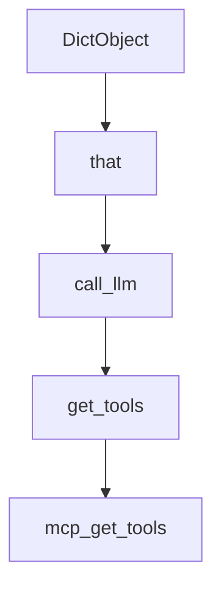

# Chapter 6: Streaming, HITL, and Interrupts

Welcome to **Chapter 6: Streaming, HITL, and Interrupts**. In this part of **PocketFlow Tutorial: Minimal LLM Framework with Graph-Based Power**, you will build an intuitive mental model first, then move into concrete implementation details and practical production tradeoffs.


PocketFlow cookbook patterns cover streaming responses and human-in-the-loop interruption points.

## Interaction Controls

| Control | Value |
|:--------|:------|
| streaming output | lower perceived latency |
| HITL gates | human governance for risky steps |
| interrupt handling | better UX and recovery |

## Summary

You now know how to add interactive controls to PocketFlow applications.

Next: [Chapter 7: Multi-Language Ecosystem](07-multi-language-ecosystem.md)

## Depth Expansion Playbook

## Source Code Walkthrough

### `cookbook/pocketflow-mcp/utils.py`

The `DictObject` class in [`cookbook/pocketflow-mcp/utils.py`](https://github.com/The-Pocket/PocketFlow/blob/HEAD/cookbook/pocketflow-mcp/utils.py) handles a key part of this chapter's functionality:

```py
    ]

    class DictObject(dict):
        """A simple class that behaves both as a dictionary and as an object with attributes."""
        def __init__(self, data):
            super().__init__(data)
            for key, value in data.items():
                if isinstance(value, dict):
                    self[key] = DictObject(value)
                elif isinstance(value, list) and value and isinstance(value[0], dict):
                    self[key] = [DictObject(item) for item in value]
        
        def __getattr__(self, key):
            try:
                return self[key]
            except KeyError:
                raise AttributeError(f"'DictObject' object has no attribute '{key}'")

    return [DictObject(tool) for tool in tools]

def call_tool(server_script_path=None, tool_name=None, arguments=None):
    """Call a tool, either from MCP server or locally based on MCP global setting."""
    if MCP:
        return mcp_call_tool(server_script_path, tool_name, arguments)
    else:
        return local_call_tool(server_script_path, tool_name, arguments)
    
def mcp_call_tool(server_script_path=None, tool_name=None, arguments=None):
    """Call a tool on an MCP server.
    """
    async def _call_tool():
        server_params = StdioServerParameters(
```

This class is important because it defines how PocketFlow Tutorial: Minimal LLM Framework with Graph-Based Power implements the patterns covered in this chapter.

### `cookbook/pocketflow-mcp/utils.py`

The `that` class in [`cookbook/pocketflow-mcp/utils.py`](https://github.com/The-Pocket/PocketFlow/blob/HEAD/cookbook/pocketflow-mcp/utils.py) handles a key part of this chapter's functionality:

```py

    class DictObject(dict):
        """A simple class that behaves both as a dictionary and as an object with attributes."""
        def __init__(self, data):
            super().__init__(data)
            for key, value in data.items():
                if isinstance(value, dict):
                    self[key] = DictObject(value)
                elif isinstance(value, list) and value and isinstance(value[0], dict):
                    self[key] = [DictObject(item) for item in value]
        
        def __getattr__(self, key):
            try:
                return self[key]
            except KeyError:
                raise AttributeError(f"'DictObject' object has no attribute '{key}'")

    return [DictObject(tool) for tool in tools]

def call_tool(server_script_path=None, tool_name=None, arguments=None):
    """Call a tool, either from MCP server or locally based on MCP global setting."""
    if MCP:
        return mcp_call_tool(server_script_path, tool_name, arguments)
    else:
        return local_call_tool(server_script_path, tool_name, arguments)
    
def mcp_call_tool(server_script_path=None, tool_name=None, arguments=None):
    """Call a tool on an MCP server.
    """
    async def _call_tool():
        server_params = StdioServerParameters(
            command="python",
```

This class is important because it defines how PocketFlow Tutorial: Minimal LLM Framework with Graph-Based Power implements the patterns covered in this chapter.

### `cookbook/pocketflow-mcp/utils.py`

The `call_llm` function in [`cookbook/pocketflow-mcp/utils.py`](https://github.com/The-Pocket/PocketFlow/blob/HEAD/cookbook/pocketflow-mcp/utils.py) handles a key part of this chapter's functionality:

```py
MCP = False

def call_llm(prompt):    
    client = OpenAI(api_key=os.environ.get("OPENAI_API_KEY", "your-api-key"))
    r = client.chat.completions.create(
        model="gpt-4o",
        messages=[{"role": "user", "content": prompt}]
    )
    return r.choices[0].message.content

def get_tools(server_script_path=None):
    """Get available tools, either from MCP server or locally based on MCP global setting."""
    if MCP:
        return mcp_get_tools(server_script_path)
    else:
        return local_get_tools(server_script_path)
    
def mcp_get_tools(server_script_path):
    """Get available tools from an MCP server.
    """
    async def _get_tools():
        server_params = StdioServerParameters(
            command="python",
            args=[server_script_path]
        )
        
        async with stdio_client(server_params) as (read, write):
            async with ClientSession(read, write) as session:
                await session.initialize()
                tools_response = await session.list_tools()
                return tools_response.tools
    
```

This function is important because it defines how PocketFlow Tutorial: Minimal LLM Framework with Graph-Based Power implements the patterns covered in this chapter.

### `cookbook/pocketflow-mcp/utils.py`

The `get_tools` function in [`cookbook/pocketflow-mcp/utils.py`](https://github.com/The-Pocket/PocketFlow/blob/HEAD/cookbook/pocketflow-mcp/utils.py) handles a key part of this chapter's functionality:

```py
    return r.choices[0].message.content

def get_tools(server_script_path=None):
    """Get available tools, either from MCP server or locally based on MCP global setting."""
    if MCP:
        return mcp_get_tools(server_script_path)
    else:
        return local_get_tools(server_script_path)
    
def mcp_get_tools(server_script_path):
    """Get available tools from an MCP server.
    """
    async def _get_tools():
        server_params = StdioServerParameters(
            command="python",
            args=[server_script_path]
        )
        
        async with stdio_client(server_params) as (read, write):
            async with ClientSession(read, write) as session:
                await session.initialize()
                tools_response = await session.list_tools()
                return tools_response.tools
    
    return asyncio.run(_get_tools())

def local_get_tools(server_script_path=None):
    """A simple dummy implementation of get_tools without MCP."""
    tools = [
        {
            "name": "add",
            "description": "Add two numbers together",
```

This function is important because it defines how PocketFlow Tutorial: Minimal LLM Framework with Graph-Based Power implements the patterns covered in this chapter.


## How These Components Connect


