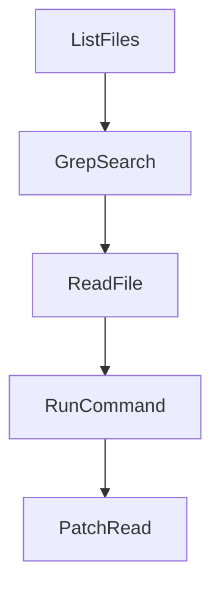

# Chapter 6: Streaming, HITL, and Interrupts

Welcome to **Chapter 6: Streaming, HITL, and Interrupts**. In this part of **PocketFlow Tutorial: Minimal LLM Framework with Graph-Based Power**, you will build an intuitive mental model first, then move into concrete implementation details and practical production tradeoffs.


PocketFlow cookbook patterns cover streaming responses and human-in-the-loop interruption points.

## Interaction Controls

| Control | Value |
|:--------|:------|
| streaming output | lower perceived latency |
| HITL gates | human governance for risky steps |
| interrupt handling | better UX and recovery |

## Summary

You now know how to add interactive controls to PocketFlow applications.

Next: [Chapter 7: Multi-Language Ecosystem](07-multi-language-ecosystem.md)

## Source Code Walkthrough

### `cookbook/pocketflow-coding-agent/nodes.py`

The `ListFiles` class in [`cookbook/pocketflow-coding-agent/nodes.py`](https://github.com/The-Pocket/PocketFlow/blob/HEAD/cookbook/pocketflow-coding-agent/nodes.py) handles a key part of this chapter's functionality:

```py
        print(f"  ✅ {str(exec_res)[:200]}")

class ListFiles(ToolNode):
    def exec(self, inputs):
        args, workdir = inputs
        result = []
        for root, _, files in os.walk(_path(workdir, args.get("directory", "."))):
            for f in files:
                if not f.startswith("."): result.append(os.path.relpath(os.path.join(root, f), workdir))
        return "\n".join(result)

class GrepSearch(ToolNode):
    def exec(self, inputs):
        args, workdir = inputs
        pattern, path = args.get("pattern", ""), args.get("path", ".")
        results = []
        for root, _, files in os.walk(_path(workdir, path)):
            for fname in files:
                if not fname.endswith(".py"): continue
                fpath = os.path.join(root, fname)
                with open(fpath) as f:
                    for i, line in enumerate(f, 1):
                        if re.search(pattern, line):
                            results.append(f"{os.path.relpath(fpath, workdir)}:{i}: {line.rstrip()}")
        return "\n".join(results) or "No matches"

class ReadFile(ToolNode):
    def exec(self, inputs):
        args, workdir = inputs
        with open(_path(workdir, args["path"])) as f: lines = f.readlines()
        end = args.get("end") or len(lines)
        start = args.get("start", 1)
```

This class is important because it defines how PocketFlow Tutorial: Minimal LLM Framework with Graph-Based Power implements the patterns covered in this chapter.

### `cookbook/pocketflow-coding-agent/nodes.py`

The `GrepSearch` class in [`cookbook/pocketflow-coding-agent/nodes.py`](https://github.com/The-Pocket/PocketFlow/blob/HEAD/cookbook/pocketflow-coding-agent/nodes.py) handles a key part of this chapter's functionality:

```py
        return "\n".join(result)

class GrepSearch(ToolNode):
    def exec(self, inputs):
        args, workdir = inputs
        pattern, path = args.get("pattern", ""), args.get("path", ".")
        results = []
        for root, _, files in os.walk(_path(workdir, path)):
            for fname in files:
                if not fname.endswith(".py"): continue
                fpath = os.path.join(root, fname)
                with open(fpath) as f:
                    for i, line in enumerate(f, 1):
                        if re.search(pattern, line):
                            results.append(f"{os.path.relpath(fpath, workdir)}:{i}: {line.rstrip()}")
        return "\n".join(results) or "No matches"

class ReadFile(ToolNode):
    def exec(self, inputs):
        args, workdir = inputs
        with open(_path(workdir, args["path"])) as f: lines = f.readlines()
        end = args.get("end") or len(lines)
        start = args.get("start", 1)
        return "".join(f"{i}: {l}" for i, l in enumerate(lines[start-1:end], start))

class RunCommand(ToolNode):
    def exec(self, inputs):
        args, workdir = inputs
        r = subprocess.run(args["cmd"], shell=True, capture_output=True, text=True, cwd=workdir, timeout=30)
        return (r.stdout + r.stderr) or "(no output)"

# patch_file as SubFlow
```

This class is important because it defines how PocketFlow Tutorial: Minimal LLM Framework with Graph-Based Power implements the patterns covered in this chapter.

### `cookbook/pocketflow-coding-agent/nodes.py`

The `ReadFile` class in [`cookbook/pocketflow-coding-agent/nodes.py`](https://github.com/The-Pocket/PocketFlow/blob/HEAD/cookbook/pocketflow-coding-agent/nodes.py) handles a key part of this chapter's functionality:

```py
        return "\n".join(results) or "No matches"

class ReadFile(ToolNode):
    def exec(self, inputs):
        args, workdir = inputs
        with open(_path(workdir, args["path"])) as f: lines = f.readlines()
        end = args.get("end") or len(lines)
        start = args.get("start", 1)
        return "".join(f"{i}: {l}" for i, l in enumerate(lines[start-1:end], start))

class RunCommand(ToolNode):
    def exec(self, inputs):
        args, workdir = inputs
        r = subprocess.run(args["cmd"], shell=True, capture_output=True, text=True, cwd=workdir, timeout=30)
        return (r.stdout + r.stderr) or "(no output)"

# patch_file as SubFlow
class PatchRead(Node):
    def prep(self, shared):
        return shared["tool_call"]["args"]["path"], shared["workdir"]
    def exec(self, inputs):
        path, workdir = inputs
        with open(_path(workdir, path)) as f: return f.read()
    def post(self, shared, prep_res, exec_res):
        shared["_patch_content"] = exec_res

class PatchValidate(Node):
    def prep(self, shared):
        args = shared["tool_call"]["args"]
        return shared["_patch_content"], args["old_str"], args["path"]
    def exec(self, inputs):
        content, old_str, path = inputs
```

This class is important because it defines how PocketFlow Tutorial: Minimal LLM Framework with Graph-Based Power implements the patterns covered in this chapter.

### `cookbook/pocketflow-coding-agent/nodes.py`

The `RunCommand` class in [`cookbook/pocketflow-coding-agent/nodes.py`](https://github.com/The-Pocket/PocketFlow/blob/HEAD/cookbook/pocketflow-coding-agent/nodes.py) handles a key part of this chapter's functionality:

```py
        return "".join(f"{i}: {l}" for i, l in enumerate(lines[start-1:end], start))

class RunCommand(ToolNode):
    def exec(self, inputs):
        args, workdir = inputs
        r = subprocess.run(args["cmd"], shell=True, capture_output=True, text=True, cwd=workdir, timeout=30)
        return (r.stdout + r.stderr) or "(no output)"

# patch_file as SubFlow
class PatchRead(Node):
    def prep(self, shared):
        return shared["tool_call"]["args"]["path"], shared["workdir"]
    def exec(self, inputs):
        path, workdir = inputs
        with open(_path(workdir, path)) as f: return f.read()
    def post(self, shared, prep_res, exec_res):
        shared["_patch_content"] = exec_res

class PatchValidate(Node):
    def prep(self, shared):
        args = shared["tool_call"]["args"]
        return shared["_patch_content"], args["old_str"], args["path"]
    def exec(self, inputs):
        content, old_str, path = inputs
        if old_str not in content:
            lines = content.split('\n')
            n = old_str.count('\n') + 1
            chunks = ['\n'.join(lines[i:i+n]) for i in range(len(lines))]
            best = difflib.get_close_matches(old_str, chunks, n=1, cutoff=0.4)
            if best: return f"ERROR: old_str not found in {path}. Did you mean:\n{best[0]}"
            return f"ERROR: old_str not found in {path}"
        if content.count(old_str) > 1:
```

This class is important because it defines how PocketFlow Tutorial: Minimal LLM Framework with Graph-Based Power implements the patterns covered in this chapter.


## How These Components Connect


