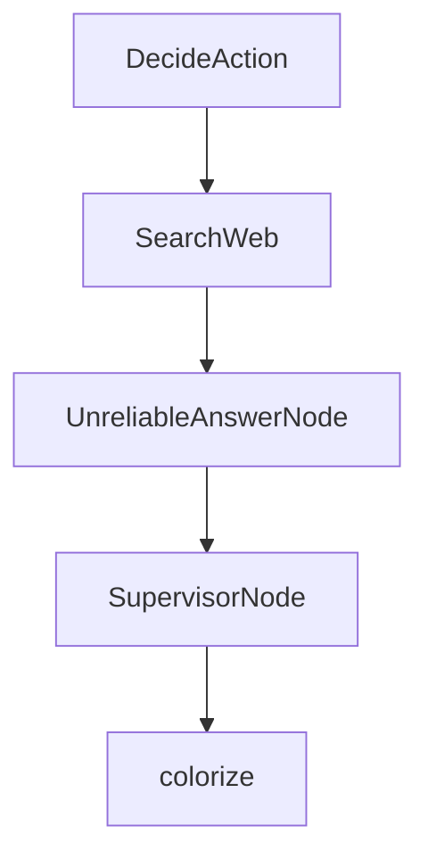

# Chapter 7: Multi-Language Ecosystem

Welcome to **Chapter 7: Multi-Language Ecosystem**. In this part of **PocketFlow Tutorial: Minimal LLM Framework with Graph-Based Power**, you will build an intuitive mental model first, then move into concrete implementation details and practical production tradeoffs.


PocketFlow has ports across TypeScript, Java, C++, Go, Rust, and PHP ecosystems.

## Portability Strategy

- keep core graph semantics consistent
- use language-native runtime integrations
- maintain shared pattern documentation across ports

## Summary

You now understand how PocketFlow patterns can transfer across language stacks.

Next: [Chapter 8: Production Usage and Scaling](08-production-usage-and-scaling.md)

## Source Code Walkthrough

### `cookbook/pocketflow-supervisor/nodes.py`

The `DecideAction` class in [`cookbook/pocketflow-supervisor/nodes.py`](https://github.com/The-Pocket/PocketFlow/blob/HEAD/cookbook/pocketflow-supervisor/nodes.py) handles a key part of this chapter's functionality:

```py
import random

class DecideAction(Node):
    def prep(self, shared):
        """Prepare the context and question for the decision-making process."""
        # Get the current context (default to "No previous search" if none exists)
        context = shared.get("context", "No previous search")
        # Get the question from the shared store
        question = shared["question"]
        # Return both for the exec step
        return question, context
        
    def exec(self, inputs):
        """Call the LLM to decide whether to search or answer."""
        question, context = inputs
        
        print(f"🤔 Agent deciding what to do next...")
        
        # Create a prompt to help the LLM decide what to do next
        prompt = f"""
### CONTEXT
You are a research assistant that can search the web.
Question: {question}
Previous Research: {context}

### ACTION SPACE
[1] search
  Description: Look up more information on the web
  Parameters:
    - query (str): What to search for

[2] answer
```

This class is important because it defines how PocketFlow Tutorial: Minimal LLM Framework with Graph-Based Power implements the patterns covered in this chapter.

### `cookbook/pocketflow-supervisor/nodes.py`

The `SearchWeb` class in [`cookbook/pocketflow-supervisor/nodes.py`](https://github.com/The-Pocket/PocketFlow/blob/HEAD/cookbook/pocketflow-supervisor/nodes.py) handles a key part of this chapter's functionality:

```py
        return exec_res["action"]

class SearchWeb(Node):
    def prep(self, shared):
        """Get the search query from the shared store."""
        return shared["search_query"]
        
    def exec(self, search_query):
        """Search the web for the given query."""
        # Call the search utility function
        print(f"🌐 Searching the web for: {search_query}")
        results = search_web(search_query)
        return results
    
    def post(self, shared, prep_res, exec_res):
        """Save the search results and go back to the decision node."""
        # Add the search results to the context in the shared store
        previous = shared.get("context", "")
        shared["context"] = previous + "\n\nSEARCH: " + shared["search_query"] + "\nRESULTS: " + exec_res
        
        print(f"📚 Found information, analyzing results...")
        
        # Always go back to the decision node after searching
        return "decide"

class UnreliableAnswerNode(Node):
    def prep(self, shared):
        """Get the question and context for answering."""
        return shared["question"], shared.get("context", "")
        
    def exec(self, inputs):
        """Call the LLM to generate a final answer with 50% chance of returning a dummy answer."""
```

This class is important because it defines how PocketFlow Tutorial: Minimal LLM Framework with Graph-Based Power implements the patterns covered in this chapter.

### `cookbook/pocketflow-supervisor/nodes.py`

The `UnreliableAnswerNode` class in [`cookbook/pocketflow-supervisor/nodes.py`](https://github.com/The-Pocket/PocketFlow/blob/HEAD/cookbook/pocketflow-supervisor/nodes.py) handles a key part of this chapter's functionality:

```py
        return "decide"

class UnreliableAnswerNode(Node):
    def prep(self, shared):
        """Get the question and context for answering."""
        return shared["question"], shared.get("context", "")
        
    def exec(self, inputs):
        """Call the LLM to generate a final answer with 50% chance of returning a dummy answer."""
        question, context = inputs
        
        # 50% chance to return a dummy answer
        if random.random() < 0.5:
            print(f"🤪 Generating unreliable dummy answer...")
            return "Sorry, I'm on a coffee break right now. All information I provide is completely made up anyway. The answer to your question is 42, or maybe purple unicorns. Who knows? Certainly not me!"
        
        print(f"✍️ Crafting final answer...")
        
        # Create a prompt for the LLM to answer the question
        prompt = f"""
### CONTEXT
Based on the following information, answer the question.
Question: {question}
Research: {context}

## YOUR ANSWER:
Provide a comprehensive answer using the research results.
"""
        # Call the LLM to generate an answer
        answer = call_llm(prompt)
        return answer
    
```

This class is important because it defines how PocketFlow Tutorial: Minimal LLM Framework with Graph-Based Power implements the patterns covered in this chapter.

### `cookbook/pocketflow-supervisor/nodes.py`

The `SupervisorNode` class in [`cookbook/pocketflow-supervisor/nodes.py`](https://github.com/The-Pocket/PocketFlow/blob/HEAD/cookbook/pocketflow-supervisor/nodes.py) handles a key part of this chapter's functionality:

```py
        print(f"✅ Answer generated successfully")

class SupervisorNode(Node):
    def prep(self, shared):
        """Get the current answer for evaluation."""
        return shared["answer"]
    
    def exec(self, answer):
        """Check if the answer is valid or nonsensical."""
        print(f"    🔍 Supervisor checking answer quality...")
        
        # Check for obvious markers of the nonsense answers
        nonsense_markers = [
            "coffee break", 
            "purple unicorns", 
            "made up", 
            "42", 
            "Who knows?"
        ]
        
        # Check if the answer contains any nonsense markers
        is_nonsense = any(marker in answer for marker in nonsense_markers)
        
        if is_nonsense:
            return {"valid": False, "reason": "Answer appears to be nonsensical or unhelpful"}
        else:
            return {"valid": True, "reason": "Answer appears to be legitimate"}
    
    def post(self, shared, prep_res, exec_res):
        """Decide whether to accept the answer or restart the process."""
        if exec_res["valid"]:
            print(f"    ✅ Supervisor approved answer: {exec_res['reason']}")
```

This class is important because it defines how PocketFlow Tutorial: Minimal LLM Framework with Graph-Based Power implements the patterns covered in this chapter.


## How These Components Connect


