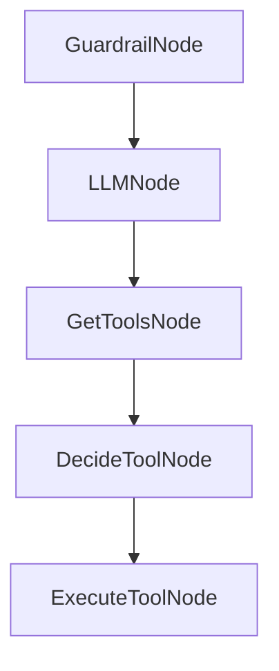

# Chapter 7: Multi-Language Ecosystem

Welcome to **Chapter 7: Multi-Language Ecosystem**. In this part of **PocketFlow Tutorial: Minimal LLM Framework with Graph-Based Power**, you will build an intuitive mental model first, then move into concrete implementation details and practical production tradeoffs.


PocketFlow has ports across TypeScript, Java, C++, Go, Rust, and PHP ecosystems.

## Portability Strategy

- keep core graph semantics consistent
- use language-native runtime integrations
- maintain shared pattern documentation across ports

## Summary

You now understand how PocketFlow patterns can transfer across language stacks.

Next: [Chapter 8: Production Usage and Scaling](08-production-usage-and-scaling.md)

## Depth Expansion Playbook

## Source Code Walkthrough

### `cookbook/pocketflow-chat-guardrail/main.py`

The `GuardrailNode` class in [`cookbook/pocketflow-chat-guardrail/main.py`](https://github.com/The-Pocket/PocketFlow/blob/HEAD/cookbook/pocketflow-chat-guardrail/main.py) handles a key part of this chapter's functionality:

```py
        return "validate"

class GuardrailNode(Node):
    def prep(self, shared):
        # Get the user input from shared data
        user_input = shared.get("user_input", "")
        return user_input
    
    def exec(self, user_input):
        # Basic validation checks
        if not user_input or user_input.strip() == "":
            return False, "Your query is empty. Please provide a travel-related question."
        
        if len(user_input.strip()) < 3:
            return False, "Your query is too short. Please provide more details about your travel question."
        
        # LLM-based validation for travel topics
        prompt = f"""
Evaluate if the following user query is related to travel advice, destinations, planning, or other travel topics.
The chat should ONLY answer travel-related questions and reject any off-topic, harmful, or inappropriate queries.
User query: {user_input}
Return your evaluation in YAML format:
```yaml
valid: true/false
reason: [Explain why the query is valid or invalid]
```"""
        
        # Call LLM with the validation prompt
        messages = [{"role": "user", "content": prompt}]
        response = call_llm(messages)
        
        # Extract YAML content
```

This class is important because it defines how PocketFlow Tutorial: Minimal LLM Framework with Graph-Based Power implements the patterns covered in this chapter.

### `cookbook/pocketflow-chat-guardrail/main.py`

The `LLMNode` class in [`cookbook/pocketflow-chat-guardrail/main.py`](https://github.com/The-Pocket/PocketFlow/blob/HEAD/cookbook/pocketflow-chat-guardrail/main.py) handles a key part of this chapter's functionality:

```py
        return "process"

class LLMNode(Node):
    def prep(self, shared):
        # Add system message if not present
        if not any(msg.get("role") == "system" for msg in shared["messages"]):
            shared["messages"].insert(0, {
                "role": "system", 
                "content": "You are a helpful travel advisor that provides information about destinations, travel planning, accommodations, transportation, activities, and other travel-related topics. Only respond to travel-related queries and keep responses informative and friendly. Your response are concise in 100 words."
            })
        
        # Return all messages for the LLM
        return shared["messages"]

    def exec(self, messages):
        # Call LLM with the entire conversation history
        response = call_llm(messages)
        return response

    def post(self, shared, prep_res, exec_res):
        # Print the assistant's response
        print(f"\nTravel Advisor: {exec_res}")
        
        # Add assistant message to history
        shared["messages"].append({"role": "assistant", "content": exec_res})
        
        # Loop back to continue the conversation
        return "continue"

# Create the flow with nodes and connections
user_input_node = UserInputNode()
guardrail_node = GuardrailNode()
```

This class is important because it defines how PocketFlow Tutorial: Minimal LLM Framework with Graph-Based Power implements the patterns covered in this chapter.

### `cookbook/pocketflow-mcp/main.py`

The `GetToolsNode` class in [`cookbook/pocketflow-mcp/main.py`](https://github.com/The-Pocket/PocketFlow/blob/HEAD/cookbook/pocketflow-mcp/main.py) handles a key part of this chapter's functionality:

```py
import sys

class GetToolsNode(Node):
    def prep(self, shared):
        """Initialize and get tools"""
        # The question is now passed from main via shared
        print("🔍 Getting available tools...")
        return "simple_server.py"

    def exec(self, server_path):
        """Retrieve tools from the MCP server"""
        tools = get_tools(server_path)
        return tools

    def post(self, shared, prep_res, exec_res):
        """Store tools and process to decision node"""
        tools = exec_res
        shared["tools"] = tools
        
        # Format tool information for later use
        tool_info = []
        for i, tool in enumerate(tools, 1):
            properties = tool.inputSchema.get('properties', {})
            required = tool.inputSchema.get('required', [])
            
            params = []
            for param_name, param_info in properties.items():
                param_type = param_info.get('type', 'unknown')
                req_status = "(Required)" if param_name in required else "(Optional)"
                params.append(f"    - {param_name} ({param_type}): {req_status}")
            
            tool_info.append(f"[{i}] {tool.name}\n  Description: {tool.description}\n  Parameters:\n" + "\n".join(params))
```

This class is important because it defines how PocketFlow Tutorial: Minimal LLM Framework with Graph-Based Power implements the patterns covered in this chapter.

### `cookbook/pocketflow-mcp/main.py`

The `DecideToolNode` class in [`cookbook/pocketflow-mcp/main.py`](https://github.com/The-Pocket/PocketFlow/blob/HEAD/cookbook/pocketflow-mcp/main.py) handles a key part of this chapter's functionality:

```py
        return "decide"

class DecideToolNode(Node):
    def prep(self, shared):
        """Prepare the prompt for LLM to process the question"""
        tool_info = shared["tool_info"]
        question = shared["question"]
        
        prompt = f"""
### CONTEXT
You are an assistant that can use tools via Model Context Protocol (MCP).

### ACTION SPACE
{tool_info}

### TASK
Answer this question: "{question}"

## NEXT ACTION
Analyze the question, extract any numbers or parameters, and decide which tool to use.
Return your response in this format:

```yaml
thinking: |
    <your step-by-step reasoning about what the question is asking and what numbers to extract>
tool: <name of the tool to use>
reason: <why you chose this tool>
parameters:
    <parameter_name>: <parameter_value>
    <parameter_name>: <parameter_value>
```
IMPORTANT: 
```

This class is important because it defines how PocketFlow Tutorial: Minimal LLM Framework with Graph-Based Power implements the patterns covered in this chapter.


## How These Components Connect


