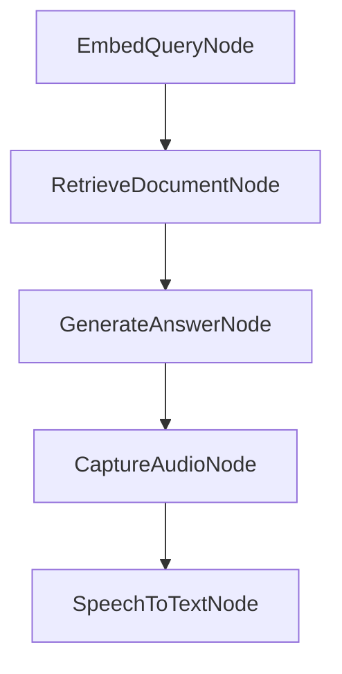

# Chapter 8: Production Usage and Scaling

Welcome to **Chapter 8: Production Usage and Scaling**. In this part of **PocketFlow Tutorial: Minimal LLM Framework with Graph-Based Power**, you will build an intuitive mental model first, then move into concrete implementation details and practical production tradeoffs.


This chapter outlines how to run PocketFlow systems reliably in production contexts.

## Operations Checklist

- flow-level observability
- deterministic retry/fallback behavior
- strict boundary controls for tool execution
- regression evals for critical flows

## Summary

You now have an operations baseline for production PocketFlow workloads.

## Source Code Walkthrough

### `cookbook/pocketflow-rag/nodes.py`

The `EmbedQueryNode` class in [`cookbook/pocketflow-rag/nodes.py`](https://github.com/The-Pocket/PocketFlow/blob/HEAD/cookbook/pocketflow-rag/nodes.py) handles a key part of this chapter's functionality:

```py

# Nodes for the online flow
class EmbedQueryNode(Node):
    def prep(self, shared):
        """Get query from shared store"""
        return shared["query"]
    
    def exec(self, query):
        """Embed the query"""
        print(f"🔍 Embedding query: {query}")
        query_embedding = get_embedding(query)
        return np.array([query_embedding], dtype=np.float32)
    
    def post(self, shared, prep_res, exec_res):
        """Store query embedding in shared store"""
        shared["query_embedding"] = exec_res
        return "default"

class RetrieveDocumentNode(Node):
    def prep(self, shared):
        """Get query embedding, index, and texts from shared store"""
        return shared["query_embedding"], shared["index"], shared["texts"]
    
    def exec(self, inputs):
        """Search the index for similar documents"""
        print("🔎 Searching for relevant documents...")
        query_embedding, index, texts = inputs
        
        # Search for the most similar document
        distances, indices = index.search(query_embedding, k=1)
        
        # Get the index of the most similar document
```

This class is important because it defines how PocketFlow Tutorial: Minimal LLM Framework with Graph-Based Power implements the patterns covered in this chapter.

### `cookbook/pocketflow-rag/nodes.py`

The `RetrieveDocumentNode` class in [`cookbook/pocketflow-rag/nodes.py`](https://github.com/The-Pocket/PocketFlow/blob/HEAD/cookbook/pocketflow-rag/nodes.py) handles a key part of this chapter's functionality:

```py
        return "default"

class RetrieveDocumentNode(Node):
    def prep(self, shared):
        """Get query embedding, index, and texts from shared store"""
        return shared["query_embedding"], shared["index"], shared["texts"]
    
    def exec(self, inputs):
        """Search the index for similar documents"""
        print("🔎 Searching for relevant documents...")
        query_embedding, index, texts = inputs
        
        # Search for the most similar document
        distances, indices = index.search(query_embedding, k=1)
        
        # Get the index of the most similar document
        best_idx = indices[0][0]
        distance = distances[0][0]
        
        # Get the corresponding text
        most_relevant_text = texts[best_idx]
        
        return {
            "text": most_relevant_text,
            "index": best_idx,
            "distance": distance
        }
    
    def post(self, shared, prep_res, exec_res):
        """Store retrieved document in shared store"""
        shared["retrieved_document"] = exec_res
        print(f"📄 Retrieved document (index: {exec_res['index']}, distance: {exec_res['distance']:.4f})")
```

This class is important because it defines how PocketFlow Tutorial: Minimal LLM Framework with Graph-Based Power implements the patterns covered in this chapter.

### `cookbook/pocketflow-rag/nodes.py`

The `GenerateAnswerNode` class in [`cookbook/pocketflow-rag/nodes.py`](https://github.com/The-Pocket/PocketFlow/blob/HEAD/cookbook/pocketflow-rag/nodes.py) handles a key part of this chapter's functionality:

```py
        return "default"
    
class GenerateAnswerNode(Node):
    def prep(self, shared):
        """Get query, retrieved document, and any other context needed"""
        return shared["query"], shared["retrieved_document"]
    
    def exec(self, inputs):
        """Generate an answer using the LLM"""
        query, retrieved_doc = inputs
        
        prompt = f"""
Briefly answer the following question based on the context provided:
Question: {query}
Context: {retrieved_doc['text']}
Answer:
"""
        
        answer = call_llm(prompt)
        return answer
    
    def post(self, shared, prep_res, exec_res):
        """Store generated answer in shared store"""
        shared["generated_answer"] = exec_res
        print("\n🤖 Generated Answer:")
        print(exec_res)
        return "default"

```

This class is important because it defines how PocketFlow Tutorial: Minimal LLM Framework with Graph-Based Power implements the patterns covered in this chapter.

### `cookbook/pocketflow-voice-chat/nodes.py`

The `CaptureAudioNode` class in [`cookbook/pocketflow-voice-chat/nodes.py`](https://github.com/The-Pocket/PocketFlow/blob/HEAD/cookbook/pocketflow-voice-chat/nodes.py) handles a key part of this chapter's functionality:

```py
from utils.text_to_speech import text_to_speech_api

class CaptureAudioNode(Node):
    """Records audio input from the user using VAD."""
    def exec(self, _): # prep_res is not used as per design
        print("\nListening for your query...")
        audio_data, sample_rate = record_audio()
        if audio_data is None:
            return None, None
        return audio_data, sample_rate

    def post(self, shared, prep_res, exec_res):
        audio_numpy_array, sample_rate = exec_res
        if audio_numpy_array is None:
            shared["user_audio_data"] = None
            shared["user_audio_sample_rate"] = None
            print("CaptureAudioNode: Failed to capture audio.")
            return "end_conversation" 

        shared["user_audio_data"] = audio_numpy_array
        shared["user_audio_sample_rate"] = sample_rate
        print(f"Audio captured ({len(audio_numpy_array)/sample_rate:.2f}s), proceeding to STT.")

class SpeechToTextNode(Node):
    """Converts the recorded in-memory audio to text."""
    def prep(self, shared):
        user_audio_data = shared.get("user_audio_data")
        user_audio_sample_rate = shared.get("user_audio_sample_rate")
        if user_audio_data is None or user_audio_sample_rate is None:
            print("SpeechToTextNode: No audio data to process.")
            return None # Signal to skip exec
        return user_audio_data, user_audio_sample_rate
```

This class is important because it defines how PocketFlow Tutorial: Minimal LLM Framework with Graph-Based Power implements the patterns covered in this chapter.


## How These Components Connect


