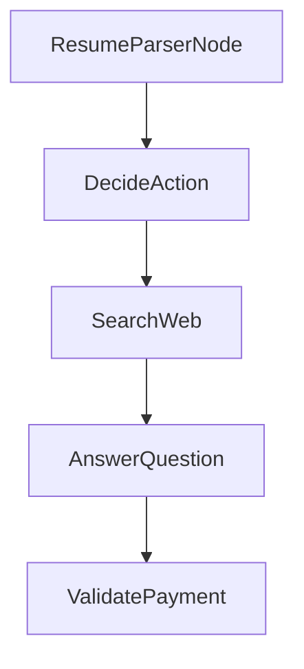

# Chapter 8: Production Usage and Scaling

Welcome to **Chapter 8: Production Usage and Scaling**. In this part of **PocketFlow Tutorial: Minimal LLM Framework with Graph-Based Power**, you will build an intuitive mental model first, then move into concrete implementation details and practical production tradeoffs.


This chapter outlines how to run PocketFlow systems reliably in production contexts.

## Operations Checklist

- flow-level observability
- deterministic retry/fallback behavior
- strict boundary controls for tool execution
- regression evals for critical flows

## Summary

You now have an operations baseline for production PocketFlow workloads.

## Depth Expansion Playbook

## Source Code Walkthrough

### `cookbook/pocketflow-structured-output/main.py`

The `ResumeParserNode` class in [`cookbook/pocketflow-structured-output/main.py`](https://github.com/The-Pocket/PocketFlow/blob/HEAD/cookbook/pocketflow-structured-output/main.py) handles a key part of this chapter's functionality:

```py
from utils import call_llm # Assumes utils.py with call_llm exists

class ResumeParserNode(Node):
    def prep(self, shared):
        """Return resume text and target skills from shared state."""
        return {
            "resume_text": shared["resume_text"],
            "target_skills": shared.get("target_skills", [])
        }

    def exec(self, prep_res):
        """Extract structured data from resume using prompt engineering.
        Requests YAML output with comments and skill indexes as a list.
        """
        resume_text = prep_res["resume_text"]
        target_skills = prep_res["target_skills"]

        # Format skills with indexes for the prompt
        skill_list_for_prompt = "\n".join([f"{i}: {skill}" for i, skill in enumerate(target_skills)])

        # Simplified Prompt focusing on key instructions and format
        prompt = f"""
Analyze the resume below. Output ONLY the requested information in YAML format.

**Resume:**
```
{resume_text}
```

**Target Skills (use these indexes):**
```
{skill_list_for_prompt}
```

This class is important because it defines how PocketFlow Tutorial: Minimal LLM Framework with Graph-Based Power implements the patterns covered in this chapter.

### `cookbook/pocketflow-a2a/nodes.py`

The `DecideAction` class in [`cookbook/pocketflow-a2a/nodes.py`](https://github.com/The-Pocket/PocketFlow/blob/HEAD/cookbook/pocketflow-a2a/nodes.py) handles a key part of this chapter's functionality:

```py
import yaml

class DecideAction(Node):
    def prep(self, shared):
        """Prepare the context and question for the decision-making process."""
        # Get the current context (default to "No previous search" if none exists)
        context = shared.get("context", "No previous search")
        # Get the question from the shared store
        question = shared["question"]
        # Return both for the exec step
        return question, context
        
    def exec(self, inputs):
        """Call the LLM to decide whether to search or answer."""
        question, context = inputs
        
        print(f"🤔 Agent deciding what to do next...")
        
        # Create a prompt to help the LLM decide what to do next with proper yaml formatting
        prompt = f"""
### CONTEXT
You are a research assistant that can search the web.
Question: {question}
Previous Research: {context}

### ACTION SPACE
[1] search
  Description: Look up more information on the web
  Parameters:
    - query (str): What to search for

[2] answer
```

This class is important because it defines how PocketFlow Tutorial: Minimal LLM Framework with Graph-Based Power implements the patterns covered in this chapter.

### `cookbook/pocketflow-a2a/nodes.py`

The `SearchWeb` class in [`cookbook/pocketflow-a2a/nodes.py`](https://github.com/The-Pocket/PocketFlow/blob/HEAD/cookbook/pocketflow-a2a/nodes.py) handles a key part of this chapter's functionality:

```py
        return exec_res["action"]

class SearchWeb(Node):
    def prep(self, shared):
        """Get the search query from the shared store."""
        return shared["search_query"]
        
    def exec(self, search_query):
        """Search the web for the given query."""
        # Call the search utility function
        print(f"🌐 Searching the web for: {search_query}")
        results = search_web(search_query)
        return results
    
    def post(self, shared, prep_res, exec_res):
        """Save the search results and go back to the decision node."""
        # Add the search results to the context in the shared store
        previous = shared.get("context", "")
        shared["context"] = previous + "\n\nSEARCH: " + shared["search_query"] + "\nRESULTS: " + exec_res
        
        print(f"📚 Found information, analyzing results...")
        
        # Always go back to the decision node after searching
        return "decide"

class AnswerQuestion(Node):
    def prep(self, shared):
        """Get the question and context for answering."""
        return shared["question"], shared.get("context", "")
        
    def exec(self, inputs):
        """Call the LLM to generate a final answer."""
```

This class is important because it defines how PocketFlow Tutorial: Minimal LLM Framework with Graph-Based Power implements the patterns covered in this chapter.

### `cookbook/pocketflow-a2a/nodes.py`

The `AnswerQuestion` class in [`cookbook/pocketflow-a2a/nodes.py`](https://github.com/The-Pocket/PocketFlow/blob/HEAD/cookbook/pocketflow-a2a/nodes.py) handles a key part of this chapter's functionality:

```py
        return "decide"

class AnswerQuestion(Node):
    def prep(self, shared):
        """Get the question and context for answering."""
        return shared["question"], shared.get("context", "")
        
    def exec(self, inputs):
        """Call the LLM to generate a final answer."""
        question, context = inputs
        
        print(f"✍️ Crafting final answer...")
        
        # Create a prompt for the LLM to answer the question
        prompt = f"""
### CONTEXT
Based on the following information, answer the question.
Question: {question}
Research: {context}

## YOUR ANSWER:
Provide a comprehensive answer using the research results.
"""
        # Call the LLM to generate an answer
        answer = call_llm(prompt)
        return answer
    
    def post(self, shared, prep_res, exec_res):
        """Save the final answer and complete the flow."""
        # Save the answer in the shared store
        shared["answer"] = exec_res
        
```

This class is important because it defines how PocketFlow Tutorial: Minimal LLM Framework with Graph-Based Power implements the patterns covered in this chapter.


## How These Components Connect


