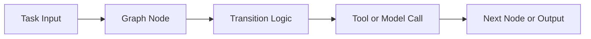

# PocketFlow Tutorial: Minimal LLM Framework with Graph-Based Power

> Learn how to build agentic applications with `The-Pocket/PocketFlow`, a minimalist graph framework that still supports workflows, multi-agent patterns, RAG, and human-in-the-loop flows.

## Why This Track Matters

PocketFlow proves that useful agent frameworks can be extremely small while remaining expressive. It is ideal for developers who want clarity, control, and portability instead of heavyweight abstractions.

This track focuses on:

- core graph abstractions in a minimal framework
- composable patterns for agents, workflows, and RAG
- multi-agent and HITL design without framework bloat
- scaling lightweight patterns into real applications

## Current Snapshot (auto-updated)

- repository: [`The-Pocket/PocketFlow`](https://github.com/The-Pocket/PocketFlow)
- stars: about **9.8k**
- release status: no tagged GitHub releases (main branch + docs cadence)
- development activity: stable project with active ecosystem/tutorial repos
- project positioning: 100-line graph-centric framework with multi-language ports

## Mental Model

## Chapter Guide

| Chapter | Key Question | Outcome |
|:--------|:-------------|:--------|
| [01 - Getting Started](01-getting-started.md) | How do I start building with PocketFlow quickly? | Working baseline |
| [02 - Core Graph Abstraction](02-core-graph-abstraction.md) | What is the minimal abstraction PocketFlow uses? | Strong conceptual model |
| [03 - Agent and Workflow Patterns](03-agent-and-workflow-patterns.md) | How do I implement common patterns cleanly? | Reusable composition patterns |
| [04 - RAG and Knowledge Patterns](04-rag-and-knowledge-patterns.md) | How do I build retrieval flows in PocketFlow? | Grounded response pipelines |
| [05 - Multi-Agent and Supervision](05-multi-agent-and-supervision.md) | How do multiple agents coordinate and recover? | Better orchestration reliability |
| [06 - Streaming, HITL, and Interrupts](06-streaming-hitl-and-interrupts.md) | How do I support real-time and human-in-the-loop behaviors? | Interactive workflow patterns |
| [07 - Multi-Language Ecosystem](07-multi-language-ecosystem.md) | How do ports and ecosystem repos extend PocketFlow? | Cross-language strategy |
| [08 - Production Usage and Scaling](08-production-usage-and-scaling.md) | How do I run PocketFlow systems in production? | Ops baseline |

## What You Will Learn

- how to implement robust agentic systems with minimal abstractions
- how to compose graph patterns for workflows, RAG, and multi-agent routing
- how to add streaming and human approvals without heavy frameworks
- how to operationalize lightweight architectures in production settings

## Source References

- [PocketFlow Repository](https://github.com/The-Pocket/PocketFlow)
- [PocketFlow Docs](https://the-pocket.github.io/PocketFlow/)
- [PocketFlow Cookbook](https://github.com/The-Pocket/PocketFlow/tree/main/cookbook)

## Related Tutorials

- [LangGraph Tutorial](../langgraph-tutorial/)
- [Agno Tutorial](../agno-tutorial/)
- [OpenHands Tutorial](../openhands-tutorial/)
- [MCP Servers Tutorial](../mcp-servers-tutorial/)

---

Start with [Chapter 1: Getting Started](01-getting-started.md).

## Navigation & Backlinks

- [Start Here: Chapter 1: Getting Started](01-getting-started.md)
- [Back to Main Catalog](../../README.md#-tutorial-catalog)
- [Browse A-Z Tutorial Directory](../../discoverability/tutorial-directory.md)
- [Search by Intent](../../discoverability/query-hub.md)
- [Explore Category Hubs](../../README.md#category-hubs)

## Full Chapter Map

1. [Chapter 1: Getting Started](01-getting-started.md)
2. [Chapter 2: Core Graph Abstraction](02-core-graph-abstraction.md)
3. [Chapter 3: Agent and Workflow Patterns](03-agent-and-workflow-patterns.md)
4. [Chapter 4: RAG and Knowledge Patterns](04-rag-and-knowledge-patterns.md)
5. [Chapter 5: Multi-Agent and Supervision](05-multi-agent-and-supervision.md)
6. [Chapter 6: Streaming, HITL, and Interrupts](06-streaming-hitl-and-interrupts.md)
7. [Chapter 7: Multi-Language Ecosystem](07-multi-language-ecosystem.md)
8. [Chapter 8: Production Usage and Scaling](08-production-usage-and-scaling.md)

*Generated by [AI Codebase Knowledge Builder](https://github.com/The-Pocket/Tutorial-Codebase-Knowledge)*
